# 使用 PHP 和 MySQL 的在线 FIR 网络应用

> 原文:[https://www . geesforgeks . org/online-fir-web-app-using-PHP-with-MySQL/](https://www.geeksforgeeks.org/online-fir-web-app-using-php-with-mysql/)

在本文中，我们将使用 [PHP](https://www.geeksforgeeks.org/php-tutorials/) 和 [MySQL](https://www.geeksforgeeks.org/mysql-common-mysql-queries/) 构建一个在线 FIR 网络应用程序。在这个应用程序中，我们可以通过姓名、投诉、状态(未决或已解决)和发生日期、注册日期从任何地方提交案件。只有管理员可以查看、删除和更新状态。只有管理员才能看到所有案例的完整列表。

**先决条件:** [XAMPP 服务器](https://www.geeksforgeeks.org/how-to-install-xampp-on-windows/)[HTML](https://www.geeksforgeeks.org/html-tutorials/)[CSS](https://www.geeksforgeeks.org/css-tutorials/)[Bootstrap](https://www.geeksforgeeks.org/bootstrap-tutorials/)[PHP](https://www.geeksforgeeks.org/php-tutorials/)[MySQL](https://www.geeksforgeeks.org/mysql-common-mysql-queries/)

我们将按照以下步骤来构建这个应用程序。

*   一个便于向公众提供快速、安全、可靠信息的网站。
*   这是一个使用 Visual Studio 代码编辑器、记事本、Notepad++、Atom、Sublime 的项目，你也可以使用 Adobe Dreamweaver 2020 软件。

**网站特色:**

*   在线注册
*   登录立案
*   检查您案例的状态

**步骤 1:** 首先，我们必须从 XAMPP 控制面板启动 XAMPP 服务器。

打开 XAMPP 控制面板，启动 Apache 和 MySQL 服务。在 XAMPP 文件夹中，转到htdocs 文件夹，并创建一个名为 OnlineFIR **的文件夹。**我们会将所有文件保存在项目文件夹中。这个文件夹里面有很多文件，但是主要的功能文件是*login.php，connect.php，registerfir.php，index.php，registerfir.php，status . PHP*

**步骤 2:** [创建数据库](https://www.geeksforgeeks.org/create-database-in-ms-sql-server/)

转到 localhost/phpMyAdmin，创建一个名为 *fir_info* 的数据库。在此之下，制作三张名为*的表格，登录，注册*。

**第三步:**打开自己选择的编辑器。为数据库 *fir_info* 连接**创建一个名为***的文件。****连接对象返回到 *$conn* 变量。***

## ***服务器端编程语言（Professional Hypertext Preprocessor 的缩写）***

```html
*<?php
  $conn=mysqli_connect("localhost","root","");
  $db=mysqli_select_db($conn,"fir_info");
?>*
```

*****步骤 4:** 创建另一个文件*index.php*。***

***本页面包含所有其他页面的超链接，如*status.php、login.php、gallery.php、aboutus.php***。**点击这些链接，用户可以执行操作。***

## ***index.php***

```html
*<html>

<head>
    <link rel="stylesheet" href=
"https://cdnjs.cloudflare.com/ajax/libs/font-awesome/4.7.0/css/font-awesome.min.css">

    <style type="text/css">
        body {
            font-family: Arial, Helvetica, sans-serif;
        }

        div.b {
            position: absolute;
            top: 150px;
            border: none;
            width: 98%;
        }

        .btn {
            background-color: #DF0000;
            border: none;
            color: white;
            padding: 12px 16px;
            font-size: 16px;
            cursor: pointer;
            width: 19%;
        }

        /* Darker background on mouse-over */
        .btn:hover {
            background-color: #f22;
        }

        a {
            color: black;
            text-decoration: none;
        }

        .rightdiv {
            position: absolute;
            top: 50%;
            right: -15px;
            height: 130%;
        }

        div {
            padding: 1%;
            width: 20%;
            border: none;
            display: block;
            margin: 20px;
            font-size: 20px;
        }

        .element {
            width: 85%;
            background-color: #633;
        }

        .div1 {
            background-color: #ff9;
            width: 80%;
        }

        .div2 {
            background-color: #F66;
            width: 80%;
        }

        .div3 {
            background-color: #ff9;
            width: 80%;
        }

        .div4 {
            background-color: #F66;
            width: 80%;
        }

        .div5 {
            background-color: #ff9;
            width: 80%;
        }

        .div6 {
            background-color: #F66;
            width: 80%;
        }

        .div7 {
            background-color: #ff9;
            width: 80%;
        }

        .div8 {
            background-color: #F66;
            width: 80%;
        }

        .div9 {
            background-color: #ff9;
            width: 80%;
        }

        .div10 {
            background-color: #F66;
            width: 80%;
        }

        .div11 {
            background-color: #Ff9;
            width: 80%;
        }

        .div15 {
            border: 2px solid #1E1E1E;
        }

        .div16 {
            border: 2px solid #BCBCBC;
        }
    </style>
</head>
<title>Rajasthan Police</title>

<body background=
"https://media.geeksforgeeks.org/wp-content/uploads/20210922144728/flag-300x200.jpg">
    <table width="100%" height="100%" border="0">
        <tr>
            <td width="15%" height="116">

<p></p>

            </td>
            <td width="29%">
                <h1 style="color:#FFF">
                    Rajasthan Police Department 
                </h1>
                <b style="color:#FFF">
                    सेवार्थ कटिबद्धता
                </b><br>
            </td>
            <p></p>

            <td width="41%">
                <b style="color:red">
                Help Line No.:-112,100
                </b><br>
                <b style="color:red"> 
                    Tel phone no.-0774-7654321,
                </b>
                <b>+91-9887267798 </b> <br />
                <b style="color:red">
                    Email id:-cybercellrajasthanpolice@raj.gov.in
                </b>
                <br /><br />
                <b style="color:red"> Fax no.:-56789</b><br>
                <b style="color:red"> 
                    Toll free No.:-18002589999
                </b>
            </td>
            <td width="15%" height="116">
                
            </td>
        </tr>

        <div class="b">
            <button class="btn">
                <i class="fa fa-home"></i>
                <a href="index.php">Home</a>
            </button>
            <button class="btn">
                <i class="fa fa-bars"></i>
                <a href="about us.php">About Us</a>
            </button>
            <button class="btn">
                <i class="fa fa-picture-o"></i>
                <a href="gallery.php">Photo Gallery</a>
            </button>
            <button class="btn">
                <i class="fa fa-search"></i>
                <a href="status.php">Status</a>
            </button>
            <button class="btn">
                <i class="fa fa-folder"></i>
                <a href="login.php">Complaint FIR</a>
                <td height="72">
            </button>
        </div>

        <div class="rightdiv">
            <h2 align="center" style="color:#EA0075">
                Public Information
            </h2>
            <div class="element">
                <div class="div1"> 
                    <a href="about us.php">About Us</a>
                </div>
                <div class="div2"> 
                    <a href="#">Corona Guidelines</a>
                </div>
                <div class="div3"> 
                    <a href="#">Crime statistics</a>
                </div>
                <div class="div4"> 
                    <a href="#">Citizen Services</a>
                </div>
                <div class="div5"> 
                    <a href="#">Pride of rajasthan</a>
                </div>
                <div class="div6"> 
                    <a href="faq.php">FAQ's</a>
                </div>
                <div class="div7"> 
                    <a href="#">The Acts and rules</a>
                </div>
                <div class="div8"> 
                    <a href="login.php">Register Your FIR here</a>
                </div>
                <div class="div9"> 
                    <a href="register.php">Registeration</a>
                </div>
                <div class="div10"> 
                    <a href="#">Important links</a>
                </div>
                <div class="div11"> 
                    <a href="#">Recruitment</a>
                </div>
            </div>
        </div>
        <br><br><br><br><br>

        <tr>
            <td height="98" colspan="4">
                <marquee bgcolor="yellow" behavior="alternate">
                    <b><i> 
                        Welcome To the Official Website 
                        of Rajasthan Police
                    </i></b>
                </marquee>
            </td>
        </tr>
        <tr>
            <td height="251">
                <b style="color:#ff0000"><br>
                    Shri Ashok Gehlot
                </b><br>

                <b>Hon'ble Chief Minister</b>
            </td>

            <td> </td>
            <td> </td>
            <td> </td>
        </tr>

        <tr>
            <td>

                <b>DGP(Director General of Police)</b>
            </td>
            <td> </td>
            <td> </td>
        </tr>
        <tr>
            <td height="43"> </td>
            <td> </td>
            <td> </td>
            <td> </td>
        </tr>
        <tr>
            <td height="43"> </td>
            <td> </td>
            <td> </td>
            <td> </td>
        </tr>
    </table>
</body>

</html>*
```

*****输出:*****

***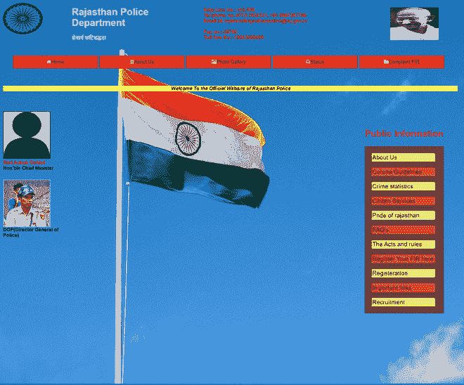

索引页*** 

*****第五步:**创建另一个名为*“register . PHP”*的文件，并添加代码。***

***创建此页面是为了将用户信息插入到*“fir _ info”*数据库中的*“注册”*表中。该 HTML 表单包含诸如 f *irstname、lastname、username、email、性别、dob、mobileno、密码、repeatpassword* 等用于用户输入的字段。当点击一个按钮时，我们包含文件“connect.php”来连接页面和数据库。***

***当信息在*【注册】*表中输入成功后，用户需自行登录前往**登录**，将出现登录页面，页面将移至***login.php***。***********

*******register.php*******

## *****服务器端编程语言（Professional Hypertext Preprocessor 的缩写）*****

```html
*****<?php

    include("connect.php");  // Connect to database

    if(isset($_POST['b1'])  && !empty($_POST['q1'])  
            && !empty($_POST['q8'] == $_POST['q9'])) {    
         mysqli_query($conn,"insert into login set
                             username = '".$_POST['q3']."',
                            userpassword = '".$_POST['q9']."'");

        $id1 = mysqli_insert_id($conn);
        mysqli_query($conn,"insert into register set 
                            firstname = '".$_POST['q1']."'  ,
                            lastname  = '".$_POST['q2']."'  , 
                            username  = '".$_POST['q3']."'  , 
                            dob  = '".$_POST['q4']."'  ,
                            gender  = '".$_POST['q5']."'  ,              
                            email   = '".$_POST['q6']."'  , 
                            mobileno  = '".$_POST['q7']."'  ,
                            password  = '".$_POST['q8']."'  , 
                            repeatpassword  = '".$_POST['q9']."'");

        $id2 = mysqli_insert_id($conn);   // Return row id from DB    
        if (isset($_POST['b1'] )  && !empty($_POST['q1'])) {
            echo"<b><i>You Registered Successfully</i>/<b>";
        }
   } 
?>

<!DOCTYPE html>
<html>
<head>
    <meta name="viewport" content=
          "width=device-width, initial-scale=1">

    <style>
      body {
        font-family: Arial, Helvetica, sans-serif;
        background-color:white;
      }

      * {
        box-sizing: border-box;
      }

      /* Add padding to containers */
      .container {
        padding: 16px;
        background-color: #D3d3d3;
      }

      /* Full-width input fields */
      input[type=text], input[type=password] {
        width: 100%;
        padding: 15px;
        border: none;
        background: #f1f1f1;
      }

      input[type=text]:focus, input[type=password]:focus {
        background-color: #ddd;
        outline: none;
      }

      /* Overwrite default styles of hr */
      hr {
        border: 1px solid #f1f1f1;
        margin-bottom: 25px;
      }

      /* Set a style for the submit button */
      .registerbtn {
        background-color: #4169E1;
        color: white;
        padding: 16px 20px;
        margin: 8px 0;
        border: none;
        cursor: pointer;
        width: 100%;
        transition-duration: 0.4sec;
      }

      .registerbtn:hover {
         opacity: 1;
      }

      /* Add a blue text color to links */
      a {
        color: dodgerblue;
      }

      /* Set a grey background color and center 
      the text of the "sign in" section */
      .signin {
        background-color: #f1f1f1;
        text-align: center;
      }
    </style>
</head>
<body>
   <form action="?" name="frm1" method="post">
    <div class="container">
      <h1>Register</h1>

<p><h4>Enter Your Credentials to create an account</h4></p>

      <hr>     
      <p>
      <label><b>First Name</b></label>
      <input type="text" placeholder="Enter Your First Name"
      name="q1" id="q1" required>

      <label><b>Last name</b></label>
      <input type="text" placeholder="Enter Your Last Name"
      name="q2" id="q2" required>      

      <label><b>Username</b></label>
      <input type="text" placeholder="Enter Username" 
       name="q3" id="q3" required>

      <label><b>Date of Birth  </b></label>
       <input type="text" placeholder="yyyy-mm-dd"
       name="q4" id="q4" required>

      <label><b>Gender</b></label>
      <input type="text" placeholder="Enter Gender" 
        name="q5" id="q5" required>

      <label><b>E-mail</b></label>
      <input type="text" placeholder="Enter your e-mail" 
          name="q6" id="q6" required>

      <label><b>Mobile no.</b></label>
      <input type="text" placeholder="Enter your phone number"
         name="q7" id="q7" required>

      <label><b>Password</b></label>
      <input type="password" placeholder="Enter Password"
         name="q8" id="q8" required>

      <label><b>Repeat Password</b></label>
      <input type="password" placeholder="Repeat Password" 
         name="q9" id="q9" required>
    </p>

       <button type="submit" class="registerbtn" 
         name="b1" id="b1">
         Register
       </button>
  </div>

  <div class="container signin">
      <p>Already have an account? 
        <a href="login.php">Sign in</a>
     </p>
  </div>
</form>

</body>
</html>*****
```

*******输出:*******

*****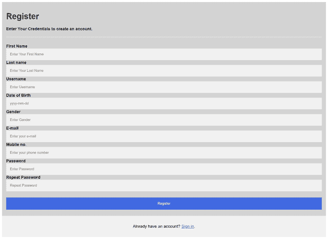*****

*****创建*注册*数据库表用于创建*注册*数据库表。*****

*   *****转到 localhost/phpmyadmin。*****
*   *****在 *fir_info* 数据库中，点击 SQL。*****
*   *****编写以下查询来创建注册表。*****

```html
*****CREATE TABLE register(
    uid int(10) AUTO_INCREMENT PRIMARY KEY,
    firstname varchar(255),
    lastname varchar(255),
    username varchar(255),
        dob date,
        gender ENUM('male','female'),
        email varchar(255),
        mobileno varchar(255),
        password varchar(50),
        repeatpassword varchar(50)
);*****
```

*****插入查询后，可以在数据库中看到以下输出。*****

*****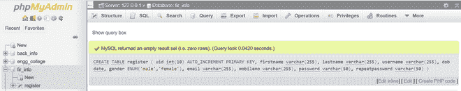*****

******寄存器*表包含 10 个字段，如下图所示。*****

*****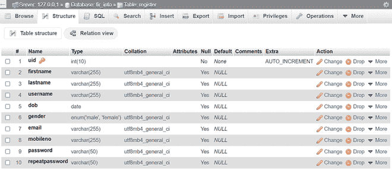*****

*******步骤 6:** 创建另一个名为*login.php 的文件。*用户必须通过输入用户名和密码登录。点击“登录”按钮，用户进入*“注册”页面。******

*****登录. php*****

## *****服务器端编程语言（Professional Hypertext Preprocessor 的缩写）*****

```html
*****<?php
     session_start();   // Session start

     include("connect.php");
     if(isset($_POST['b1']) && !empty($_POST['q1'])  
                            && !empty($_POST['q2'])) {
         $q=mysqli_query($conn,
                  "select * from login where username = '" 
                  . $_POST['q1'] . "' and userpassword = '"
                  . $_POST['q2'] ."'");

         $num = mysqli_num_rows($q);

         if($num > 0) {
            $row = mysqli_fetch_array($q);

            $_SESSION['sid']   =   $row[0];
            $_SESSION['sname'] =   $row[1];

            // URL Redirection to another page //
            header("location:registerfir.php");
            exit();
         }
         else {
           echo"<hr> Sorry Wrong /Invalid Username or Password !<hr>";
         }
     }

     // LOGOUT CODE
     if(isset($_GET['todo'])  && $_GET['todo']=="logout" ) {
        session_unset();
        //  session_destroy();
     }                
?>
<html>

<head>
<title>Login Here</title>
<meta name="viewport" content=
      "width=device-width",initial-scale=1>
   <style>
    body,html {
        height:100%;
        font-family:Arial, Helvetica, sans-serif;
        background-color:#d3d3d3;
    }

    * {
      box-sizing: border-box;
    }

    .button1 {
      background-color: #4CAF50; /* Green */
      border: none;
      color: white;
      padding: 20px;
      text-align: center;
      text-decoration: none;
      display: inline-block;
      font-size: 16px;
      margin: 4px 2px;
      transition-duration:0.4s;
      cursor: pointer;
    }
    .button1{
        background-color:#FFF;
        color:#000;
        border:2px solid #4caf50;
    }

    .button1 {
      border-radius: 12px;
    }
    .button1:hover {
      background-color:#4caf50;
      color: white;
    }

    .bg-img {

      /* The image used */
      background-image: url("tn.jfif");
      min-height: 380px;

      /* Center and scale the image nicely */
      background-position: center;
      background-repeat: no-repeat;
      background-size: cover;
      position: relative;
       /* Full height */
      height: 100%; 
    }

    /* Add styles to the form container */
    .container {
        position: absolute;
        right: 400px;
        margin: 20px;
        max-width: 650px;
        padding: 16px;
        background-color: white;
        top: 74px;
    }

    /* Full-width input fields */
    input[type=text], input[type=password] {
      width: 100%;
      padding: 15px;
      margin: 5px 0 22px 0;
      border: none;
      background: #f1f1f1;
    } 
    input[type=text]:focus, input[type=password]:focus {
      background-color: #ddd;
      outline: none;
    }

    /* Set a style for the submit button */
    .btn {
      background-color: #4CAF50;
      color: white;
      padding: 16px 20px;
      border: none;
      cursor: pointer;
      width: 100%;
      opacity: 0.9;
    }

    .btn:hover {
      opacity: 1;
    }

    .top-left {
        position: absolute;
        top: 10px;
        left: 570px;
        width: 397px;
        height: 47px;
    }
    a {
        text-decoration:none;
    }
  </style>
</head>

<body>
   <div class="bg-img">
   <div class="top-left"> <h1>Rajasthan Police Service</h1> </div>
     <form action="?" class="container" method="post">
       <h1>Login</h1>
      <p>
        <label for="username"><b>Username</b></label>
        <input type="text" placeholder="Enter username" 
           name="q1" id="q1" required>

        <label for="password"><b>Password</b></label>
        <input type="password" placeholder="Enter password"
          name="q2"  id="q2" required>

        <p>
          <button type="submit" class="btn" name="b1" id="b1">
          Login</button>
        </p>

        <h4>
          If you are not registerd and you want to complaint
          against someone then click on Register</h4>
         <button class="button button1"> <b>
          <a href="register.php"> Register </a></b></button>  
      </form>
    </div>
</form>    
</body>
</html>*****
```

*******输出:*******

*****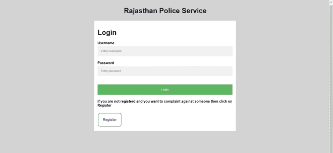*****

*****创建*登录*数据库表，用于创建登录数据库表。*****

*   *****转到 localhost/phpmyadmin*****
*   *****在*fir_info* 数据库中，点击 SQL*****
*   *****编写以下查询来创建登录表*****

```html
*****CREATE TABLE login
(
    uid int(10) AUTO_INCREMENT PRIMARY KEY,
    username varchar(255),
    userpassword varchar(255)
);*****
```

*****插入该查询后，可以在数据库中看到以下输出。*****

*****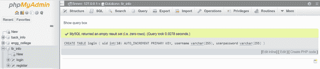*****

*****登录表包含 3 个字段，如下图所示。*****

*****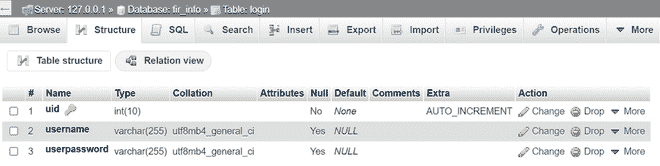*****

*******步骤 6:** 创建另一个名为*registerfir.php*的文件，并添加以下代码。*****

*****现在用户可以进行任何类别的立案，如*失物招领、诈骗、家庭暴力、其他*等**。**现在用户必须点击“状态”按钮，该按钮在“index.php”页面上可用。*****

*****寄存器. php*****

## *****服务器端编程语言（Professional Hypertext Preprocessor 的缩写）*****

```html
*****<?php

      include("connect.php");  // connect to database

      if (isset($_POST['b1'])  && !empty($_POST['q1'])) {    
            $i = rand(10000,50000);                        
            mysqli_query($conn,
                  "insert into fir set
                        name  = '".$_POST['q1']."'  ,
                        parent_name   = '".$_POST['q2']."', 
                        age   = '".$_POST['q3']."', 
                        address  = '".$_POST['q4']."'  ,
                        gender    = '".$_POST['q5']."'  ,              
                        inc_datetime  = '".$_POST['q6']."', 
                         reg_datetime  = '".$_POST['q7']."',
                         complaint   = '".$_POST['q8']."', 
                         section  = '".$_POST['q9']."'  , 
                         category  = '".$_POST['q10']."' ,
                         qid2  = '".$i."'");

              if (isset($_POST['b1']) && !empty($_POST['q1']))
             {
                  echo 
                  "<b>Your FIR registered Successfully<br>your FIR no is $i . 
                    kindly remember this no for further assistance";
             }            
         }
?>

<html lang="en">
 <head>

     <!-- Required meta tags -->
     <meta charset="utf-8">
         <link rel="stylesheet" href="Login/css/firstat.css">
         <meta name="viewport" content=
             "width=device-width, initial-scale=1, shrink-to-fit=no">

     <!-- Bootstrap CSS -->
     <link href=
     "https://cdn.jsdelivr.net/npm/bootstrap@5.0.2/dist/css/bootstrap.min.css" 
      rel="stylesheet" 
      integrity=
     "sha384-EVSTQN3/azprG1Anm3QDgpJLIm9Nao0Yz1ztcQTwFspd3yD65VohhpuuCOmLASjC" 
      crossorigin="anonymous">

    <title>Register your complaint</title>
    <style type="text/css">
        .registerform{
            margin-top: 5%;
            width:50vw;
            max-width: 90vw;
        }
        .form-group{
            margin: 2vw;
        }        
    </style>
  </head>
  <body>
       <h1 align="center" style="color:red;">
          Register Your Complaint Here</h1>

       <center>
       <div class=" card registerform">
          <form name="frm" action="?" method="post" align="center">

          <div class="form-group">
            <label>Name</label>
            <input type="text" class="form-control" placeholder="Enter name" 
             name="q1" id="q1">
          </div>

          <div class="form-group">
            <label>Father/Mother name</label>
            <input type="text" class="form-control" 
               placeholder="Enter name of father or mother" name="q2" id="q2">
          </div>

          <div class="form-group">
            <label>Age</label>
            <input type="number"class="form-control" placeholder="Enter Age" 
               name="q3" id="q3">
          </div>

          <div class="form-group">
            <label>Address</label>
            <textarea class="form-control" placeholder="Enter address" 
              name="q4" id="q4"></textarea>
          </div>

          <div class="form-group">
            <label>Gender</label>
            <input type="text" class="form-control" placeholder="Enter Gender"
                      name="q5" id="q5">
          </div>

           <div class="form-group">
            <label>Date and time of incidence</label>
            <input type="datetime-local" class="form-control"
                 placeholder="Enter date and time" name="q6" id="q6">
          </div>

           <div class="form-group">
            <label>Date and time of registeration</label>
            <input type="datetime-local" class="form-control" 
                    placeholder="Enter date and time" name="q7" id="q7">
          </div>

           <div class="form-group">
            <label>Complaint</label>
               <textarea type="text" class="form-control" 
                    placeholder="Enter complaint" 
                     name="q8" id="q8"></textarea>
           </div>

           <div class="form-group">
            <label>Section</label>
            <input type="text" class="form-control" 
             placeholder="section"
                  name="q9" id="q9">
           </div>

          <div class="form-group">
            <label>Select Complaint Type</label>
            <select class="form-control" name="q10" id="q10">
              <option>Attempt to Murder</option>
              <option>Theft                </option>
              <option>Domestic Violence    </option>
              <option>Lost and Found    </option>
              <option>Stolen Vehical    </option>
              <option>Missing Person    </option>
              <option>Others            </option>
            </select>
          </div>    

          <button class="btn btn-lg btn-warning" type="submit"
            id="b1" name="b1">
                Submit
          </button>
        </form>       
     </div>
    </center>
 </body>
</html>*****
```

*******输出:*******

*****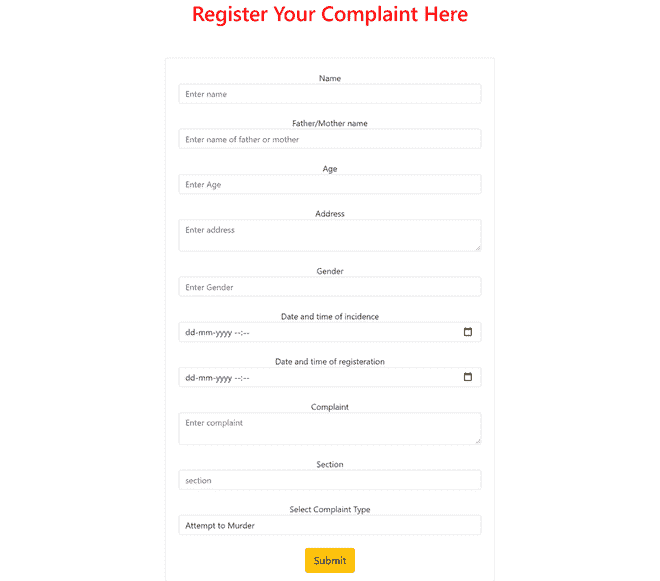*****

*****创建 *fir* 表，用于创建 *fir* 数据库表。*****

*   *****转到 localhost/phpmyadmin*****
*   *****在 ***fir_info*** 数据库中，点击 SQL*****
*   *****编写以下查询来创建 *fir* 表*****

```html
*****CREATE TABLE fir(
    s_no int(10) AUTO_INCREMENT PRIMARY KEY,
    name varchar(255),
    parent_name varchar(255),
    age int(10),
    address varchar(255),
    gender ENUM('male','female'),
    inc_datetime datetime(6),
    reg_datetime datetime(6),
    complaint varchar(255),
    section int(20),
    category varchar(255),
    qui1 varchar(255) DEFAULT 'RAJ/FIR/2021/',
    qid2 int(10) UNIQUE,
    status varchar(255),
    information text
);*****
```

*****在数据库中可以看到以下输出。*****

*****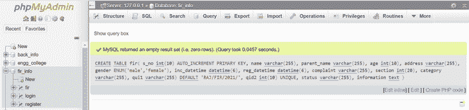*****

******fir* 表包含 15 个字段，如下图所示。*****

*****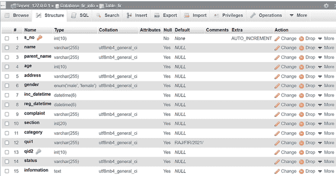*****

*******第 7 步:**创建另一个名为*status.php*的文件，并对以下行进行编码。*****

*****通过点击状态按钮，用户必须在搜索栏上输入自己的 FIR 号，才能看到自己的案件状态(已解决或待决或其他信息)。*****

*******status.php*******

## *****服务器端编程语言（Professional Hypertext Preprocessor 的缩写）*****

```html
*****<?php
    include("connect.php");
    if(isset($_REQUEST['b1']) && !empty($_GET['q'])) {
       $q = mysqli_query($conn, 
           "select *  from fir where qid2 = '"
           . $_GET['q']."' ");
       $num  =  mysqli_num_rows($q);

       if($num > 0) {
          $row = mysqli_fetch_array($q);
?>
    <div style="float:right;">
      <a href="login.php?todo=logout" 
          style="color:#FFF"> Sign Out 
        </a> 
    </div>
<hr>

<?php
      }
     else
     {
        echo "Registration number not exist";
     }
  }
?>
<html>
<head>
    <meta name="viewport" content=
            "width=device-width, initial-scale=1">
       <link rel="stylesheet" href=
  "https://cdnjs.cloudflare.com/ajax/libs/font-awesome/4.7.0/css/font-awesome.min.css">
</head>

<body bgcolor="#8F8F8F">

    <h2 style="text-align:center">
        To Know Your complaint Status Write 
          Your FIR Number in Search Box
    </h2>
    <form name="frm1" action="?" method="get" align="center">
      <input type="text"  name="q" id="q">
      <input type="submit" name="b1" value="Search Status"  />
    </form>
</body>
</html>

<?php
     if(isset($row)) {
        echo "<br>";
        echo "FIR Logged by ----> ".$row[1];
        echo "<br>";
        echo "Fir Date ---->". $row[7];
        echo "<br>";
        echo "Your FIR Number was --->". $row[11].$row[12];
        echo "<br>";
        echo "Your FIR status is ---> ".$row[13];
        echo "<br>";
        echo "RESULT ---> " . $row[14];
    }
?>*****
```

*******输出:*******

*****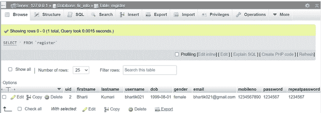*****

*****登录后，数据库看起来像下面的输出。*****

*****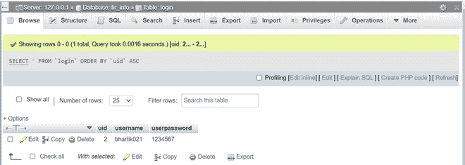*****

*****投诉 FIR 后，数据库如下所示。*****

*****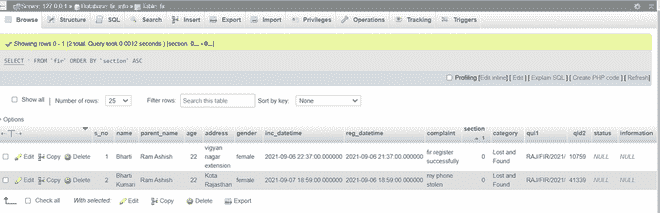*****

*******输出:**要运行输出，您必须在浏览器的网址栏中输入*“本地主机/在线航班/*“T4”。*****

**********

*******github link:**[https://github . com/bhartik 021/online fir](https://github.com/bhartik021/onlineFIR)*****