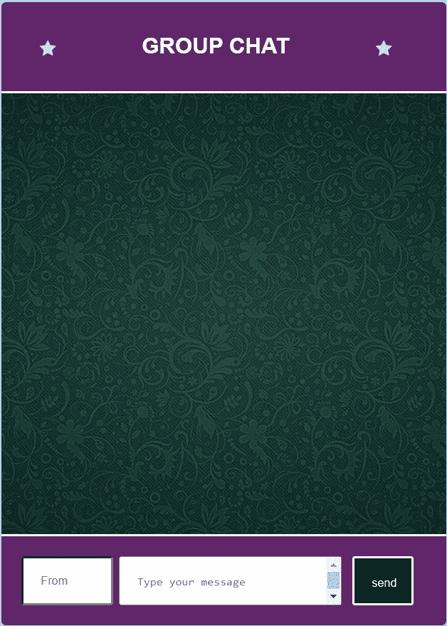
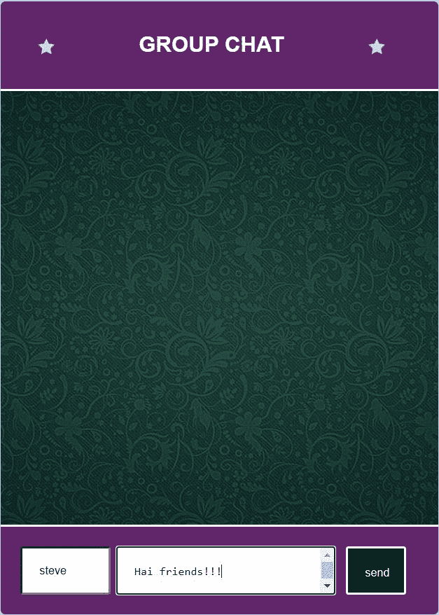
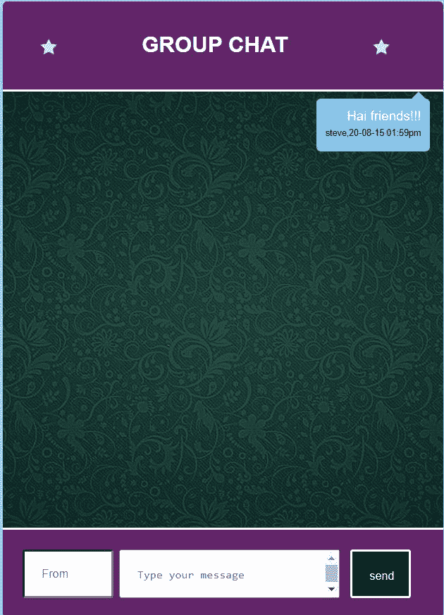
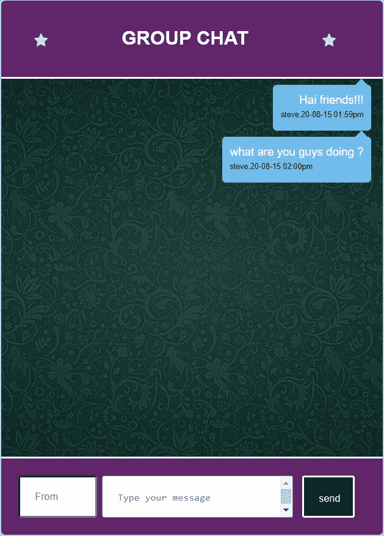
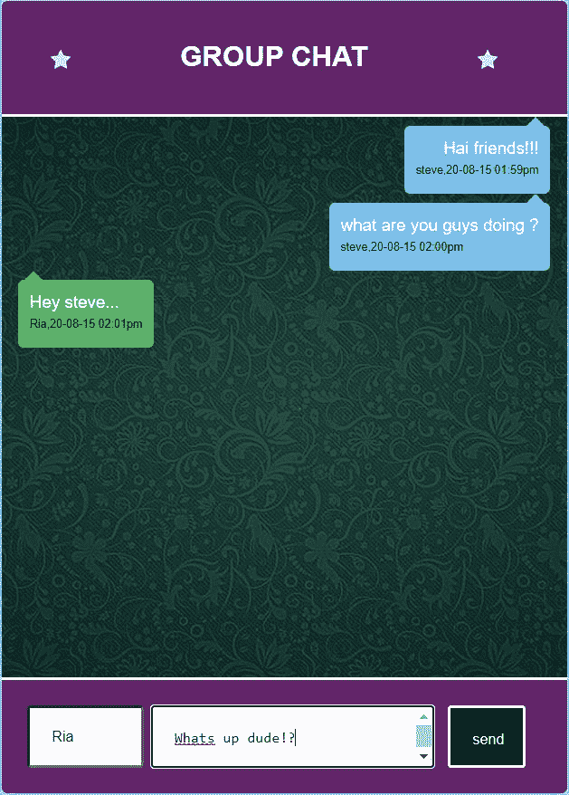
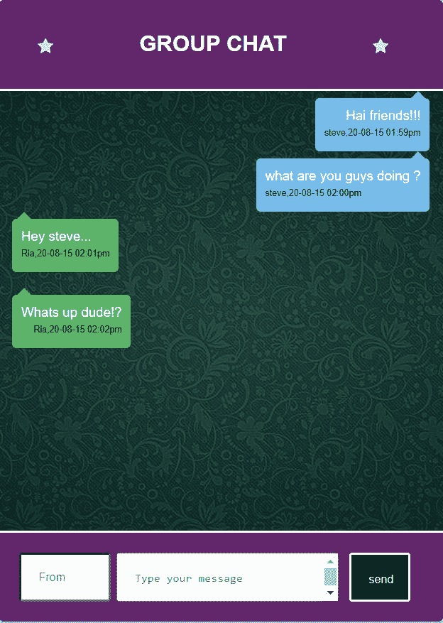

# 使用 PHP 的在线群聊应用

> 原文:[https://www . geesforgeks . org/online-group-chat-application-use-PHP/](https://www.geeksforgeeks.org/online-group-chat-application-using-php/)

**先决条件:**
**技术知识:**

*   超文本标记语言
*   半铸钢ˌ钢性铸铁(Cast Semi-Steel)
*   Javascript(基础)
*   数据库连接
*   SQL 查询

**待安装软件:**

*   **XAMPP 服务器:**这是一个包含网页服务器 Apache 的免费软件，数据库管理系统为 MySQL(或 MariaDB)。可以从[官方网站](https://www.apachefriends.org/download.html)免费下载。
*   **phpmyadmin:** 是一款免费的开源软件，用于管理 MySQL 和 MariaDB。你可以从[官方网站](https://www.phpmyadmin.net/downloads/)下载。下载的 zip 文件必须粘贴在以下位置。

> C:\xampp\htdocs

*   将文件解压到其他任何地方都不会很好。只要把里面的东西拉开就够了。
*   **文本编辑器:**任何像记事本++或者普通记事本这样的文本编辑器都足以实现这一点。
*   **浏览器:**任何启用的 JavaScript 都足以运行代码。

**群聊应用程序:**这是一个简单的群聊应用程序，演示您在 **WhatsApp** messenger 中看到的那个与本地主机服务器的想法。多个用户可以来这里分享他们的观点。MySQL 数据库存储聊天记录并有效地检索它。为了成功地实现这个应用程序，我们必须构建用于设计用户界面样式的 CSS 和 JavaScript，用于呈现用户界面的 HTML 部分，以及用于存储和检索数据库的 PHP 代码。该应用程序将包含两个字段，即用户名和文本消息。最先发短信的用户的信息将被排列在聊天室的右侧，其他人的信息将被排列在左侧。让我们看看实现。

**CSS:** 将它放在*样式*标签下或者外部样式表文件中并链接它。这个 CSS 文件包括聊天室、短信和聊天气泡的样式。

## 超文本标记语言

```html
<style>
*{
    box-sizing:border-box;
}
body{
    background-color:#abd9e9;
    font-family:Arial;
}
#container{
    width:500px;
    height:700px;
    background:white;
    margin:0 auto;
    font-size:0;
    border-radius:5px;
    overflow:hidden;
}
main{
    width:500px;
    height:700px;
    display:inline-block;
    font-size:15px;
    vertical-align:top;
}
main header{
    height:100px;
    padding:30px 20px 30px 40px;
    background-color:#622569;  
}
main header > *{
    display:inline-block;
    vertical-align:top;
}
main header img:first-child{
    width:24px;
    margin-top:8px;
}  
main header img:last-child{
    width:24px;
    margin-top:8px;
}
main header div{
    margin-left:90px;
    margin-right:90px;
}
main header h2{
    font-size:25px;
    margin-top:5px;
    text-align:center;
    color:#FFFFFF;  
}
main .inner_div{
    padding-left:0;
    margin:0;
    list-style-type:none;
    position:relative;
    overflow:auto;
    height:500px;
    background-image:url(
https://media.geeksforgeeks.org/wp-content/cdn-uploads/20200911064223/bg.jpg);
    background-position:center;
    background-repeat:no-repeat;
    background-size:cover;
    position: relative;
    border-top:2px solid #fff;
    border-bottom:2px solid #fff;

}
main .triangle{
    width: 0;
    height: 0;
    border-style: solid;
    border-width: 0 8px 8px 8px;
    border-color: transparent
    transparent #58b666 transparent;
    margin-left:20px;
    clear:both;
}
main .message{
    padding:10px;
    color:#000;
    margin-left:15px;
    background-color:#58b666;
    line-height:20px;
    max-width:90%;
    display:inline-block;
    text-align:left;
    border-radius:5px;
    clear:both;
}
main .triangle1{
    width: 0;
    height: 0;
    border-style: solid;
    border-width: 0 8px 8px 8px;
    border-color: transparent
   transparent #6fbced transparent;
    margin-right:20px;
    float:right;
    clear:both;
}
main .message1{
    padding:10px;
    color:#000;
    margin-right:15px;
    background-color:#6fbced;
    line-height:20px;
    max-width:90%;
    display:inline-block;
    text-align:left;
    border-radius:5px;
    float:right;
    clear:both;
}
main .triangle2{
    width: 0;
    height: 0;
    border-style: solid;
    border-width: 0 8px 8px 8px;
    border-color: transparent
    transparent #58b666 transparent;
    margin-left:20px;
    clear:both
}
main .message2{
    padding:10px;
    color:#000;
    margin-left:15px;
    background-color:#58b666;
    line-height:20px;
    max-width:90%;
    display:inline-block;
    text-align:left;
    border-radius:5px;
    clear:both
}
main footer{
    height:150px;
    padding:20px 30px 10px 20px;
    background-color:#622569;
}
main footer .input1{
    resize:none;
    border:100%;
    display:block;
    width:120%;
    height:55px;
    border-radius:3px;
    padding:20px;
    font-size:13px;
    margin-bottom:13px;
}
main footer textarea{
    resize:none;
    border:100%;
    display:block;
    width:140%;
    height:55px;
    border-radius:3px;
    padding:20px;
    font-size:13px;
    margin-bottom:13px;
    margin-left:20px;
}
main footer .input2{
    resize:none;
    border:100%;
    display:block;
    width:40%;
    height:55px;
    border-radius:3px;
    padding:20px;
    font-size:13px;
    margin-bottom:13px;
    margin-left:100px;
    color:white;
    text-align:center;
    background-color:black;
    border: 2px solid white; 
}
}
main footer textarea::placeholder{
    color:#ddd;
}
</style>
```

**数据库创建:**打开电脑中的 XAMPP 控制面板，点击 Apache 和 MySQL 的开始按钮。这一步对于创建数据库和运行应用程序非常重要。打开浏览器(大多是 Internet Explorer)。在搜索栏上，键入下面给出的行。

> localhost/phpmyadmin

它将打开一个选项卡，您可以在其中创建数据库。对于这个应用程序，创建了一个名为 *chat_app* 的数据库。创建了一个名为*的表，该表与字段*“uname”、“msg”、“dt”*进行聊天。这里*“uname”*是 varchar 类型，表示用户名，“msg”也是 varchar 类型，表示发送的消息，“dt”表示日期时间(设置为 varchar 类型，用于格式化)，用于存储消息发送的时间。*

**用于存储在 MySQL 数据库中的 PHP 代码:**要在用户每次按下“发送”按钮时插入聊天记录，请在初始 HTML 标记之前编写该代码。尝试 MySQL 服务器连接。假设您运行的是默认设置的 MySQL 服务器(用户“root”没有密码)。

## 服务器端编程语言（Professional Hypertext Preprocessor 的缩写）

```html
<?php
    if (isset($_POST['submit'])){

    $link = mysqli_connect("localhost",
                "root", "", "chat_app");

    // Check connection
    if($link === false){
        die("ERROR: Could not connect. "
                . mysqli_connect_error());
    }

    // Escape user inputs for security
    $un= mysqli_real_escape_string(
            $link, $_REQUEST['uname']);
    $m = mysqli_real_escape_string(
            $link, $_REQUEST['msg']);

    date_default_timezone_set('Asia/Kolkata');
    $ts=date('y-m-d h:ia');

    // Attempt insert query execution
    $sql = "INSERT INTO chats (uname, msg, dt)
                VALUES ('$un', '$m', '$ts')";
    if(mysqli_query($link, $sql)){
        ;
    } else{
        echo "ERROR: Message not sent!!!";
    }

    // Close connection
    mysqli_close($link);
}
?>
```

**获取和对齐聊天室消息的 PHP 和 HTML 代码:**在这个聊天应用程序中，第一个用户的聊天被对齐到右侧。如果下一条消息也来自同一个用户，它也将与聊天室的右侧对齐。如果消息来自任何其他用户，则该消息将被对齐到左侧。下面给出了实现这一点的 PHP 函数。由于要使用 PHP 函数执行的动作写在同一个文件上，在 **<表单>** 标签中，*动作*被设置为同一个文件的名称。(Group_chat.php)

## 服务器端编程语言（Professional Hypertext Preprocessor 的缩写）

```html
<body onload="show_func()">
<div id="container">
    <main>
        <header>
            
            <div>
                <h2>GROUP CHAT</h2>
            </div>
            
        </header>

<script>
function show_func(){

 var element = document.getElementById("chathist");
    element.scrollTop = element.scrollHeight;

 }
 </script>

<form id="myform" action="Group_chat.php" method="POST" >
<div class="inner_div" id="chathist">
<?php
$host = "localhost";
$user = "root";
$pass = "";
$db_name = "chat_app";
$con = new mysqli($host, $user, $pass, $db_name);

$query = "SELECT * FROM chats";
 $run = $con->query($query);
 $i=0;

 while($row = $run->fetch_array()) :
 if($i==0){
 $i=5;
 $first=$row;
 ?>
 <div id="triangle1" class="triangle1"></div>
 <div id="message1" class="message1">
 <span style="color:white;float:right;">
  <?php echo $row['msg']; ?>
 </span> <br/>
 <div>
  <span style="color:black;float:left;
   font-size:10px;clear:both;">
   <?php echo $row['uname']; ?>, <?php echo $row['dt']; ?>
 </span>
 </div>
</div>
<br/><br/>
 <?php
 }
else
{
if($row['uname']!=$first['uname'])
{
?>
 <div id="triangle" class="triangle"></div>
 <div id="message" class="message">
 <span style="color:white;float:left;">
 <?php echo $row['msg']; ?></span> <br/>
 <div>
  <span style="color:black;float:right;
          font-size:10px;clear:both;">
   <?php echo $row['uname']; ?>,
        <?php echo $row['dt']; ?>
 </span>
</div>
</div>
<br/><br/>
<?php
}
else
{
?>
 <div id="triangle1" class="triangle1"></div>
 <div id="message1" class="message1">
 <span style="color:white;float:right;">
 <?php echo $row['msg']; ?></span> <br/>
 <div>
  <span style="color:black;float:left;
          font-size:10px;clear:both;">
    <?php echo $row['uname']; ?>,
        <?php echo $row['dt']; ?>
  </span>
</div>
</div>
<br/><br/>
<?php
}
}
endwhile; ?>
</div>
    <footer>
        <table>
         <tr>
             <th>
              <input  class="input1" type="text" id="uname"
               name="uname" placeholder="From"></input>
              </th>
              <th>
              <textarea id="msg" name="msg" rows='3'
               cols='50' placeholder="Type your message">
             </textarea>
              </th>
              <th>
              <input class="input2" type="submit" id="submit"
              name="submit" value="send"></input>
              </th>               
        </tr>
        </table>               
    </footer>
</form>
</main>   
</div>

</body>
```

现在把 CSS、JavaScript、PHP 和 HTML 部分放在一起，下面给出整个代码。保存为 *Group_chat.php*

## 服务器端编程语言（Professional Hypertext Preprocessor 的缩写）

```html
<?php
if (isset($_POST['submit'])){
/* Attempt MySQL server connection. Assuming
you are running MySQL server with default
setting (user 'root' with no password) */
$link = mysqli_connect("localhost",
            "root", "", "chat_app");

// Check connection
if($link === false){
    die("ERROR: Could not connect. "
          . mysqli_connect_error());
}

// Escape user inputs for security
$un= mysqli_real_escape_string(
      $link, $_REQUEST['uname']);
$m = mysqli_real_escape_string(
      $link, $_REQUEST['msg']);
date_default_timezone_set('Asia/Kolkata');
$ts=date('y-m-d h:ia');

// Attempt insert query execution
$sql = "INSERT INTO chats (uname, msg, dt)
        VALUES ('$un', '$m', '$ts')";
if(mysqli_query($link, $sql)){
    ;
} else{
    echo "ERROR: Message not sent!!!";
}
 // Close connection
mysqli_close($link);
}
?>
<html>
<head>
<style>
*{
    box-sizing:border-box;
}
body{
    background-color:#abd9e9;
    font-family:Arial;
}
#container{
    width:500px;
    height:700px;
    background:white;
    margin:0 auto;
    font-size:0;
    border-radius:5px;
    overflow:hidden;
}
main{
    width:500px;
    height:700px;
    display:inline-block;
    font-size:15px;
    vertical-align:top;
}
main header{
    height:100px;
    padding:30px 20px 30px 40px;
    background-color:#622569;  
}
main header > *{
    display:inline-block;
    vertical-align:top;
}
main header img:first-child{
    width:24px;
    margin-top:8px;
}  
main header img:last-child{
    width:24px;
    margin-top:8px;
}
main header div{
    margin-left:90px;
    margin-right:90px;
}
main header h2{
    font-size:25px;
    margin-top:5px;
    text-align:center;
    color:#FFFFFF;  
}
main .inner_div{
    padding-left:0;
    margin:0;
    list-style-type:none;
    position:relative;
    overflow:auto;
    height:500px;
    background-image:url(
https://media.geeksforgeeks.org/wp-content/cdn-uploads/20200911064223/bg.jpg);
    background-position:center;
    background-repeat:no-repeat;
    background-size:cover;
    position: relative;
    border-top:2px solid #fff;
    border-bottom:2px solid #fff;

}
main .triangle{
    width: 0;
    height: 0;
    border-style: solid;
    border-width: 0 8px 8px 8px;
    border-color: transparent transparent
      #58b666 transparent;
    margin-left:20px;
    clear:both;
}
main .message{
    padding:10px;
    color:#000;
    margin-left:15px;
    background-color:#58b666;
    line-height:20px;
    max-width:90%;
    display:inline-block;
    text-align:left;
    border-radius:5px;
    clear:both;
}
main .triangle1{
    width: 0;
    height: 0;
    border-style: solid;
    border-width: 0 8px 8px 8px;
    border-color: transparent
      transparent #6fbced transparent;
    margin-right:20px;
    float:right;
    clear:both;
}
main .message1{
    padding:10px;
    color:#000;
    margin-right:15px;
    background-color:#6fbced;
    line-height:20px;
    max-width:90%;
    display:inline-block;
    text-align:left;
    border-radius:5px;
    float:right;
    clear:both;
}

main footer{
    height:150px;
    padding:20px 30px 10px 20px;
    background-color:#622569;
}
main footer .input1{
    resize:none;
    border:100%;
    display:block;
    width:120%;
    height:55px;
    border-radius:3px;
    padding:20px;
    font-size:13px;
    margin-bottom:13px;
}
main footer textarea{
    resize:none;
    border:100%;
    display:block;
    width:140%;
    height:55px;
    border-radius:3px;
    padding:20px;
    font-size:13px;
    margin-bottom:13px;
    margin-left:20px;
}
main footer .input2{
    resize:none;
    border:100%;
    display:block;
    width:40%;
    height:55px;
    border-radius:3px;
    padding:20px;
    font-size:13px;
    margin-bottom:13px;
    margin-left:100px;
    color:white;
    text-align:center;
    background-color:black;
    border: 2px solid white; 
}
}
main footer textarea::placeholder{
    color:#ddd;
}

</style>
<body onload="show_func()">
<div id="container">
    <main>
        <header>
            
            <div>
                <h2>GROUP CHAT</h2>
            </div>
            
        </header>

<script>
function show_func(){

 var element = document.getElementById("chathist");
    element.scrollTop = element.scrollHeight;

 }
 </script>

<form id="myform" action="Group_chat.php" method="POST" >
<div class="inner_div" id="chathist">
<?php
$host = "localhost";
$user = "root";
$pass = "";
$db_name = "chat_app";
$con = new mysqli($host, $user, $pass, $db_name);

$query = "SELECT * FROM chats";
 $run = $con->query($query);
 $i=0;

 while($row = $run->fetch_array()) :
 if($i==0){
 $i=5;
 $first=$row;
 ?>
 <div id="triangle1" class="triangle1"></div>
 <div id="message1" class="message1">
 <span style="color:white;float:right;">
 <?php echo $row['msg']; ?></span> <br/>
 <div>
   <span style="color:black;float:left;
   font-size:10px;clear:both;">
    <?php echo $row['uname']; ?>,
        <?php echo $row['dt']; ?>
   </span>
</div>
</div>
<br/><br/>
 <?php
 }
else
{
if($row['uname']!=$first['uname'])
{
?>
 <div id="triangle" class="triangle"></div>
 <div id="message" class="message">
 <span style="color:white;float:left;">
   <?php echo $row['msg']; ?>
 </span> <br/>
 <div>
  <span style="color:black;float:right;
          font-size:10px;clear:both;">
  <?php echo $row['uname']; ?>,
        <?php echo $row['dt']; ?>
 </span>
</div>
</div>
<br/><br/>
<?php
}
else
{
?>
 <div id="triangle1" class="triangle1"></div>
 <div id="message1" class="message1">
 <span style="color:white;float:right;">
  <?php echo $row['msg']; ?>
 </span> <br/>
 <div>
 <span style="color:black;float:left;
         font-size:10px;clear:both;">
 <?php echo $row['uname']; ?>,
      <?php echo $row['dt']; ?>
 </span>
</div>
</div>
<br/><br/>
<?php
}
}
endwhile;
?>
</div>
    <footer>
        <table>
        <tr>
           <th>
            <input  class="input1" type="text"
                    id="uname" name="uname"
                    placeholder="From">
           </th>
           <th>
            <textarea id="msg" name="msg"
                rows='3' cols='50'
                placeholder="Type your message">
            </textarea></th>
           <th>
            <input class="input2" type="submit"
            id="submit" name="submit" value="send">
           </th>               
        </tr>
        </table>               
    </footer>
</form>
</main>   
</div>

</body>
</html>
```

**运行代码的步骤:**

*   将上面的文件保存为**新文件夹中的*群聊. php* 。例如，我将文件放在名为*“我的文件”*的文件夹中，该文件夹位于 *htdocs* 文件夹中。**
*   在运行应用程序之前，按照上面给出的步骤创建一个数据库。将数据库命名为 *chat_app* 。将桌子命名为*聊天*。
*   检查 XAMPP 控制面板，确保 Apache 和 MySQL 是否处于运行状态。
*   打开浏览器，输入 *localhost/myfiles* 。该目录的索引将会打开。点击*群聊。*
*   开始发送消息并查看结果

**输出:**



空荡荡的聊天室



用户 1:史蒂夫输入信息，然后点击发送



添加到聊天室的消息



史蒂夫的另一条信息



Ria 输入她的第二条信息



添加到聊天室的消息