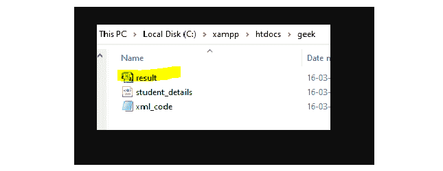
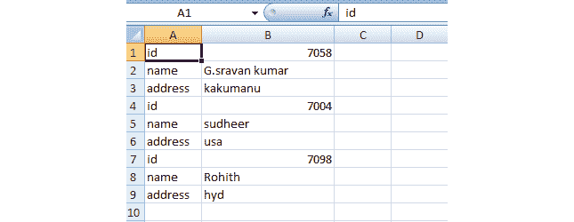

# 将 XML 数据存储到 CSV 中的 PHP 代码

> 原文:[https://www . geesforgeks . org/PHP-code-to-store-XML-data-to-CSV/](https://www.geeksforgeeks.org/php-code-to-store-xml-data-into-csv/)

在本文中，我们将使用 PHPH 将 [XML](https://www.geeksforgeeks.org/xml-basics/) 数据存储到 CSV 文件中。XML 代表一种可扩展标记语言。XML 类似于 HTML，但是在 HTML 中，我们不能定义自己的标签，但是在 XML 中，我们可以定义自己的标签。

**要求:**

[XAMPP 服务器](https://www.geeksforgeeks.org/how-to-install-xampp-on-windows/)。

**XML 的结构:**

```php
<root>
  <child>
    <subchild>.....</subchild>
   </child>
</root>
```

**示例:**我们正在将*学生*的详细信息保存为 *student_data.xml* 文件，并将该数据存储在 CSV 文件中。

```php
<?xml version="1.0" encoding="UTF-8"?> 
<student> 
    <details> 
        <id>7058</id> 
        <name>G.sravan kumar</name> 
        <address>kakumanu</address>
    </details> 
    <details> 
        <id>7004</id> 
        <name>sudheer</name> 
        <address>usa</address>
    </details> 
    <details> 
        <id>7098</id> 
        <name>Rohith</name> 
        <address>hyd</address>
    </details> 
</student>
```

**CSV:** CSV 代表逗号分隔值。

我们将使用一些预定义的函数将 XML 数据存储到 CSV 中。[*file _ exists()*](https://www.geeksforgeeks.org/php-file_exists-function/)*功能用于检查文件或目录是否存在。*

***语法:***

```php
*file_exists(path/filename)*
```

*   **路径*是文件存在的路径。*
*   **文件名*是文件的名称。*

*[**【Simplexml _ load _ file()】**](https://www.geeksforgeeks.org/php-simplexml_load_file-function/)**函数:***SimpleXML _ load _ file()*函数用于将 XML 文档转换为对象。*

***语法:***

```php
*simplexml_load_file(file)*
```

*   **文件*是文件名*

*[**fopen()功能:**](https://www.geeksforgeeks.org/php-fopen-function-open-file-or-url/) 用于打开文件。*

***语法:***

```php
*fopen(filename, mode)*
```

*   **文件名*是文件的名称。*
*   *模式有 a(追加)、r(读取模式)、w(写入模式)*

*[**【fclose()】功能:**](https://www.geeksforgeeks.org/php-fclose-function/) 该功能用于关闭打开的文件。*

***语法:***

```php
*fclose(file_pointer)*
```

***[**fputcsv()函数:**](https://www.geeksforgeeks.org/php-fputcsv-function/)**fputcsv()函数用于将一行格式化为 csv(逗号分隔值)文件，并将其写入打开的文件。必须读取的文件和字段作为参数发送给 fputcsv()函数，它在成功时返回写入字符串的长度，在失败时返回 FALSE。*

***语法:***

```php
*fputcsv(file, fields, separator)*
```

*   ***文件:**用于指定要写入的打开文件。*
*   ***字段:**需要指定从哪个数组获取数据。*
*   ***分隔符:**是指定字段分隔符的字符。默认值为逗号(，)*

***步骤:***

*   *启动 XAMPP 服务器。*

**

*   *打开记事本，创建 XML 代码，保存为 *xampp/htdocs/geek* 文件夹中的 *student_details.xml* 。*
*   *打开记事本，创建 PHP 代码，保存为 *xampp/htdocs/geek* 文件夹中的 *xml_code.php* 。*

***XML 数据:**以下是文件*的内容**

## *学生详细信息. xml*

```php
*<?xml version="1.0" encoding="UTF-8"?> 
<student> 
    <details> 
        <id>7058</id> 
        <name>G.sravan kumar</name> 
        <address>kakumanu</address>
    </details> 
    <details> 
        <id>7004</id> 
        <name>sudheer</name> 
        <address>usa</address>
    </details> 
    <details> 
        <id>7098</id> 
        <name>Rohith</name> 
        <address>hyd</address>
    </details> 
</student>*
```

***PHP 代码:****以下是文件*的内容****

## ***服务器端编程语言（Professional Hypertext Preprocessor 的缩写）***

```php
***<?php

// Open xml file that is present in
// your folder
$xmldata = 'student_details.xml';

// Check if your file mentioned above
// is exists or not
if (file_exists($xmldata)) {

    // If file exists then load your xml
    // data using simplexml_load_file
    // function
    $xml_data = simplexml_load_file($xmldata);

    // Open xml file using fopen in write
    // mode and download the data as
    // result.csv
    $i = fopen('result.csv', 'w');

    // Function call 
    Csv($xml_data, $i);

    // Closing file
    fclose($i);
}

// Function to create csv file
function Csv($xml_data, $i) {

    // Count data for data present in
    // xml using children function
    foreach ($xml_data->children() as $data) {
        $hasChild = (count($data->children()) 
                        > 0) ? true : false;

        // Data is present, then store into
        // csv by using fputcsv function
        if( ! $hasChild) {
            $arr = array($data->getName(),$data); 
            fputcsv($i, $arr ,',','"');
        }
        else {

            // Call function
            Csv($data, $i);
        }
    }
}
?>***
```

***打开浏览器，在地址栏中输入*<u>localhost/geek/XML _ code . PHP</u>*路径。
***

***转到您的文件夹，您将看到 CSV 文件已经创建。***

******

*****输出:**打开 CSV 文件时，显示如下输出。***

***

CSV 文件***