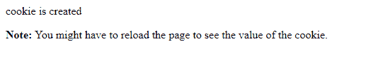
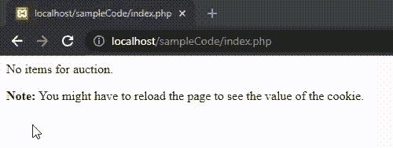
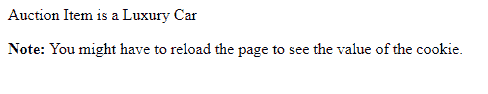
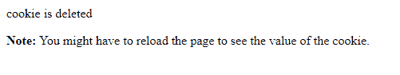

# PHP cookie

> 原文:[https://www.geeksforgeeks.org/php-cookies/](https://www.geeksforgeeks.org/php-cookies/)

PHP 中的 **cookie** 是一个最大大小为 4KB 的小文件，由网络服务器存储在客户端计算机上。它们通常用于跟踪信息，如用户下次访问网站时，网站可以检索用户名来个性化页面。cookie 只能从发出它的域中读取。cookie 通常设置在 HTTP 头中，但是 JavaScript 也可以直接在浏览器上设置 cookie。

**在 PHP 中设置 Cookie**:在 PHP 中设置 Cookie，使用 **setcookie()** 功能。setcookie()函数需要在脚本生成任何输出之前调用，否则不会设置 cookie。

**语法:**

```
setcookie(name, value, expire, path, domain, security);
```

**参数:**setcookie()函数通常需要六个参数，它们是:

*   **名称:**用于设置 cookie 的名称。
*   **值:**用于设置 cookie 的值。
*   **Expire:** 用于设置 cookie 的过期时间戳，过期后 cookie 无法访问。
*   **路径:**用于指定服务器上 cookie 可用的路径。
*   **域:**用于指定 cookie 可用的域。
*   **安全:**用于表示只有存在安全的 HTTPS 连接时，才应该发送 cookie。

下面是一些可以在 PHP 中对 Cookies 执行的操作:

*   **创建 cookie**:创建一个名为 Auction_Item 的 cookie，并为其赋值“豪华车”。cookie 将在 2 天后过期(2 天* 24 小时* 60 分钟* 60 秒)。

**示例:**这个示例描述了 PHP 中 cookie 的创建。

## 服务器端编程语言（Professional Hypertext Preprocessor 的缩写）

```
<!DOCTYPE html>
<?php
    setcookie("Auction_Item", "Luxury Car", time() + 2 * 24 * 60 * 60);
?>
<html>
<body>
    <?php
        echo "cookie is created."
    ?>
    <p>
        <strong>Note:</strong> 
        You might have to reload the 
        page to see the value of the cookie.
    </p>

</body>
</html>
```

**注意:**只有 setcookie()函数中的 name 参数是强制的。若要跳过参数，可以用空字符串("")替换该参数。

**输出:**



PHP 中的 Cookie 创建

**检查是否设置了 cookie**:在访问 Cookie 的值之前，最好检查是否设置了 Cookie。因此，为了检查是否设置了 cookie，使用了 PHP isset()函数。要检查是否设置了 cookie“拍卖项目”，is set()函数的执行如下:

**示例:**此示例描述了检查 cookie 是否已设置。

## 服务器端编程语言（Professional Hypertext Preprocessor 的缩写）

```
<!DOCTYPE html>
<?php
    setcookie("Auction_Item", "Luxury Car", time() + 2 * 24 * 60 * 60);
?>
<html>
<body>
    <?php
    if (isset($_COOKIE["Auction_Item"]))
    {
        echo "Auction Item is a  " . $_COOKIE["Auction_Item"];
    }
    else
    {
        echo "No items for auction.";
    }
    ?>
    <p>
        <strong>Note:</strong>
        You might have to reload the page 
        to see the value of the cookie.
    </p>

</body>
</html>
```

**输出:**



正在检查要设置的 cookie

**访问 cookie 值**:对于访问 Cookie 值，使用 PHP $_COOKIE 超全局变量。它是一个关联数组，包含浏览器在当前请求中发送的所有 cookies 值的记录。记录存储为一个列表，其中 cookie 名称用作密钥。要访问名为“拍卖项目”的 cookie，可以执行以下代码。

**示例:**本示例描述了访问&修改 cookie 值。

## 服务器端编程语言（Professional Hypertext Preprocessor 的缩写）

```
<!DOCTYPE html>
<?php
    setcookie("Auction_Item", "Luxury Car", time() + 2 * 24 * 60 * 60);
?>
<html>
<body>
<?php
    echo "Auction Item is a  " . $_COOKIE["Auction_Item"];
?>
    <p>
        <strong>Note:</strong> 
        You might have to reload the page
        to see the value of the cookie.
    </p>

</body>
</html>
```

**输出:**



访问 Cookie 值

**删除 cookie**:setcookie()功能可以用来删除一个 cookie。对于删除 cookie，通过传递 cookie 名称和其他参数或空字符串来调用 setcookie()函数，但是这一次，到期日期需要设置在过去。要删除名为“拍卖项目”的 cookie，可以执行以下代码。

**示例:**该示例描述了 cookie 值的删除。

## 服务器端编程语言（Professional Hypertext Preprocessor 的缩写）

```
<!DOCTYPE html>
<?php
    setcookie("Auction_Item", "Luxury Car", time() + 2 * 24 * 60 * 60);
?>
<html>
<body>
    <?php
       setcookie("Auction_Item", "", time() - 60);
    ?>
    <?php
        echo "cookie is deleted"
    ?>
    <p>
        <strong>Note:</strong>
        You might have to reload the page 
        to see the value of the cookie.
    </p>

</body>
</html>
```

**输出:**



删除 Cookie

**要点:**

*   如果 cookie 的过期时间设置为 0 或省略，cookie 将在会话结束时过期，即浏览器关闭时。
*   应该传递用于创建 cookie 的相同路径、域和其他参数，以确保删除正确的 cookie。

PHP 是一种专门为 web 开发设计的服务器端脚本语言。您可以通过以下 [PHP 教程](https://www.geeksforgeeks.org/php-tutorials/)和 [PHP 示例](https://www.geeksforgeeks.org/php-examples/)从头开始学习 PHP。