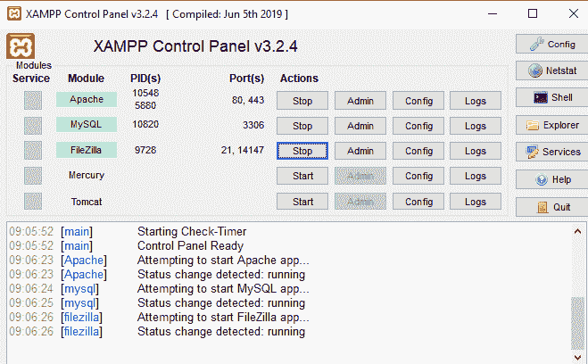
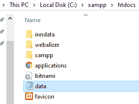
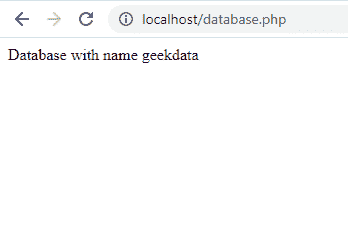
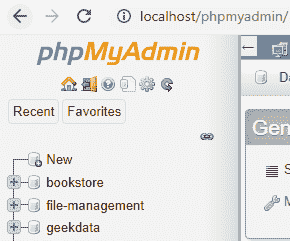

# PHP 数据库连接

> Original: [https://www.geeksforgeeks.org/php-database-connection/](https://www.geeksforgeeks.org/php-database-connection/)

相关数据的集合称为数据库。 XAMPP 代表跨平台、Apache、MySQL、PHP 和 Perl。 它是用于网站开发的简单的轻量级本地服务器之一。

**要求：**XAMPP Web 服务器流程：

*   通过启动 Apache 和 MySQL 启动 XAMPP 服务器。
*   编写用于连接到 XAMPP 的 PHP 脚本。
*   在本地浏览器中运行它。
*   成功创建了基于 PHP 代码的数据库。

在 PHP 中，我们可以使用以下路径使用 XAMPP web 服务器连接到数据库。

```
"localhost/phpmyadmin"
```

**详细步骤：**

*   打开 XAMPP 并开始运行 Apache、MySQL 和 FileZilla
    

*   Now open your PHP file and write your PHP code to create database and a table in your database.

    加入时间：清华大学 2007 年 01 月 25 日下午 3：33

    ## PHP

    ```
    <?php

    // Server name must be localhost
    $servername = "localhost";

    // In my case, user name will be root
    $username = "root";

    // Password is empty
    $password = "";

    // Creating a connection
    $conn = new mysqli($servername, 
                $username, $password);

    // Check connection
    if ($conn->connect_error) {
        die("Connection failure: " 
            . $conn->connect_error);
    } 

    // Creating a database named geekdata
    $sql = "CREATE DATABASE geekdata";
    if ($conn->query($sql) === TRUE) {
        echo "Database with name geekdata";
    } else {
        echo "Error: " . $conn->error;
    }

    // Closing connection
    $conn->close();
    ?>
    ```

*   将该文件保存到 XAMPP 文件夹下的*htdocs*文件夹中，名称为“data.php”。
    
*   然后打开 Web 浏览器，键入*localhost/data.php*
    

最后，创建数据库并将其连接到 PHP。

如果您想查看数据库，只需在 Web 浏览器中键入*localhost/phpmyadmin*，即可找到该数据库。

