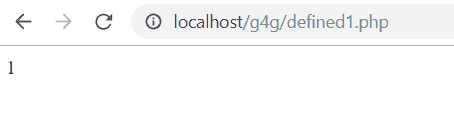
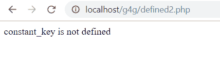

# PHP|Defined()函数

> Original: [https://www.geeksforgeeks.org/php-defined-function/](https://www.geeksforgeeks.org/php-defined-function/)

**PHP Defined()函数**是 PHP 中的一个内置函数，用于检查是否存在一个常量，换句话说，就是检查是否定义了一个常量。

**语法：**

```php
*bool* defined($constant_name);
```

**参数：**此函数接受单个参数，如上所述，如下所述。

*   **$Constant_Name**：必选参数。 它指定常量的名称。

**返回值：**如果常量存在，此函数返回 TRUE，否则返回 FALSE。

**注意：**此函数适用于 PHP 4.0.0 及更新版本。

以下示例说明了该功能：

**示例 1：**

```php
<?php
define("constant_key", "value for the constant key");
echo defined("constant_key");
?>
```

发帖主题：Re：Колибри0.7.0

```php
1

```



**示例 2：**定义常量后使用 IF 条件进行检查。

```php
<?php
define("constant_key", "value for the constant key");
if(defined("constant_key")){
    echo "constant_key is defined";
}else{
    echo "constant_key is not defined";
}
?>
```

发帖主题：Re：Колибри0.7.0

```php
constant_key is defined

```


**示例 3：**在不定义常量的情况下检查 IF 条件。

```php
<?php
//define("constant_key", "value for the constant key");
if(defined("constant_key")){
    echo "constant_key is defined";
}else{
    echo "constant_key is not defined";
}
?>
```

发帖主题：Re：Колибри0.7.0

```php
constant_key is not defined

```

