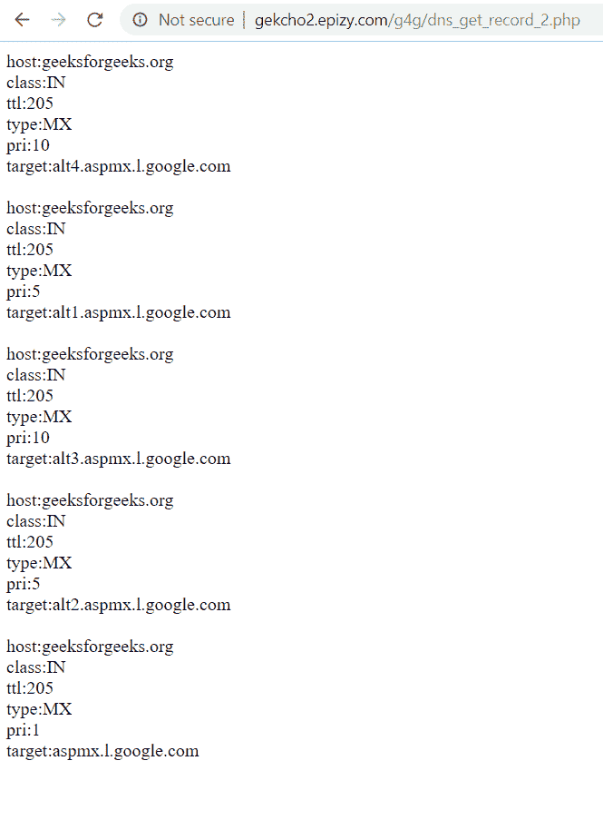
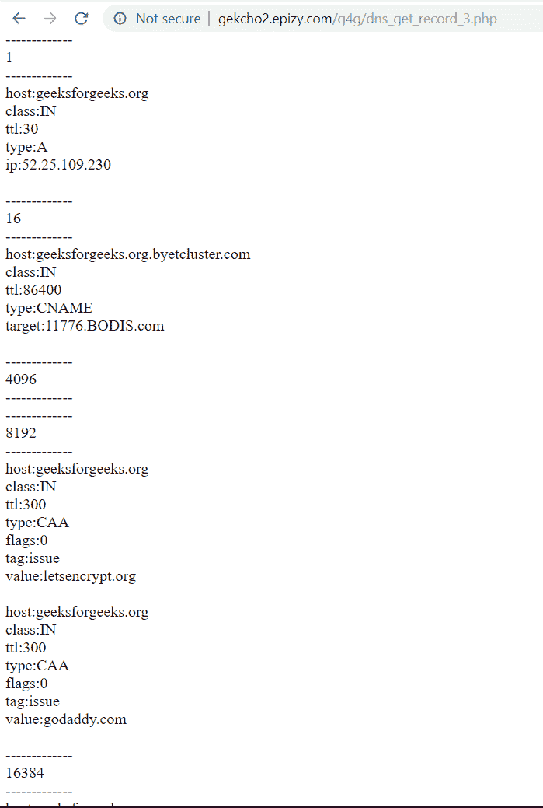

# PHP|dns_get_Records()函数

> Original: [https://www.geeksforgeeks.org/php-dns_get_record-function/](https://www.geeksforgeeks.org/php-dns_get_record-function/)

**dns_get_record()函数**是 PHP 中的内置函数，它返回指定 Internet 主机名的 DNS 资源记录。

**语法：**

```php
dns_get_record($host, $type, $authoritative, $additional, $raw);
```

**参数：**此函数接受上述五个参数，如下所述：

*   **$HOST**：必填参数。 它指定要找到其 DNS 资源记录的主机名。
*   **$type**：可选参数。 它指定要搜索的 DNS 记录的类型。 可能值为
    *   DNA_A
    *   DNA_CNAME
    *   DNS_HINFO
    *   DNA_CAA
    *   DNS_MX
    *   DNA_NS
    *   DNA_PTR
    *   DNA_SOA
    *   DNS_TXT
    *   DNA_AAAA
    *   DNS_SRV
    *   DNA_NAPTR
    *   DNA_A6
    *   DNA_ALL
    *   帖子主题：Re：Колибри
*   **$Authoritative：**可选参数。 它是通过引用传递的，如果设置，它将使用权威名称服务器的资源记录填充。
*   **$Additional：**这是一个可选参数。 它是通过引用传递的，如果设置了任何其他记录，它将被填充。
*   **$RAW：**这是一个可选参数。 布尔参数。 如果设置为 true，则在获取信息内容之前，它只查询请求的类型，而不是逐个类型循环。 False 是默认值。

**返回值：**

*   它返回一个关联数组数组，失败时返回 False。 每个数组至少包含以下键：
    *   **主机：**主机名
    *   **class：**此函数仅返回 Internet 类记录，因此始终返回 IN
    *   **类型：**记录的类型
    *   **ttl：**此记录的剩余“生存时间”(计算方法为原始 ttl 减去自查询服务器以来经过的平均
        个时间长度)

**注意：**此函数适用于 PHP 5.0.0 及更新版本。

**示例 1：**

## PHP

```php
<?php
print_r(dns_get_record("geeksforgeeks.org", DNS_MX));
?>
```

发帖主题：Re：Колибри0.7.0

> Array([0]=>Array([host]=>geeksforgeeks.org[class]=>IN[ttl]=>299[type]=>MX[pri]=>1[target]=>aspmx.l.google.com)[1]=>Array([host]=>geeksforgeeks.org[class]=>IN[ttl]=>299[type]=>MX[pri]=>10[target]=。 ]=>299[type]=>mx[pri]=>10[target]=>alt4.aspmx.l.google.com)[3]=>Array([host]=>geeksforgeeks.org[class]=>IN[ttl]=>299[type]=>mx[pri]=>5[target]=>alt1.aspmx.l.google.com)[4]=>Array([host]=>geeksforgeeks.org

**示例 2：**系统输出

## PHP

```php
<?php
$res=dns_get_record("geeksforgeeks.org", DNS_MX);
foreach($res as $ar){

    foreach($ar as $key=>$val){
            echo $key.":".$val."</br>";
    }
    echo "</br>";
}

?>
```

发帖主题：Re：Колибри0.7.0



**示例 3：***$类型*的所有可能值

## PHP

```php
<?php
$domain="geeksforgeeks.org";
single_type_dns_get_record($domain, DNS_A);
single_type_dns_get_record($domain, DNS_CNAME);
single_type_dns_get_record($domain, DNS_HINFO);
single_type_dns_get_record($domain, DNS_CAA);
single_type_dns_get_record($domain, DNS_MX);
single_type_dns_get_record($domain, DNS_NS);
single_type_dns_get_record($domain, DNS_PTR);
single_type_dns_get_record($domain, DNS_SOA);
single_type_dns_get_record($domain, DNS_TXT);
single_type_dns_get_record($domain, DNS_AAAA);
single_type_dns_get_record($domain, DNS_SRV);
single_type_dns_get_record($domain, DNS_NAPTR);
single_type_dns_get_record($domain, DNS_A6);
single_type_dns_get_record($domain, DNS_ALL);
single_type_dns_get_record($domain, DNS_ANY);

function single_type_dns_get_record($domain, $type){
    echo "-------------<br>".$type."<br>-------------<br>";
    $res=dns_get_record($domain, $type);
    foreach($res as $ar){
        foreach($ar as $key=>$val){
                echo $key.":".$val."</br>";
        }
        echo "</br>";
    }
}

?>
```

发帖主题：Re：Колибри0.7.0



**引用：**[https://www.php.net/manual/en/function.dns-get-record.php](https://www.php.net/manual/en/function.dns-get-record.php)