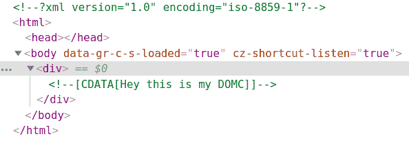
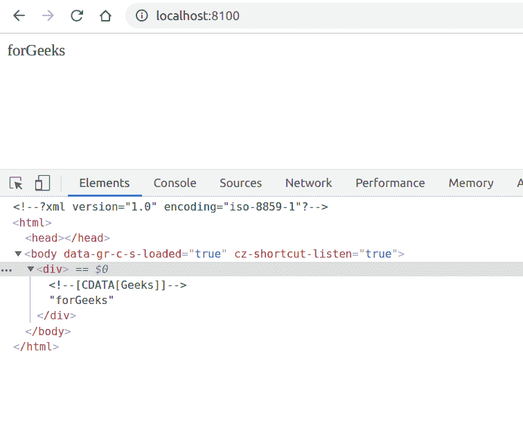

# PHP|DOMCdataSection__struct()函数

> Original: [https://www.geeksforgeeks.org/php-domcdatasection-__construct-function/](https://www.geeksforgeeks.org/php-domcdatasection-__construct-function/)

**DOMCdataSection：：__Construct()函数**是 PHP 中的内置函数，用于构造新的 DOMCdataSection 对象。 Domc 代表 DOM 字符，可以使用[DOMCharacterData](https://www.php.net/manual/en/class.domcharacterdata.php)类的方法进一步操作此部分。 此 CDATA 节点的工作方式类似于[DOMTEXT](https://www.php.net/manual/en/class.domtext.php)类。

**语法：**

```php
*public* DOMCdataSection::__construct( *string* $value )
```

**参数：**此函数接受单个参数**$value**，该参数保存 CDATA 节点的值。

下面给出的程序说明了 PHP 中的**DOMCdataSection：：__Construction()函数**：

**程序 1：**

```php
<?php

// Create a new DOM Document
$dom = new DOMDocument('1.0', 'iso-8859-1');

// Create a div element
$element = $dom->appendChild(new DOMElement('div'));

// Create a DOMCdataSection 
$text = $element->appendChild(
    new DOMCdataSection('Hey this is my DOMC'));

echo $dom->saveXML();
?>
```

**输出：**使用 Chrome Developer 工具查看 HTML 或按 Ctrl+U


**程序 2：**

```php
<?php

// Create a new DOM Document
$dom = new DOMDocument('1.0', 'iso-8859-1');

// Create a div element
$element = $dom->appendChild(new DOMElement('div'));

// Create a DOMCdataSection 
$text = $element->appendChild(
    new DOMCdataSection('GeeksforGeeks'));

// Split the first 5 words
$text->splitText(5);

echo $dom->saveXML();
?>
```

**输出：**


**引用：**[https://www.php.net/manual/en/domcdatasection.construct.php](https://www.php.net/manual/en/domcdatasection.construct.php)