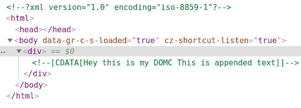
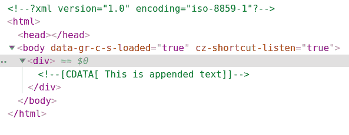

# PHP|DOMCharacterData appendData()函数

> Original: [https://www.geeksforgeeks.org/php-domcharacterdata-appenddata-function/](https://www.geeksforgeeks.org/php-domcharacterdata-appenddata-function/)

**DOMCharacterData：：appendData()函数**是 PHP 中的一个内置函数，用于将字符串附加到节点字符数据的末尾。

**语法：**

```php
*public* DOMCharacterData::appendData( *string* $data )
```

**参数：**此函数接受单个参数**$data**，该参数保存需要追加的字符串。

**返回值：**此函数不返回任何值。

下面给出的程序演示了 PHP 中的**DOMCharacterData：：appendData()函数**：

**程序 1：**

```php
<?php

// Create a new DOM Document
$dom = new DOMDocument('1.0', 'iso-8859-1');

// Create a div element
$element = $dom->appendChild(new DOMElement('div'));

// Create a DOMCdataSection 
$text = $element->appendChild(
        new DOMCdataSection('Hey this is my DOMC'));

// Append data at the end
$text->appendData(' This is appended text');

echo $dom->saveXML();
?>
```

```php
<?xml version="1.0" encoding="iso-8859-1"?>
<div>
    <![CDATA[Hey this is my DOMC This is appended text]]>
</div>
```

**输出：**使用 Chrome Developer 工具查看 HTML 或按 Ctrl+U


**程序 2：**

```php
<?php

// Create a new DOM Document
$dom = new DOMDocument('1.0', 'iso-8859-1');

// Create a div element
$element = $dom->appendChild(new DOMElement('div'));

// Create a DOMCdataSection 
$text = $element->appendChild(
        new DOMCdataSection('DOMC Data'));

// Overwriting by deleting old data
$text->deleteData(0, 9);
$text->appendData(' This is appended text');

echo $dom->saveXML();
?>
```

发帖主题：Re：Колибри0.7.0

```php
<?xml version="1.0" encoding="iso-8859-1"?>
<div><![CDATA[ This is appended text]]></div>
```



**引用：**[https://www.php.net/manual/en/domcharacterdata.appenddata.php](https://www.php.net/manual/en/domcharacterdata.appenddata.php)