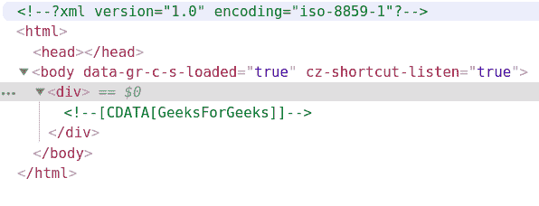
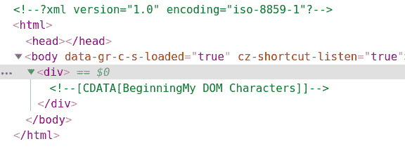
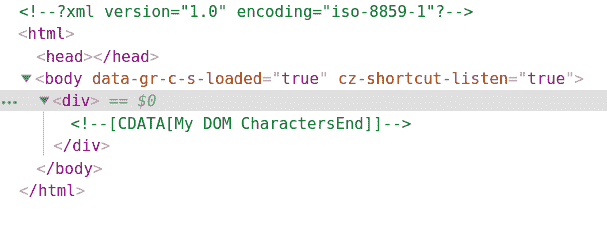

# PHP|DOMCharacterData intertData()函数

> Original: [https://www.geeksforgeeks.org/php-domcharacterdata-insertdata-function/](https://www.geeksforgeeks.org/php-domcharacterdata-insertdata-function/)

**DOMCharacterData：：insert tData()函数**是 PHP 中的一个内置函数，用于在指定的 16 位单位偏移量处插入字符串。

**语法：**

```
*void* DOMCharacterData::insertData( *int* $offset, *string* $data )
```

**参数：**此函数接受上述两个参数，如下所述：

*   **$Offset：**它指定插入数据的起始点。
*   **$data：**它指定要插入的数据。

**返回值：**此函数不返回任何值。

下面给出的程序演示了 PHP 中的**DOMCharacterData：：insert tData()函数**：

**程序 1：**

```
<?php

// Create a new DOM Document
$dom = new DOMDocument('1.0', 'iso-8859-1');

// Create a div element
$element = $dom->appendChild(new DOMElement('div'));

// Create a DOMCdataSection 
$text = $element->appendChild(
        new DOMCdataSection('GeeksGeeks'));

// Insert 'For' between Geeks and Geeks
$text->insertData(5, 'For');

echo $dom->saveXML();
?>
```

发帖主题：Re：Колибри0.7.0

```
<?xml version="1.0" encoding="iso-8859-1"?>
<div><![CDATA[GeeksForGeeks]]></div>
```

使用 Chrome 开发人员工具查看 HTML 或按 Ctrl+U


**程序 2：**

```
<?php

// Create a new DOM Document
$dom = new DOMDocument('1.0', 'iso-8859-1');

// Create a div element
$element = $dom->appendChild(new DOMElement('div'));

// Create a DOMCdataSection 
$text = $element->appendChild(
        new DOMCdataSection('My DOM Characters'));

// Insert in the beginning
$text->insertData(0, 'Beginning');

echo $dom->saveXML();
?>
```

发帖主题：Re：Колибри0.7.0

```
<?xml version="1.0" encoding="iso-8859-1"?>
<div><![CDATA[BeginningMy DOM Characters]]></div>
```



**程序 3：**

```
<?php

// Create a new DOM Document
$dom = new DOMDocument('1.0', 'iso-8859-1');

// Create a div element
$element = $dom->appendChild(new DOMElement('div'));

// Create a DOMCdataSection 
$text = $element->appendChild(
        new DOMCdataSection('My DOM Characters'));

// Insert in the end
$text->insertData(17, 'End');

echo $dom->saveXML();
?>
```

发帖主题：Re：Колибри0.7.0

```
<?xml version="1.0" encoding="iso-8859-1"?>
<div><![CDATA[My DOM CharactersEnd]]></div>
```



**引用：**[https://www.php.net/manual/en/domcharacterdata.insertdata.php](https://www.php.net/manual/en/domcharacterdata.insertdata.php)