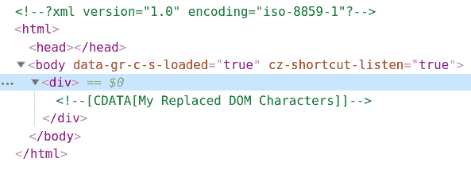
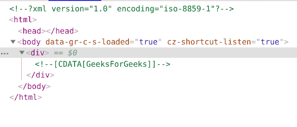

# PHP|DOMCharacterData replaceData()函数

> Original: [https://www.geeksforgeeks.org/php-domcharacterdata-replacedata-function/](https://www.geeksforgeeks.org/php-domcharacterdata-replacedata-function/)

**DOMCharacterData：：replaceData()函数**是 PHP 中的内置函数，用于替换 DOMCharacterData 节点中的子字符串。

**语法：**

```php
*void* DOMCharacterData::replaceData( *int* $offset, *int* $count, *string* $data)
```

**参数：**此函数接受上述三个参数，如下所述：

*   **$OFFSET：**指定删除数据的起始位置。
*   **$count：**它指定要删除的字符数。
*   **$DATA：**它指定必须用来替换范围的字符串。

**返回值：**此函数不返回任何值。

**异常：如果**$OFFSET**为负或大于数据中的 16 位单元数，或者如果**$COUNT**为负，则会引发**DOM_INDEX_SIZE_ERR。

下面给出的程序演示了 PHP 中的**DOMCharacterData：：replaceData()函数**：

**程序 1(从头替换数据)：**

```php
<?php

// Create a new DOM Document
$dom = new DOMDocument('1.0', 'iso-8859-1');

// Create a div element
$element = $dom->appendChild(new DOMElement('div'));

// Create a DOMCdataSection
$text = $element->appendChild(
        new DOMCdataSection('My DOM Characters'));

// Replace the data
$text->replaceData(0, 2, 'My Replaced');

echo $dom->saveXML();
?>
```

发帖主题：Re：Колибри0.7.0

```php
<?xml version="1.0" encoding="iso-8859-1"?>
<div><![CDATA[My Replaced DOM Characters]]></div>
```

使用 Chrome 开发人员工具查看 HTML 或按 Ctrl+U


**程序 2(替换中间的数据)：**

```php
<?php

// Create a new DOM Document
$dom = new DOMDocument('1.0', 'iso-8859-1');

// Create a div element
$element = $dom->appendChild(new DOMElement('div'));

// Create a DOMCdataSection 
$text = $element->appendChild(
        new DOMCdataSection('GeeksErrorGeeks'));

// Replace Data
$text->replaceData(5, 5, 'For');

echo $dom->saveXML();
?>
```

发帖主题：Re：Колибри0.7.0

```php
<?xml version="1.0" encoding="iso-8859-1"?>
<div><![CDATA[GeeksForGeeks]]></div>
```



**引用：**[https://www.php.net/manual/en/domcharacterdata.replacedata.php](https://www.php.net/manual/en/domcharacterdata.replacedata.php)