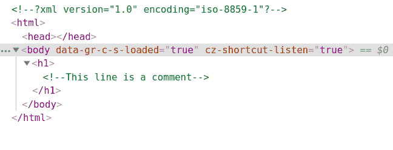
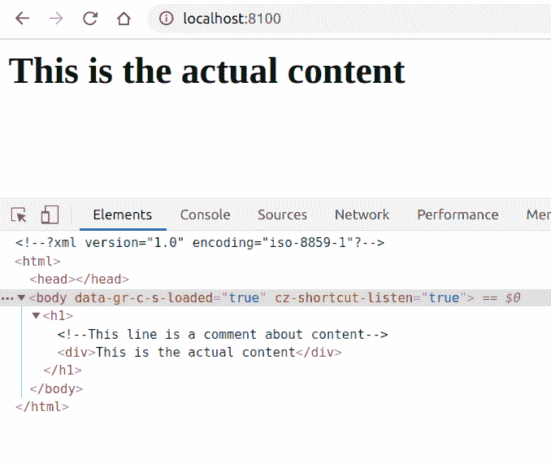

# PHP|DOMComment__Construction()函数

> Original: [https://www.geeksforgeeks.org/php-domcomment-__construct-function/](https://www.geeksforgeeks.org/php-domcomment-__construct-function/)

**DOMComment：：__Construct()函数**是 PHP 中的一个内置函数，用于创建一个新的 DOMComment 对象。 此对象是只读的，可以追加到文档中

**语法：**

```php
*public* DOMComment::__construct( *string* $value)
```

**参数：**此函数接受保存注释的单个参数**$value**。

下面给出的程序演示了 PHP 中的**DOMComment：：__Construct()函数**：

**程序 1(简单注释)：**

```php
<?php

// Create a new DOM Document
$dom = new DOMDocument('1.0', 'iso-8859-1');

// Create a h1 element
$element = $dom->appendChild(new DOMElement('h1'));

// Create a DOMComment
$comment = $element->appendChild(
        new DOMComment('This line is a comment'));

echo $dom->saveXML();
?>
```

发帖主题：Re：Колибри0.7.0

```php
<?xml version="1.0" encoding="iso-8859-1"?>
<h1><!--This line is a comment--></h1>
```



**程序 2(使用带元素的注释)：**

```php
<?php

// Create a new DOM Document
$dom = new DOMDocument('1.0', 'iso-8859-1');

// Create a h1 element
$element = $dom->appendChild(new DOMElement('h1'));

// Create a DOMCdataSection 
$comment = $element->appendChild(new DOMComment(
        'This line is a comment about content'));

// Create a div element
$element = $element->appendChild(new DOMElement(
          'div', 'This is the actual content'));

echo $dom->saveXML();
?>
```

发帖主题：Re：Колибри0.7.0

```php
<?xml version="1.0" encoding="iso-8859-1"?>
<h1><!--This line is a comment about content-->
<div>This is the actual content</div></h1>
```



**引用：**[https://www.php.net/manual/en/domcomment.construct.php](https://www.php.net/manual/en/domcomment.construct.php)