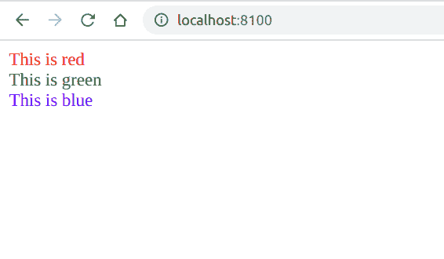

# PHP|DOMDocument createDocumentFragment()函数

> Original: [https://www.geeksforgeeks.org/php-domdocument-createdocumentfragment-function/](https://www.geeksforgeeks.org/php-domdocument-createdocumentfragment-function/)

**DOMDocument：：createDocumentFragment()函数**是 PHP 中的内置函数，用于创建新的文档片段。

**语法：**

```
*DOMDocumentFragment* DOMDocument::createDocumentFragment( *void* )
```

**参数：**此函数不接受任何参数。

**返回值：**此函数返回新的 DOMDocumentFragment，如果出现错误，则返回 False。

下面的程序说明了 PHP 中的**DOMDocument：：createDocumentFragment()函数**：

**程序 1：**在本例中，我们将创建带有片段的标题。

```
<?php

// Create a new DOM Document
$dom = new DOMDocument('1.0', 'iso-8859-1');

// Create a root element
$dom->loadXML("<root/>");

// Create a Fragment
$fragment = $dom->createDocumentFragment();

// Append the XML
$fragment->appendXML(
    "<h1>Heading 1</h1><h2>Heading 2</h2><h3>Heading 3</h3>");

// Append the fragment
$dom->documentElement->appendChild($fragment);

echo $dom->saveXML();
?>
```

发帖主题：Re：Колибри0.7.0

```
<?xml version="1.0"?>
<root><h1>Heading 1</h1><h2>Heading 2</h2><h3>Heading 3</h3></root>
```


**程序 2：**在本例中，我们将创建彩色线条

```
<?php

// Create a new DOM Document
$dom = new DOMDocument('1.0', 'iso-8859-1');

// Create a root element
$dom->loadXML("<root/>");

// Create a Fragment
$fragment = $dom->createDocumentFragment();

// Colors
$colors = ['red', 'green', 'blue'];

for ($i = 0; $i < 3; $i++) {
    // Append the XML
    $fragment->appendXML(
"<div style='color: $colors[$i]'>This is $colors[$i]</div>");

    // Append the fragment
    $dom->documentElement->appendChild($fragment);
}

echo $dom->saveXML();
?>
```

发帖主题：Re：Колибри0.7.0

```
<?xml version="1.0"?>
<root>
    <div style="color: red">This is red</div>
    <div style="color: green">This is green</div>
    <div style="color: blue">This is blue</div>
</root>
```



**引用：**[https://www.php.net/manual/en/domdocument.createdocumentfragment.php](https://www.php.net/manual/en/domdocument.createdocumentfragment.php)