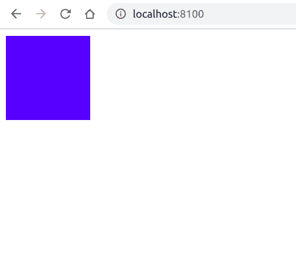

# PHP|DOMDocument registerNodeClass()函数

> Original: [https://www.geeksforgeeks.org/php-domdocument-registernodeclass-function/](https://www.geeksforgeeks.org/php-domdocument-registernodeclass-function/)

**DOMDocument：：registerNodeClass()函数**是 PHP 中的一个内置函数，用于注册用于创建基本节点类型的扩展类。

**语法：**

```
*bool* DOMDocument::registerNodeClass( *string* $baseclass,
                              *string* $extendedclass )
```

**参数：**此函数接受上述两个参数，如下所述：

*   **$baseclass：**它指定要扩展的 DOM 类。
*   **$extdedclass：**它指定扩展的类名。

**返回值：**此函数成功时返回 TRUE，失败时返回 FALSE。

下面给出的程序演示了 PHP 中的**DOMDocument：：registerNodeClass()函数**：

**程序 1：**在此程序中，我们将使用类创建具有 CSS 属性的 HTML div 元素。

```
<?php

// Create a class myElement
class myElement extends DOMElement
{
    // Create a custom function to
    // append the element
    public function appendElement($name)
    {
        return $this->appendChild(new myElement($name));
    }
}

// Create a class myDocoment
class myDocument extends DOMDocument {

    // Create a custom function to set the root
    public function setRoot($name) {
        return $this->appendChild(new myElement($name));
    }
}

// Create a instance of above class
$doc = new myDocument();

// Register the node class
$doc->registerNodeClass('DOMElement', 'myElement');

// Use setRoot created in myDocument class
$root = $doc->setRoot('div');

// Use appendElement created in myElement
$child = $root->appendElement('div');

// Set the attribute
$child->setAttribute('style',
    'background:blue; width:100px;height:100px');

echo $doc->saveXML();
?>
```

**输出：**


**程序 2：**在本程序中，我们将使用类获取标记的文本内容。

```
<?php

class myElement extends DOMElement {

    // Create a custom function to
    // get the value of node
    public function getData() {
        return $this->nodeValue;
    }
}

// Create a new DOMDocument
$doc = new DOMDocument;

// Load the XML
$doc->loadXML(
"<root><div><h1>This is my heading</h1></div></root>");

// Register the node class
$doc->registerNodeClass("DOMElement", "myElement");

// Get the element
$element = $doc->getElementsByTagName("h1")->item(0);

// Use the custom created getData() function
echo $element->getData();
?>
```

发帖主题：Re：Колибри0.7.0

```
This is my heading
```

**引用：**[https://www.php.net/manual/en/domdocument.registernodeclass.php](https://www.php.net/manual/en/domdocument.registernodeclass.php)