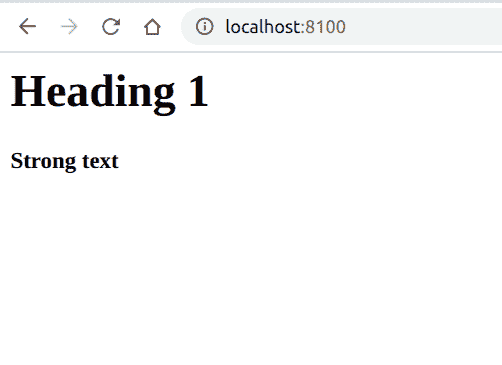
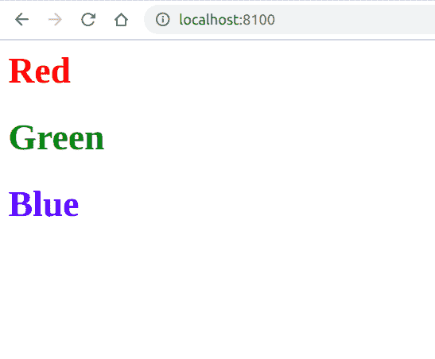

# PHP|DOMDocumentFragment appendXML()函数

> Original: [https://www.geeksforgeeks.org/php-domdocumentfragment-appendxml-function/](https://www.geeksforgeeks.org/php-domdocumentfragment-appendxml-function/)

**DOMDocument：：appendXML()函数**是 PHP 中的一个内置函数，用于将原始 XML 数据附加到 DOMDocumentFragment。

**语法：**

```
*bool* DOMDocumentFragment::appendXML( *string* $data )
```

**参数：**此函数接受单个参数**$data**，该参数保存要追加的 XML。

**返回值：**此函数成功时返回 TRUE，失败时返回 FALSE。

下面给出的程序演示了 PHP 中的**DOMDocument：：appendXML()函数**：

**程序 1：**

```
<?php

// Create a new DOMDocument
$doc = new DOMDocument;

// Load the XML
$doc->loadXML("<root/>");

// Create a Document Fragment
$f = $doc->createDocumentFragment();

// Append the XML to fragment
$f->appendXML(
  "<h1>Heading 1</h1><strong>Strong text</strong>");

// Append the fragment to document
$doc->documentElement->appendChild($f);

// Save the XML
echo $doc->saveXML(); 
?>
```

发帖主题：Re：Колибри0.7.0

```
<?xml version="1.0"?>
<root><h1>Heading 1</h1><strong>Strong text</strong></root>
```



**程序 2：**

```
<?php

// Create a new DOMDocument
$doc = new DOMDocument;

// Load the XML
$doc->loadXML("<root/>");

// Create a Document Fragment
$f = $doc->createDocumentFragment();

// Append the XML to fragment
$f->appendXML("<h1 style=\"color: red\"> Red </h1>");
$f->appendXML("<h1 style=\"color: green\"> Green </h1>");
$f->appendXML("<h1 style=\"color: blue\"> Blue </h1>");

// Append the fragment to document
$doc->documentElement->appendChild($f);

// Save the XML
echo $doc->saveXML(); 
?>
```

发帖主题：Re：Колибри0.7.0

```
<?xml version="1.0"?>
<root>
    <h1 style="color: red"> Red </h1>
    <h1 style="color: green"> Green </h1>
    <h1 style="color: blue"> Blue </h1>
</root>
```



**引用：**[https://www.php.net/manual/en/domdocumentfragment.appendxml.php](https://www.php.net/manual/en/domdocumentfragment.appendxml.php)