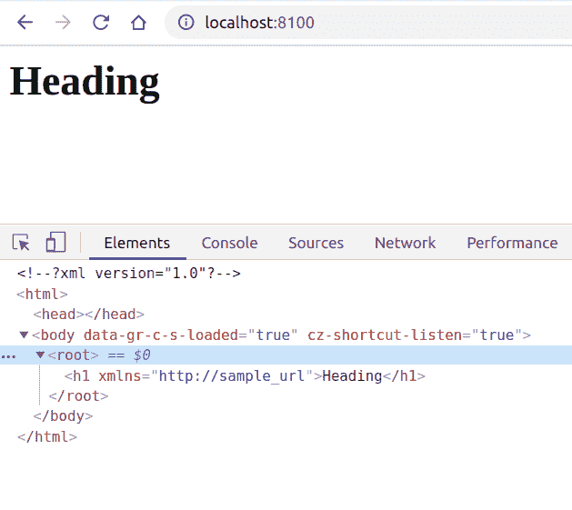
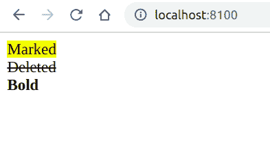

# PHP|DOMElement__Construct()函数

> Original: [https://www.geeksforgeeks.org/php-domelement-__construct-function/](https://www.geeksforgeeks.org/php-domelement-__construct-function/)

**DOMElement：：__Construct()函数**是 PHP 中的内置函数，用于创建新的 DOMElement 对象。 此对象是只读的，可以附加到文档，但在节点与文档关联之前，不能将其他节点附加到此节点。

**语法：**

```
*public* DOMElement::__construct( *string* $name, *string* $value, *string* $namespaceURI )
```

**参数：**此函数接受上述三个参数，如下所述：

*   **$name：**它指定元素的标记名。
*   **$value(可选)：**它指定元素的值。
*   **$nampaceURI(可选)：**它指定在特定名称空间中创建元素的名称空间 URI。

下面给出的程序说明了 PHP 中的**DOMElement：：__Construct()函数**：

**程序 1：**

```
<?php

// Create a new DOMDocument
$dom = new DOMDocument();

// Append a new Child which is a DOMElement
$element = $dom->appendChild(new DOMElement('root'));

// Create another h1 element using
// DOMElement  constructor
$element_new = new DOMElement('h1',
          'Heading', 'http://sample_url');

// Append the child
$element->appendChild($element_new);

// Save the XML
echo $dom->saveXML(); 
?>
```

发帖主题：Re：Колибри0.7.0

```
<?xml version="1.0"?>
<root><h1 xmlns="http://sample_url">Heading</h1></root>
```



**程序 2：**

```
<?php

// Create a new DOMDocument
$dom = new DOMDocument();

// Append a new Child which is a DOMElement
$element = $dom->appendChild(new DOMElement('root'));

// Create another DOMElement for mark
$element_mark = new DOMElement('mark', 'Marked');

// Append the child
$element->appendChild($element_mark);

// Create another DOMElement for break
$element_break = new DOMElement('br');

// Append the child
$element->appendChild($element_break);

// Create another DOMElement for delete
$element_delete = new DOMElement('del', 'Deleted');

// Append the child
$element->appendChild($element_delete);

// Create another DOMElement for break
$element_break = new DOMElement('br');

// Append the child
$element->appendChild($element_break);

// Create another DOMElement for bold
$element_bold = new DOMElement('b', 'Bold');

// Append the child
$element->appendChild($element_bold);

// Save the XML
echo $dom->saveXML(); 
?>
```

发帖主题：Re：Колибри0.7.0

```
<?xml version="1.0"?>
<root>
    <mark>Marked</mark><br/>
    <del>Deleted</del><br/>
    <b>Bold</b>
</root>
```



**引用：**[https://www.php.net/manual/en/domelement.construct.php](https://www.php.net/manual/en/domelement.construct.php)