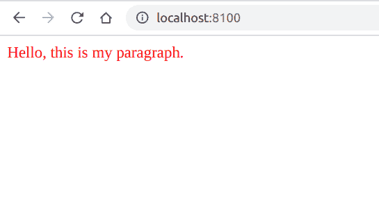

# PHP|DOMElement setAttribute()函数

> Original: [https://www.geeksforgeeks.org/php-domelement-setattribute-function/](https://www.geeksforgeeks.org/php-domelement-setattribute-function/)

**DOMElement：：setAttribute()函数**是 PHP 中的一个内置函数，用于将给定名称的属性设置为给定值。 如果该属性不存在，则会创建该属性。

**语法：**

```
*DOMAttr* DOMElement::setAttribute( *string* $name, *string* $value )
```

**参数：**此函数接受上述两个参数，如下所述：

*   **$name：**它指定属性的名称。
*   **$value：**指定属性的值。

**返回值：**此函数成功时返回 DOMAttr，错误时返回 False。

**异常：**如果节点为只读，则此函数抛出 DOM_NO_MODIFICATION_ALLOWED_ERR。

下面给出的程序演示了 PHP 中的**DOMElement：：setAttribute()函数**：

**程序 1：**

```
<?php

// Create a new DOMDocument
$dom = new DOMDocument();

// Create an element
$node = $dom->createElement("p",
     'Hello, this is my paragraph.');

// Add the node to the dom
$newnode = $dom->appendChild($node);

// Set the attribute
$newnode->setAttribute("style", "color:red");

echo $dom->saveXML();
?>
```

发帖主题：Re：Колибри0.7.0

```
<?xml version="1.0"?>
<p style="color:red">Hello, this is my paragraph.</p>
```



**程序 2：**

```
<?php

// Create a new DOMDocument
$dom = new DOMDocument();

// Load the XML
$dom->loadXML("<?xml version=\"1.0\"?>
<root>
    <html>
        <h1 id=\"my_id\"> Geeksforgeeks </h1>
        <h2> Second heading </h2>
    </html>
</root>");

// Get the elements
$node = $dom->getElementsByTagName('h1')[0];

echo "Before the addition of attributes: <br>";

// Get the attribute count
$attributeCount = $node->attributes->count();
echo 'No of attributes => ' . $attributeCount;

// Set the id attribute
$node->setAttribute('new', 'value');

echo "<br>After the addition of attributes: <br>";

// Get the attribute count
$attributeCount = $node->attributes->count();
echo 'No of attributes => ' . $attributeCount;
?>
```

发帖主题：Re：Колибри0.7.0

```
Before the addition of attributes:
No of attributes => 1
After the addition of attributes:
No of attributes => 2
```

**引用：**[https://www.php.net/manual/en/domelement.setattribute.php](https://www.php.net/manual/en/domelement.setattribute.php)