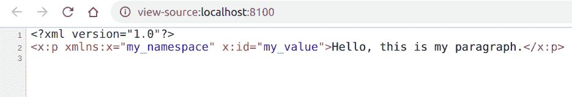

# PHP|DOMElement setAttributeNS()函数

> Original: [https://www.geeksforgeeks.org/php-domelement-setattributens-function/](https://www.geeksforgeeks.org/php-domelement-setattributens-function/)

**DOMElement：：setAttributeNS()函数**是 PHP 中的一个内置函数，用于将具有给定名称空间和名称的属性设置为给定值。 如果该属性不存在，则会创建该属性。

**语法：**

```
*void* DOMElement::setAttributeNS( *string* $namespaceURI, 
*string* $qualifiedName, *string* $value )
```

**参数：**此函数接受上述三个参数，如下所述：

*   **$nampaceURI：**它指定命名空间 URI。
*   **$QualifiedName：**它指定属性的名称。
*   **$value：**指定属性的值。

**返回值：**此函数不返回任何内容。

**异常：**如果节点为只读或 DOM_NAMESPACE_ERR，如果**$QualifiedName**是错误的限定名称，或者如果**$QualifiedName**具有前缀且名称空间 URI 为 NULL，则此函数引发 DOM_NO_MODIFICATION_ALLOWED_ERR。

以下示例说明 PHP 中的**DOMElement：：setAttributeNS()函数**：

**示例 1：**

```
<?php

// Create a new DOMDocument
$dom = new DOMDocument();

// Create an element
$node = $dom->createElementNS("my_namespace", "x:p", 
                     'Hello, this is my paragraph.');

// Add the node to the dom
$newnode = $dom->appendChild($node);

// Set the attribute
$newnode->setAttributeNS("my_namespace", "id", "my_value");

echo $dom->saveXML();
?>
```

**输出：**您可以按 Ctrl+U 查看 DOM。


**示例 2：**

```
<?php

// Create a new DOMDocument
$dom = new DOMDocument();

// Create an element
$node = $dom->createElementNS("my_namespace", "x:p",
                     'Hello, this is my paragraph.');

// Add the node to the dom
$newnode = $dom->appendChild($node);

echo "Before the addition of attributes: <br>";

// Get the attribute count
$attributeCount = $node->attributes->count();
echo 'No of attributes => ' . $attributeCount;

// Set the attribute with a namespace
$newnode->setAttributeNS("my_namespace", "style", "color:blue");

echo "<br>After the addition of attributes: <br>";

// Get the attribute count
$attributeCount = $node->attributes->count();
echo 'No of attributes => ' . $attributeCount;
?>
```

发帖主题：Re：Колибри0.7.0

```
Before the addition of attributes:
No of attributes => 0
After the addition of attributes:
No of attributes => 1
```

**引用：**[https://www.php.net/manual/en/domelement.setattributens.php](https://www.php.net/manual/en/domelement.setattributens.php)