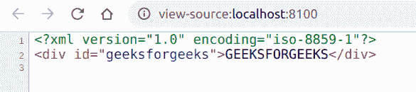

# PHP|DOMElement setIdAttributeNode()函数

> Original: [https://www.geeksforgeeks.org/php-domelement-setidattributenode-function/](https://www.geeksforgeeks.org/php-domelement-setidattributenode-function/)

**DOMElement：：setIdAttributeNode()函数**是 PHP 中的一个内置函数，用于将 DOMAttr 实例指定的属性声明为 ID 类型。

**语法：**

```php
*void* DOMElement::setIdAttributeNode( *DOMAttr* $attr, *bool* $isId )
```

**参数：**此函数接受上述两个参数，如下所述：

*   **$attr：**它将属性指定为 DOMAttr 实例。
*   **$isid：**它指定是否希望名称为 ID 类型。

**返回值：**此函数不返回任何内容。

**异常：**如果节点为只读，则此函数抛出 DOM_NO_MODIFICATION_ALLOWED_ERR；如果名称不是此元素的属性，则抛出 DOM_NOT_FOUND。

以下示例说明 PHP 中的**DOMElement：：setIdAttributeNode()函数**：

**示例 1：**

```php
<?php

// Create a new DOM Document
$dom = new DOMDocument('1.0', 'iso-8859-1');

// Enable validate on parse
$dom->validateOnParse = true;

// Create a div element
$element = $dom->appendChild(new DOMElement
                  ('div', 'GEEKSFORGEEKS'));

// Create the id element 
$id = new DOMAttr('id', 'geeksforgeeks');

// Create a id attribute to div
$attr = $element->setAttributeNode($id);

// Set that attribute as id
$element->setIDAttributeNode($id, true);

echo $dom->saveXML();
?>
```

**输出：**


**示例 2：**

```php
<?php

// Create a new DOM Document
$dom = new DOMDocument('1.0', 'iso-8859-1');

// Enable validate on parse
$dom->validateOnParse = true;

// Create a div element
$element = $dom->appendChild(new DOMElement
                 ('div', 'Hey ! This is my content.'));

// Create the id element 
$id = new DOMAttr('id', 'geeksforgeeks');

// Create a id attribute to div
$attr = $element->setAttributeNode($id);

// Set that attribute as id
$element->setIDAttributeNode($id, true);

// Get the text of element with id='geeksforgeeks'
// just to see if it works
$value = $dom->getElementById('geeksforgeeks')->textContent;

echo $value;
?>
```

发帖主题：Re：Колибри0.7.0

```php
Hey ! This is my content.
```

**引用：**[https://www.php.net/manual/en/domelement.setidattributenode.php](https://www.php.net/manual/en/domelement.setidattributenode.php)