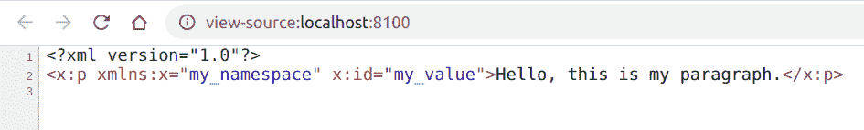

# PHP|DOMElement setIdAttributeNS()函数

> Original: [https://www.geeksforgeeks.org/php-domelement-setidattributens-function/](https://www.geeksforgeeks.org/php-domelement-setidattributens-function/)

**DOMElement：：setIdAttributeNS()函数**是 PHP 中的一个内置函数，用于声明给定本地名称和命名空间 URI 指定的属性为 ID 类型。

**语法：**

```php
*void* DOMElement::setIdAttributeNS( *string* $namespaceURI, 
*string* $localName, *bool* $isId )
```

**参数：**此函数接受上述三个参数，如下所述：

*   **$nampaceURI：**它指定命名空间 URI。
*   **$localName：**它指定本地名称。
*   **$isid：**它指定是否希望名称为 ID 类型。

**返回值：**此函数不返回任何内容。

**异常：**如果节点为只读，则此函数抛出 DOM_NO_MODIFICATION_ALLOWED_ERR；如果名称不是此元素的属性，则抛出 DOM_NOT_FOUND。

以下示例说明 PHP 中的**DOMElement：：setIdAttributeNS()函数**：

**示例 1：**

```php
<?php

// Create a new DOMDocument
$dom = new DOMDocument();

// Enable validate on parse
$dom->validateOnParse = true;

// Create an element
$element = $dom->createElementNS("my_namespace", "x:p", 
                         'Hello, this is my paragraph.');

// Add the node to the dom
$newnode = $dom->appendChild($element);

// Set the attribute
$newnode->setAttributeNS("my_namespace", "id", "my_value");

// Set that attribute as id
$element->setIDAttributeNS("my_namespace", 'id', true);

echo $dom->saveXML();
?>
```

**输出：**您可以按 Ctrl+U 查看 DOM。


**示例 2：**

```php
<?php
// Create a new DOMDocument
$dom = new DOMDocument();

// Enable validate on parse
$dom->validateOnParse = true;

// Create an element
$element = $dom->createElementNS("my_namespace", "x:p", 
                                       'GeeksforGeeks');

// Add the node to the dom
$newnode = $dom->appendChild($element);

// Set the attribute
$newnode->setAttributeNS("my_namespace", "id",
                                       "geeksforgeeks");

// Set that attribute as id
$element->setIDAttributeNS("my_namespace", 'id', true);

// Get the text of element with id='geeksforgeeks'
// just to see if it works
$value = $dom->getElementById('geeksforgeeks')->textContent;
echo $value;
?>
```

发帖主题：Re：Колибри0.7.0

```php
GeeksforGeeks
```

**引用：**[https://www.php.net/manual/en/domelement.setidattributens.php](https://www.php.net/manual/en/domelement.setidattributens.php)