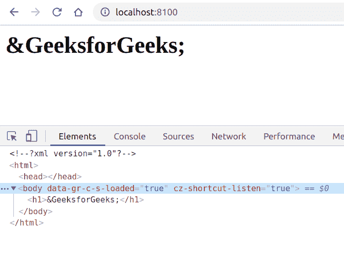

# PHP|DOMEntityReference__Construct()函数

> Original: [https://www.geeksforgeeks.org/php-domentityreference-__construct-function/](https://www.geeksforgeeks.org/php-domentityreference-__construct-function/)

**DOMEntityReference：：__Construct()函数**是 PHP 中的内置函数，用于创建新的 DOMEntityReference 对象。

**语法：**

```php
*public* DOMEntityReference::__construct( *string* $name )
```

**参数：**此函数接受单个参数**$name**，该参数保存实体引用的名称。

下面给出的程序演示了 PHP 中的**DOMEntityReference：：__Construct()函数**：

**程序 1：**

```php
<?php
// Create a new DOMDocument
$dom = new DOMDocument();

// Add the node to the dom
$element = $dom->appendChild(new DOMElement('H1'));

// Add the DOM Entity Reference as a child
$entity = $element->appendChild(new DOMEntityReference('GeeksforGeeks'));

// Render the XML
echo $dom->saveXML();
?>
```

**输出：**


**程序 2：**

```php
<?php
// Create a new DOMDocument
$dom = new DOMDocument();

// Add the node to the dom
$element = $dom->appendChild(new DOMElement('body'));

// Add the DOM Entity Reference as a child
$entity = $element->appendChild(new DOMEntityReference('GeeksforGeeks'));

// View the name of node
echo $entity->nodeName;
?>
```

发帖主题：Re：Колибри0.7.0

```php
GeeksforGeeks
```

**引用：**[https://www.php.net/manual/en/domentityreference.construct.php](https://www.php.net/manual/en/domentityreference.construct.php)