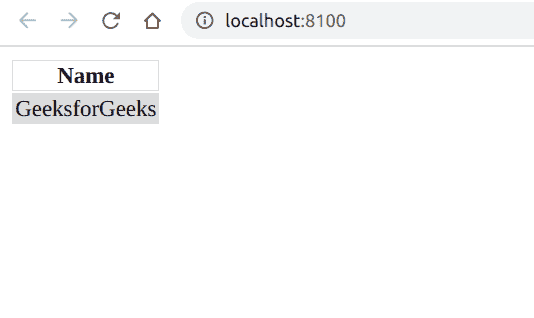

# PHP|DOMNode appendChild()函数

> Original: [https://www.geeksforgeeks.org/php-domnode-appendchild-function/](https://www.geeksforgeeks.org/php-domnode-appendchild-function/)

**DOMNode：：appendChild()函数**是 PHP 中的一个内置函数，用于将子级附加到现有的子级列表或创建新的子级列表。 可以使用*DOMDocument：：createElement()*、*DOMDocument：：createTextNode()*或使用任何其他节点创建子对象。

**语法：**

```php
*DOMNode* DOMNode::appendChild( *DOMNode* $newnode )
```

**参数：**此函数接受单个参数**$newnode**，该参数保存要追加的节点。

**返回值：**此函数返回添加的节点。

**异常：**如果节点是只读的，或者要插入的节点的上一个父代是只读的，或者是*DOM_Hierarchy_Request_Err*，如果节点的类型不允许**$newnode**节点类型的子节点，或者如果要追加的节点是此节点的祖先之一、此节点本身或*DOM_HERHERY_REQUEST_ERR*，则此函数抛出*DOM_NO_MODIFICATION_ALLOWED_ERR*，或者如果要追加的节点是此节点的祖先之一、此节点本身或[。 如果**$newnode**是从与创建此节点的文档不同的文档创建的。

下面给出的程序说明了 PHP：
**程序 1：**中的**DOMNode：：appendChild()函数**

```php
<?php
// Create a new DOMDocument
$doc = new DOMDocument();

// Create an Element
$node = $doc->createElement("em", "GeeksforGeeks");

// Append the child
$newnode = $doc->appendChild($node);

// Render the XML
echo $doc->saveXML();
?>
```

发帖主题：Re：Колибри0.7.0

```php
*GeeksforGeeks*
```

**程序 2：**

```php
<?php
// Create a new DOMDocument
$doc = new DOMDocument();

// Create an Table element
$table = $doc->createElement("table");

// Append the child
$tablenode = $doc->appendChild($table);

// Create a tr element
$tr = $doc->createElement("tr");

// Append the child
$tablenode->appendChild($tr);

// Create a th element
$th = $doc->createElement("th", "Name");

// Set the attribute
$th->setAttribute("style", "border: 1px solid #dddddd;");

// Append the child
$tr->appendChild($th);

// Create a tr element
$tr = $doc->createElement("tr");

// Append the child
$tablenode->appendChild($tr);

// Create a th element
$th = $doc->createElement("td", "GeeksforGeeks");

// Set the attribute
$th->setAttribute("style", "background-color: #dddddd;border: 1px solid #dddddd;");

// Append the child
$tr->appendChild($th);

// Render the XML
echo $doc->saveXML();
?>
```

**输出：**


**引用：**[https://www.php.net/manual/en/domnode.appendchild.php](https://www.php.net/manual/en/domnode.appendchild.php)