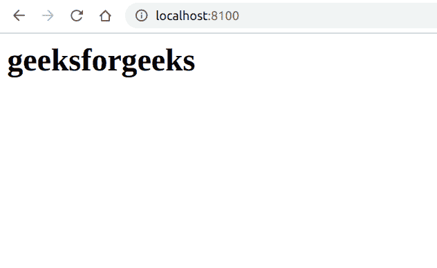
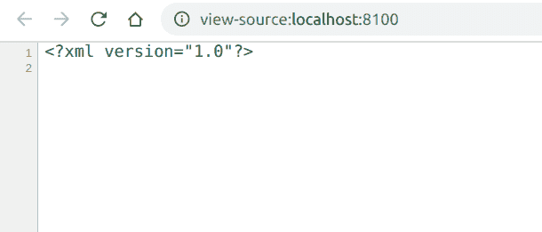

# PHP|DOMNode cloneNode()函数

> Original: [https://www.geeksforgeeks.org/php-domnode-clonenode-function/](https://www.geeksforgeeks.org/php-domnode-clonenode-function/)

**DOMNode：：cloneNode()函数**是 PHP 中的一个内置函数，用于创建节点的副本。

**语法：**

```
*DOMNode* DOMNode::cloneNode( *bool* $deep )
```

**参数：**此函数接受单个参数**$Deep**，该参数指示是否复制所有子代节点。 默认情况下，此参数设置为 False。

**返回值：**此函数返回克隆的节点。

**程序 1：**

```
<?php
// Create a DOMDocument
$doc = new DOMDocument();

// Load XML
$doc->loadXML('<html></html>');

// Create an heading element on DOMDocument object
$h1 = $doc->createElement('h1', "geeksforgeeks");

// Append the child
$doc->documentElement->appendChild($h1);

// Create a new DOMDocument
$doc_new = new DOMDocument();

// Deep clone the node to new instance
$doc_new = $doc->cloneNode(true);

// Render the cloned instance
echo $doc_new->saveXML();
?>
```

**输出：**


**程序 2：**

```
<?php
// Create a DOMDocument
$doc = new DOMDocument('1.0', 'iso-8859-1');

// Load XML
$doc->loadXML('<html></html>');

// Create an heading element on DOMDocument object
$h1 = $doc->createElement('h1', "geeksforgeeks");

// Append the child
$doc->documentElement->appendChild($h1);

// Shallow clone the node to a new instance
// It will clone only the instance not its
// children nodes
$doc_new = $doc->cloneNode(false);

// Render the cloned instance
echo $doc_new->saveXML();
?>
```

**输出：**按 Ctrl+U 查看 DOM


**引用：**[https://www.php.net/manual/en/domnode.clonenode.php](https://www.php.net/manual/en/domnode.clonenode.php)