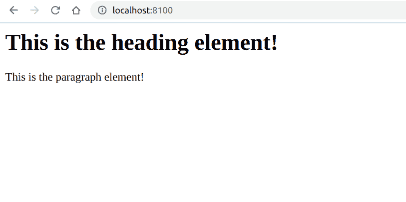

# PHP|DOMNode intertBefore()函数

> Original: [https://www.geeksforgeeks.org/php-domnode-insertbefore-function/](https://www.geeksforgeeks.org/php-domnode-insertbefore-function/)

函数是 PHP 中的一个内置函数，用于在某个节点之前插入一个新节点。

**语法：**

```
*DOMNode* DOMNode::insertBefore( *DOMNode* $newNode, *DOMNode* $refNode )
```

**参数：**此函数接受上述两个参数，如下所述：

*   **$newNode：**它指定新节点。
*   **$refNode(可选)：**它指定引用节点。 如果未提供，则会将 newnode 附加到子级。

**返回值：**此函数返回插入的节点。

**异常：**如果此节点是只读的，或者如果要插入的节点的上一个父节点是只读的，则此函数抛出*DOM_NO_MODIFICATION_ALLOWED_ERR*。 *DOM_HERHORY_REQUEST_ERR*，如果此节点的类型不允许**$newNode**节点类型的子节点，或者如果要追加的节点是此节点的祖先之一或此节点本身，如果*DOM_WROR_DOCUMENT_ERR*，如果**$newNode**是从与创建此节点的文档不同的文档(*DOM)创建的。 如果**$refNode**不是此节点的子节点。*

下面给出的程序演示了 PHP 中的**DOMNode：：insert tBefront()函数**：

**程序 1：**

```
<?php

// Create a new DOMDocument
$dom = new DOMDocument();

// Create a paragraph element
$p_element = $dom->createElement('p', 
      'This is the paragraph element!');

// Append the child
$dom->appendChild($p_element);

// Create a paragraph element
$h_element = $dom->createElement('h1', 
      'This is the heading element!');

// Insert heading before HTML
$dom->insertBefore($h_element, $p_element);

// Render the output
echo $dom->saveXML();
?>
```

发帖主题：Re：Колибри0.7.0

```
<?xml version="1.0"?>
<h1>This is the heading element!</h1>
<p>This is the paragraph element!</p>
```



**程序 2：**

```
<?php

// Create a new DOMDocument
$dom = new DOMDocument();

// Create a paragraph element
$p_element = $dom->createElement('p', 
      'GeeksforGeeks, paragraph');

// Append the child
$dom->appendChild($p_element);

// Create a paragraph element
$h_element = $dom->createElement('h1',
      'GeeksforGeeks, heading');

// When second argument is not provided
// It will appended to the child
$dom->insertBefore($h_element);

// Render the output
echo $dom->saveXML();
?>
```

发帖主题：Re：Колибри0.7.0

```
<?xml version="1.0"?>
<p>GeeksforGeeks, paragraph</p>
<h1>GeeksforGeeks, heading</h1>
```


**引用：**[https://www.php.net/manual/en/domnode.insertbefore.php](https://www.php.net/manual/en/domnode.insertbefore.php)