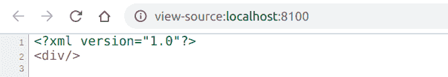

# PHP|DOMNode removeChild()函数

> Original: [https://www.geeksforgeeks.org/php-domnode-removechild-function/](https://www.geeksforgeeks.org/php-domnode-removechild-function/)

**DOMNode：：removeChild()函数**是 PHP 中的一个内置函数，用于从子级列表中删除子级。

**语法：**

```php
*DOMNode* DOMNode::removeChild( *DOMNode* $oldnode )
```

**参数：**此函数接受单个参数**$oldnode**，该参数保存要删除的子级。

**返回值：**此函数在成功时返回被移除的子级。

**异常：**如果节点是只读的，**DOM_NOT_FOUND**，如果**$oldnode**不是此节点的子节点，则此函数抛出**DOM_NO_MODIFICATION_ALLOWED_ERR**。

下面的示例说明了 PHP 中的**DOMNode：：removeChild()函数**：

**示例 1：**

```php
<?php

// Create a new DOMDocument instance
$document = new DOMDocument();

// Create a div element
$element = $document-> 
        appendChild(new DOMElement('div'));

// Create a text Node
$text1 = $document->
          createTextNode('GeeksforGeeks');

// Append the nodes
$element->appendChild($text1);

// Remove the child
$element->removeChild($text1);

// Render the XML
echo $document->saveXML();
?>
```

**输出：**按 Ctrl+U 查看 XML


**示例 2：**

```php
<?php

// Create a new DOMDocument instance
$document = new DOMDocument();

// Create a h1 element
$element = $document->
             appendChild(new DOMElement('h1'));

// Create the text Node
$text1 = $document->
               createTextNode('GeeksforGeeks');
$text2 = $document->
          createTextNode('Text to be removed');

// Append the nodes
$element->appendChild($text1);
$element->appendChild($text2);

// Remove the child
$element->removeChild($text2);

// Render the output
echo $document->saveXML();
?>
```

**输出：**


**引用：**[https://www.php.net/manual/en/domnode.removechild.php](https://www.php.net/manual/en/domnode.removechild.php)