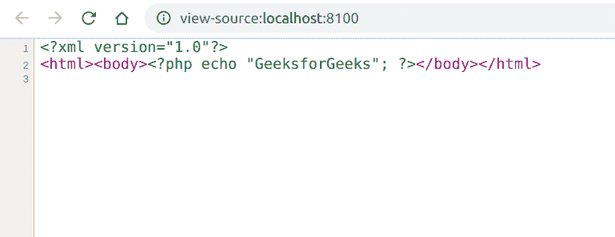
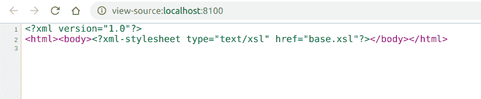

# PHP|DOMProcessingInstructionInstruct()函数

> Original: [https://www.geeksforgeeks.org/php-domprocessinginstruction-__construct-function/](https://www.geeksforgeeks.org/php-domprocessinginstruction-__construct-function/)

**DOMProcessingInstruction：：__Construct()函数**是 PHP 中的一个内置函数，它使用一个新的只读 DOMProcessingInstruction 对象。 要创建可写节点，请使用 DOMDocument：：createProcessingInstruction.。
**语法：**

```php
*public* DOMProcessingInstruction::__construct( *string* $name, *string* $value )
```

**参数：**此函数接受上述两个参数，如下所述：

*   **$name：**它指定处理指令的标记名。
*   **$value：**它指定处理指令的值。

下面给定的程序说明了 PHP 中的**DOMProcessingInstruction：：__Construct()函数**：
**程序 1：**按*Ctrl+U*查看 DOM

## PHP

```php
<?php

// Create a new DOMDocument instance
$dom = new DOMDocument();

// Create a html element
$html = $dom->appendChild(new DOMElement('html'));

// Create a body element
$body = $html->appendChild(new DOMElement('body'));

// Create a new DOMProcessingInstruction node
$pinode = new DOMProcessingInstruction('php',
          'echo "GeeksforGeeks"; ');

// Append the child
$body->appendChild($pinode);

// Render the XML
echo $dom->saveXML();
?>
```

发帖主题：Re：Колибри0.7.8.0



**程序 2：**按*Ctrl+U*查看 DOM 元素。

## PHP

```php
<?php

// Create a new DOMDocument instance
$dom = new DOMDocument();

// Create a html element
$html = $dom->appendChild(new DOMElement('html'));

// Create a body element
$body = $html->appendChild(new DOMElement('body'));

// Create a new DOMProcessingInstruction node
$pinode = new DOMProcessingInstruction('xml-stylesheet',
       'type="text/xsl" href="base.xsl"');

// Append the child
$body->appendChild($pinode);

// Render the XML
echo $dom->saveXML();
?>
```

发帖主题：Re：Колибри0.7.8.0



**引用：**[https://www.php.net/manual/en/domprocessinginstruction.construct.php](https://www.php.net/manual/en/domprocessinginstruction.construct.php)