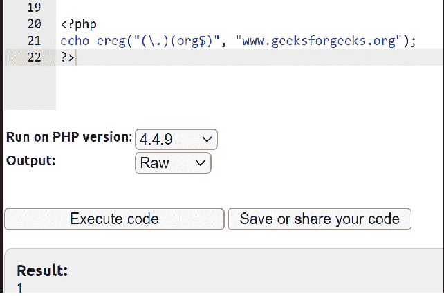
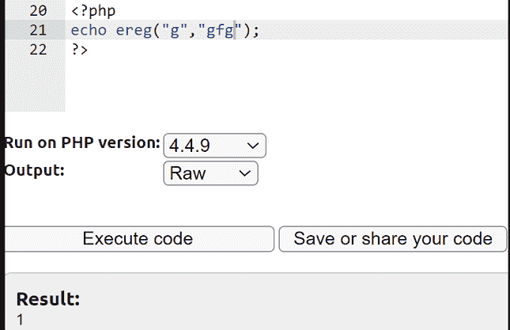
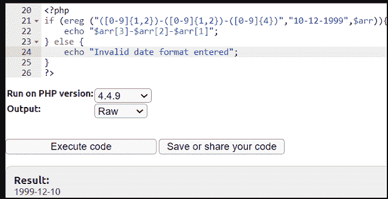

# PHP Ereg()函数

> Original: [https://www.geeksforgeeks.org/php-ereg-function/](https://www.geeksforgeeks.org/php-ereg-function/)

PHP 中的**erg()**函数搜索字符串以匹配模式中给出的正则表达式。 该函数区分大小写。 此函数已在 PHP 5.3.0 中弃用，并在 PHP 7.0.0 中删除。

**语法：**

```php
int ereg ( string $pattern , string $str, array &$arr );
```

**参数：**

*   ***模式：***它是区分大小写的正则表达式。
*   ***字符串：***它是输入字符串。
*   ***arr：***它是一个可选的输入参数，包含正则表达式中由圆括号分组的所有匹配表达式的数组。

**返回值：**

如果找到该模式，该函数将返回*TRUE*ELSE*FALSE*。 如果在字符串中找到模式匹配，则返回匹配字符串的长度；如果未找到匹配或出现错误，则返回*False*。 *如果未传递可选参数*arr*或匹配字符串的长度为 0，则函数返回 1。

**示例 1：**在此示例中，语句检查提供给**erg()**函数的主题是否包含*.org*。

## PHP

```php
<?php

 echo ereg("(\.)(org$)", "www.geeksforgeeks.org");

?>
```

发帖主题：Re：Колибри0.7.0

```php
1
```



**示例 2：**此示例检查主题是否以‘g’开头。 “^”符号用于检查主题是否以所需字符串开头。

## PHP

```php
<?php

echo ereg("g","gfg");  

?>
```

发帖主题：Re：Колибри0.7.0

```php
1
```



**示例 3：**在此示例中，以下代码片断将获取 DD-MM-YYYY 格式的日期，并以 ISO 格式(YYYY-MM-DD)打印它。

## PHP

```php
<?php

if (ereg ("([0-9]{1,2})-([0-9]{1,2})-([0-9]{4})",
            "10-12-1999", $arr)) {

   echo "$arr[3]-$arr[2]-$arr[1]";

} else {

   echo "Invalid date format entered";

}

?>
```

**输出：**

```php
1999-12-10
```

