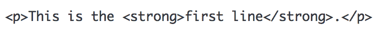

# PHP|fgetss()函数

> Original: [https://www.geeksforgeeks.org/php-fgetss-function/](https://www.geeksforgeeks.org/php-fgetss-function/)

PHP 中的 fgetss()函数是一个内置函数，用于在从打开的文件中删除[HTML](https://www.geeksforgeeks.org/html-basics/)和[PHP](https://www.geeksforgeeks.org/php/)标记后，从打开的文件中返回一行。

Fegtss()函数在指定长度、文件末尾(EOF)或新行(以先出现者为准)停止返回。-
要读取的文件和要读取的字节数作为参数发送给 fgetss()函数，并从用户指定的文件返回长度为-1 字节的字符串。 它在失败时返回 FALSE。

**语法：**

```php
fgetss(file, length, tags)
```

**使用的参数：**和
PHP 中的 fgetss()函数接受三个参数。

1.  **file：**它指定必须从中提取字符的文件。
2.  **长度：**它指定 fgetss()函数要读取的字节数。 默认值为 1024 字节。
3.  **标签：**可选参数，用于指定不应条带化的标签。

**返回值：**和
它在删除所有 HTML 和 PHP 标记后，从用户指向的文件返回一个长度为-1 字节的字符串。

**错误和异常：**

1.  该函数没有针对大文件进行优化，因为它一次读取一行，并且可能需要很长时间才能完全读取长文件。
2.  如果多次使用 fgetss()函数，则必须清除缓冲区。
3.  Fgetss()函数返回布尔值 False，但很多时候它返回的是非布尔值，计算结果为 False。

下面的程序演示了 fgetss()函数。

假设有一个名为**“gfg.txt”**的文件，它包含：



**程序 1**

## PHP

```php
<?php
// PHP program to illustrate the fgetss() function

//file is opened using fopen() function
$my_file = fopen("gfg.txt", "rw");

// Prints a single line from the opened file pointer
// after removing HTML and PHP tags
echo fgetss($my_file);

// file is closed using fclose() function
fclose($my_file);
?>
```

**输出：**

```php
This is the first line.
```

**程序 2**

## PHP

```php
<?php
// PHP program to illustrate the fgetss() function

// file is opened using fopen() function
$my_file = fopen("gfg.txt", "rw");

// Prints 1024 bytes from the opened file pointer
// without striping "p" and "strong" tags
echo fgetss($my_file, 1024, "
<p>, <strong>");

// file is closed using fclose() function
fclose($my_file);
?>
```

**输出：**


**引用：**和
[http://php.net/manual/en/function.fgetss.php](http://php.net/manual/en/function.fgetss.php)