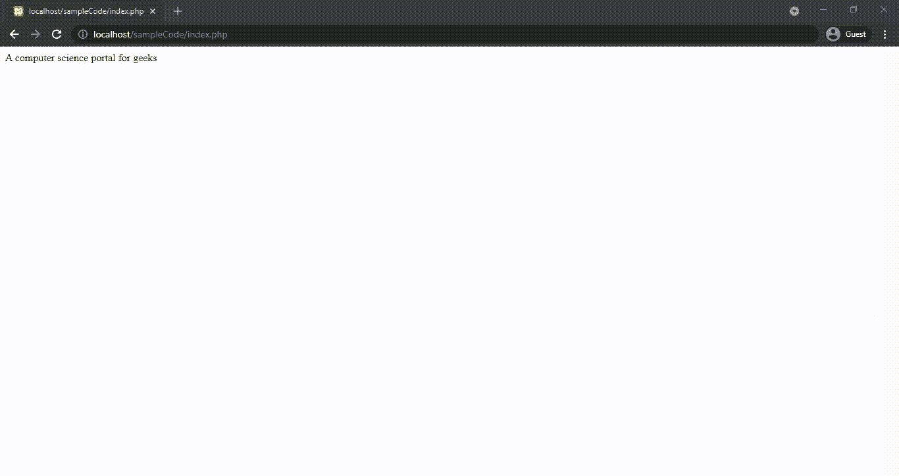

# PHP file_get_content()函数

> Original: [https://www.geeksforgeeks.org/php-file_get_contents-function/](https://www.geeksforgeeks.org/php-file_get_contents-function/)

在本文中，我们将了解如何使用 FILE_GET_CONTENTS()函数将整个文件读入一个字符串，并通过示例了解它们的实现。

PHP 中的**FILE_GET_CONTENTS()**函数是一个内置函数，用于将文件读入字符串。 该函数使用服务器支持的内存映射技术，从而增强了性能，使其成为读取文件内容的首选方式。 要读取的文件的路径，该路径作为参数发送给函数，成功时返回读取的数据，失败时返回 False。

**语法：**

```php
file_get_contents($path, $include_path, $context, 
                              $start, $max_length)
```

**参数：**PHP 中的 file_get_content()函数接受一个强制参数和四个可选参数。

*   **$path**：它指定要检查的文件或目录的路径。
*   **$include_path**：这是一个可选参数，如果将其设置为 1，也可以在 include_path(php.ini 中)的文件中搜索文件。
*   **$CONTEXT**：可选参数，用于指定自定义上下文。
*   **$start**：可选参数，用于指定文件中读取的起点。
*   **$max_length**：这是一个可选参数，用于指定要读取的字节数。

**返回值：**成功时返回读取数据，失败时返回 False。

**方法：**为了将文件放入字符串，我们将使用 FILE_GET_CONTENTS()函数。 对于第一个示例，我们将 URL 链接指定为将重定向到给定站点的参数。 对于第二个示例，生成包含数据的文件名“gfg.txt”。 此函数将文件读入字符串&，相应地呈现内容。

**错误和异常**：

*   如果要打开包含特殊字符(如空格)的文件，则需要首先使用 urlencode()对其进行编码。
*   函数的作用是：返回布尔值 FALSE，但也可能返回计算结果为 FALSE 的非布尔值。
*   如果找不到文件名，最大长度小于零，或者在流中查找指定的偏移量失败，则会生成 E_WARNING 级别错误。

请考虑以下示例。

```php
Input:  file_get_contents('https://www.geeksforgeeks.org/');
Output: A computer science portal for geeks

Input:  file_get_contents('gfg.txt', FALSE, NULL, 0, 14);
Output: A computer science portal for geeks
```

**示例 1**：下面的示例说明了 file_get_content()函数。

## PHP

```php
<!DOCTYPE html>

<body>
    <?php
        // Reading contents from the
        // geeksforgeeks homepage
        $homepage = file_get_contents(
            "https://www.geeksforgeeks.org/");
        echo $homepage;
    ?>
</body>
</html>
```

发帖主题：Re：Колибри0.7.8.0



**示例 2**：此示例说明如何将文件转换为字符串。

## PHP

```php
<!DOCTYPE html>
<body>
    <?php
        // Reading 36 bytes starting from
        // the 0th character from gfg.txt
        $text = file_get_contents('gfg.txt', false, NULL, 0, 36);
        echo $text;
    ?>
</body>
</html>
```

发帖主题：Re：Колибри0.7.8.0

```php
A computer science portal for geeks
```

**引用：**[http://php.net/manual/en/function.file-get-contents.php](http://php.net/manual/en/function.file-get-contents.php)