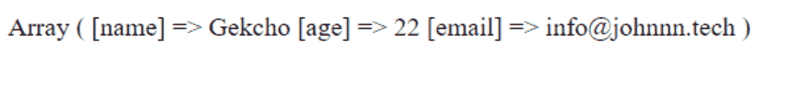
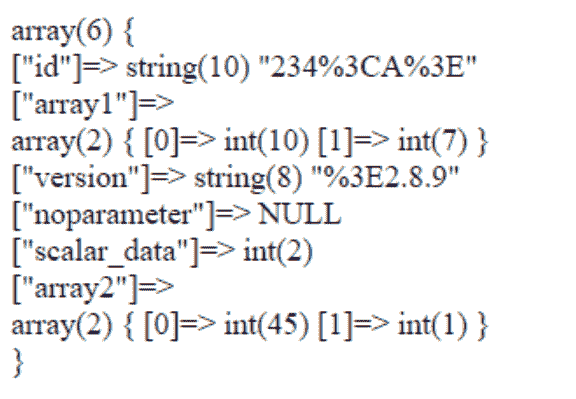

# PHP|filter_input_array()函数

> Original: [https://www.geeksforgeeks.org/php-filter_input_array-function/](https://www.geeksforgeeks.org/php-filter_input_array-function/)

**filter_input_array()**函数是 PHP 中的一个内置函数，用于获取外部变量(例如，从表单输入)，并在指定的情况下对其进行过滤。 此函数类似于[filter_input()](https://www.geeksforgeeks.org/php-filter_input-function/)函数，唯一的区别是 filter_input()过滤单个值，但在 filter_input_array()中，根据提供的选项过滤整个数组。 它用于检索/过滤许多值，而不是多次调用 filter_input()。 这是 PHP 中的新特性，只适用于 PHP 5.2 或更高版本的 PHP。

**语法：**

```php
*mixed* filter_input_array( $type_of_data, $definition, $add_empty_parameter )
```

**参数：**此函数接受上述三个参数，如下所述：

*   **type_of_data：**必选参数。 它保存要检查的数据的输入类型。 可用选项包括：
    *   INPUT_GET
    *   输入 _ 发布
    *   输入 cookie
    *   输入服务器
    *   INPUT_ENV
*   **定义：**可选参数。 它指定筛选器参数或参数的数组。 作为变量名的有效数组键和作为筛选器名称或 ID 的有效值，或者指定筛选器、标志和选项的数组。 此参数也可以是单个筛选器名称/ID，就像 filter_input()一样，然后由指定的筛选器过滤输入数组中的所有值。
*   **ADD_EMPTY_PARAMETER：**可选参数。 它是一个布尔参数。 当它设置为 True 时，它会将缺少的键作为 NULL 添加到返回值中。 其默认值为 True。

**返回值：**成功时返回包含变量值的数组，失败时返回 False。 如果未填充由 type 指定的输入数组，并且未给出 FILTER_NULL_ON_FAILURE 标志，则函数返回 NULL，否则返回 FALSE。 对于其他失败，则返回 FALSE。

下面的程序演示了 PHP 中的 filter_input_array()函数：

**程序 1：**

```php
<?php

$filters = array(
    "name" => array(
        "filter" => FILTER_CALLBACK,
        "flags" => FILTER_FORCE_ARRAY,
        "options" => "ucwords"
    ),
    "age" => array(
        "filter" => FILTER_VALIDATE_INT,
        "options" => array(
            "min_range" => 1,
            "max_range" => 120
        )
    ),
    "email"=> FILTER_VALIDATE_EMAIL,
);

print_r(filter_input_array(INPUT_GET, $filters));

?>
```

**输出：**


**注意：**此示例在 Online IDE 上可能不会给出预期的结果，因为它不支持在 GET 或 POST 方法中传递参数。 因此，请尝试在一些 PHP 托管服务器或本地主机中运行它，并通过 GET 或 POST 方法传递参数值。

**程序 2：**
**数据来自 POST 方法：**

```php
$_POST = array(
    'product_id' => '234<A>',
    'component'  => array('10'),
    'version'    => '<2.8.9',
    'array2'  => array('45', '1'),
    'scalar_data' => '2',
);

```

```php
<?php
// PHP program to uses filter_input_array() Function

error_reporting(E_ALL | E_STRICT);

$args = array(
    'id' => FILTER_SANITIZE_ENCODED,
    'array1' => array(
        'filter' => FILTER_VALIDATE_INT,
        'flags' => FILTER_REQUIRE_ARRAY, 
        'options' => array(
            'min_range' => 1,
            'max_range' => 10
        )
    ),
    'version' => FILTER_SANITIZE_ENCODED,
    'noparameter' => FILTER_VALIDATE_INT,
    'scalar_data' => array(
        'filter' => FILTER_VALIDATE_INT,
        'flags'  => FILTER_REQUIRE_SCALAR,
    ),
    'array2' => array(
        'filter' => FILTER_VALIDATE_INT,
        'flags'  => FILTER_REQUIRE_ARRAY,
    )
);

$allinputs = filter_input_array(INPUT_GET, $args);

var_dump($allinputs);
echo "\n";

?>
```

**输出：**


**注意：**此示例在 Online IDE 上可能不会给出预期的结果，因为它不支持在 GET 或 POST 方法中传递参数。 因此，请尝试在一些 PHP 托管服务器或本地主机中运行它，并通过 GET 或 POST 方法传递参数值。

**引用：**[http://php.net/manual/en/function.filter-input-array.php](http://php.net/manual/en/function.filter-input-array.php)