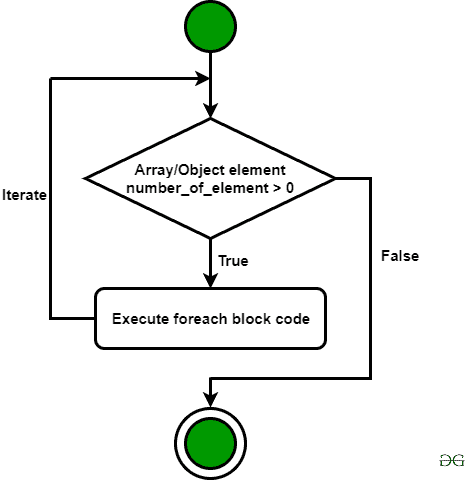

# PHP|foreach 循环

> Original: [https://www.geeksforgeeks.org/php-foreach-loop/](https://www.geeksforgeeks.org/php-foreach-loop/)

Foreach 构造提供了迭代数组元素的最简单方法。 它对数组和对象都有效。 尽管 foreach 循环遍历元素数组，但执行得到简化，完成循环所需的时间相对较少。 它为索引迭代分配临时内存，这使得整个系统在内存分配方面的性能变得冗余。



**语法：**

```
foreach( $array as $element ) {
    // PHP Code to be executed
}
```

或者 / 还是 / 即 / 否则

```
foreach( $array as $key => $element) {
    // PHP Code to be executed
}
```

下面的程序演示了 PHP 中的 foreach 循环：

**程序 1：**使用 foreach 循环打印数组元素的 PHP 程序。

```
<?php

// Declare an array
$arr = array("green", "blue", "pink", "white"); 

// Loop through the array elements
foreach ($arr as $element) {
    echo "$element ";
}

?>
```

**Output:**

```
green blue pink white

```

**程序 2：**使用 foreach 循环打印关联数组元素的 PHP 程序。

```
<?php 
$employee = array( 
    "name" => "Robert", 
    "email" => "robert112233@mail.com", 
    "age" => 18, 
    "gender" => "male"

); 

// Loop through employee array 
foreach($employee as $key => $element) { 
    echo $key . ": " . $element . "<br>"; 
} 

?> 
```

**Output:**

```
name: Robert
email: robert112233@mail.com
age: 18
gender: male

```