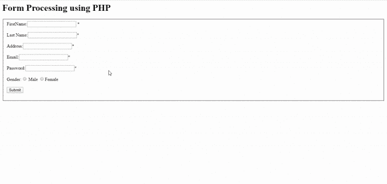

# PHP 表单处理

> 原文:[https://www.geeksforgeeks.org/php-form-processing/](https://www.geeksforgeeks.org/php-form-processing/)

在本文中，我们将讨论如何在 PHP 中处理表单。HTML 表单用于将用户信息发送给服务器，并将结果返回给浏览器。例如，如果你想获得网站访问者的详细信息，并向他们发送好的想法，你可以通过表单处理的方式收集用户信息。然后，可以在客户端或服务器端验证信息。最终结果通过各自的网络浏览器发送给客户端。要创建一个 HTML 表单，应该使用**表单**标签。

**表单标签的属性:**

| 属性 | 描述 |
| 姓名或 id | 它指定表单的名称，并用于标识单个表单。 |
| 行为 | 它指定提交表单时表单数据必须发送到的位置。 |
| 方法 | 它指定提交表单时要使用的 HTTP 方法。可能的值是**获得**和**发布**。如果使用 **get** 方法，表单数据在 url 中对用户可见。默认 HTTP 方式是**获取**。 |
| encType | 它指定提交表单时表单数据的加密类型。 |
| novalidate | 这意味着服务器在提交表单时不验证表单数据。 |

**表单中使用的控件:**表单处理包含一组控件，客户端和服务器可以通过这些控件进行通信和共享信息。表单中使用的控件有:

*   **Textbox:** Textbox 允许用户提供单行输入，可用于获取姓名、搜索菜单等数值。
*   **Textarea:** Textarea 允许用户提供多行输入，可用于获取地址、消息等数值。
*   **下拉菜单:**下拉菜单或组合框允许用户从值列表中选择一个值。
*   **单选按钮:**单选按钮允许用户从给定的选项集中仅选择一个选项。
*   **复选框:**复选框允许用户从给定选项集中选择多个选项。
*   **按钮:**按钮是可用于提交表单的可点击控件。

**创建一个简单的 HTML 表单:**上面给出的所有表单控件都是基于标签的**类型**属性使用**输入**标签来设计的。在下面的脚本中，当提交表单时，没有任何事件处理机制。事件处理是指在提交表单时完成的过程。这些事件处理机制可以通过使用 javaScript 或 PHP 来完成。但是，JavaScript 只提供客户端验证。因此，我们可以使用 PHP 进行表单处理。

**HTML 代码:**

```html
<!DOCTYPE html>
<html>

<head>
    <title>Simple Form Processing</title>
</head>

<body>
    <form id="form1" method="post">
        FirstName:
        <input type="text" name="firstname" required/>
        <br>
        <br> 
        LastName
        <input type="text" name="lastname" required/>
        <br>
        <br> 
        Address
        <input type="text" name="address" required/>
        <br>
        <br> 
        Email Address:
        <input type="email" name="emailaddress" required/>
        <br>
        <br> 
        Password:
        <input type="password" name="password" required/>
        <br>
        <br>
        <input type="submit" value="Submit”/>
    </form>
</body>
</html>
```

**表单验证:**表单验证是为了确保用户已经提供了相关信息。基本验证可以使用 HTML 元素完成。例如，在上面的脚本中，电子邮件地址文本框的类型值为“email”，这可以防止用户为电子邮件输入不正确的值。上述脚本中的每个表单字段后面都有一个必需的属性，这将提示用户在提交表单之前不要将任何字段留空。表单处理中使用的 PHP 方法和数组有:

*   **isset():** 此函数用于确定变量或表单控件是否有值。
*   **$_GET[]:** 用于通过 URL 中发送的参数从表单控件中检索信息。它将 url 中给定的属性作为参数。
*   **$_POST[]:** 用于通过 HTTP POST 方法从表单控件中检索信息。它以相应表单控件的名称属性为参数。
*   **$_REQUEST[]:** 用于在使用数据库时检索信息。

**使用 PHP 的表单处理:**上面的 HTML 脚本是使用上面提到的函数和数组重写的。重写后的脚本会验证所有表单字段，如果没有错误，它会以表格形式显示收到的信息。

*   **例:**

    ```html
    <?php
    if (isset($_POST['submit']))
    {
        if ((!isset($_POST['firstname'])) || (!isset($_POST['lastname'])) || 
            (!isset($_POST['address'])) || (!isset($_POST['emailaddress'])) || 
            (!isset($_POST['password'])) || (!isset($_POST['gender'])))
        {
            $error = "*" . "Please fill all the required fields";
        }
        else
        {
            $firstname = $_POST['firstname'];
            $lastname = $_POST['lastname'];
            $address = $_POST['address'];
            $emailaddress = $_POST['emailaddress'];
            $password = $_POST['password'];
            $gender = $_POST['gender'];
        }
    }
    ?>
    <html>

    <head>
        <title>Simple Form Processing</title>
    </head>

    <body>
        <h1>Form Processing using PHP</h1>
        <fieldset>
            <form id="form1" method="post" action="form.php">
                <?php
                    if (isset($_POST['submit']))
                    {
                        if (isset($error))
                        {
                            echo "<p style='color:red;'>" 
                            . $error . "</p>";
                        }
                    }
                    ?>

                    FirstName:
                    <input type="text" name="firstname"/> 
                     <span style="color:red;">*</span>
                    <br>
                    <br>
                    Last Name:
                    <input type="text" name="lastname"/>
                      <span style="color:red;">*</span>
                    <br>
                    <br> 
                    Address:
                    <input type="text" name="address"/>
                      <span style="color:red;">*</span>
                    <br>
                    <br> 
                    Email:
                    <input type="email" name="emailaddress"/>
                      <span style="color:red;">*</span>
                    <br>
                    <br> 
                    Password:
                    <input type="password" name="password"/>
                       <span style="color:red;">*</span>
                    <br>
                    <br> 
                    Gender:
                    <input type="radio" 
                           value="Male" 
                           name="gender"> Male
                    <input type="radio" 
                           value="Female"
                           name="gender">Female
                    <br>
                    <br>
                    <input type="submit" value="Submit" name="submit" />
            </form>
        </fieldset>
        <?php
           if(isset($_POST['submit']))
           {
              if(!isset($error))
               {
                       echo"<h1>INPUT RECEIVED</h1><br>";
                       echo "<table border='1'>";
                       echo "<thead>";
                       echo "<th>Parameter</th>";
                       echo "<th>Value</th>";
                       echo "</thead>";
                       echo "<tr>";
                       echo "<td>First Name</td>";
                       echo "<td>".$firstname."</td>";
                       echo "</tr>";
                       echo "<tr>";
                       echo "<td>Last Name</td>";
                       echo "<td>".$lastname."</td>";
                       echo "</tr>";
                       echo "<tr>";
                       echo "<td>Address</td>";
                       echo "<td>".$address."</td>";
                       echo "</tr>";
                       echo "<tr>";
                       echo "<td>Email Address</td>";
                       echo "<td>" .$emailaddress."</td>";
                       echo "</tr>";
                       echo "<tr>";
                       echo "<td>Password</td>";
                       echo "<td>".$password."</td>";
                       echo "</tr>";
                       echo "<tr>";
                       echo "<td>Gender</td>";
                       echo "<td>".$gender."</td>";
                       echo "</tr>";
                       echo "</table>";
            }
          }
        ?>
    </body>

    </html>
    ```

*   **输出:**
    

**注意:**当 PHP 和 HTML 编码在一个文件中时，文件应该保存为 PHP。在表单中，action 参数的值应该是文件名。