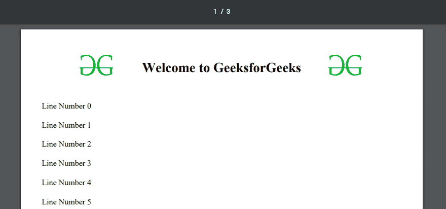

# PHP|FPDF-PDF 生成器

> Original: [https://www.geeksforgeeks.org/php-fpdf-pdf-generator/](https://www.geeksforgeeks.org/php-fpdf-pdf-generator/)

FPDF 是一个 PHP 类，允许使用 PHP 代码生成 PDF 文件。 它是免费使用的，不需要任何 API 密钥。 FPDF 代表免费 PDF。 这意味着可以在 PDF 文件中进行任何类型的修改。
**这个类的主要功能是：**

*   允许设置页面格式和页边距。
*   允许设置页眉和页脚。
*   它提供自动分页符和分行符。
*   它支持各种格式(JPEG、PNG 和 GIF)的图像。
*   它允许设置颜色和链接。
*   它还支持编码。
*   除了页面压缩功能，它还提供了许多其他功能。

**注意：**从[http://www.fpdf.org/en/download.php](http://www.fpdf.org/en/download.php)下载本课的最新版本

**程序 1：**

```php
<?php

require('fpdf.php');

// New object created and constructor invoked
$pdf = new FPDF();

// Add new pages. By default no pages available.
$pdf->AddPage();

// Set font format and font-size
$pdf->SetFont('Times', 'B', 20);

// Framed rectangular area
$pdf->Cell(176, 5, 'Welcome to GeeksforGeeks!', 0, 0, 'C');

// Set it new line
$pdf->Ln();

// Set font format and font-size
$pdf->SetFont('Times', 'B', 12);

// Framed rectangular area
$pdf->Cell(176, 10, 'A Computer Science Portal for geek!', 0, 0, 'C');

// Close document and sent to the browser
$pdf->Output();

?>
```

**输出：**


**程序 2：**设置页眉和页脚以及换行符

```php
<?php
require('fpdf.php');

class PDF extends FPDF
{
    // Page header
    function Header()
    {
        // GFG logo image
        $this->Image('geeks.png', 30, 8, 20);

        // GFG logo image
        $this->Image('geeks.png', 160, 8, 20);

        // Set font-family and font-size
        $this->SetFont('Times','B',20);

        // Move to the right
        $this->Cell(80);

        // Set the title of pages.
        $this->Cell(30, 20, 'Welcome to GeeksforGeeks', 0, 2, 'C');

        // Break line with given space
        $this->Ln(5);
    }

    // Page footer
    function Footer()
    {
        // Position at 1.5 cm from bottom
        $this->SetY(-15);

        // Set font-family and font-size of footer.
        $this->SetFont('Arial', 'I', 8);

        // set page number
        $this->Cell(0, 10, 'Page ' . $this->PageNo() .
              '/{nb}', 0, 0, 'C');
    }
}

// Create new object.
$pdf = new PDF();
$pdf->AliasNbPages();

// Add new pages
$pdf->AddPage();

// Set font-family and font-size.
$pdf->SetFont('Times','',12);

// Loop to display line number content
for($i = 0; $i < 50; $i++)
    $pdf->Cell(30, 10, 'Line Number ' . $i, 0, 2, 'L');

$pdf->Output();

?>
```

**输出：**

**参考：**[http://www.fpdf.org/](http://www.fpdf.org/)