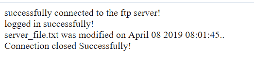

# PHP|ftp_mdtm()函数

> Original: [https://www.geeksforgeeks.org/php-ftp_mdtm-function/](https://www.geeksforgeeks.org/php-ftp_mdtm-function/)

Ftp_mdtm()函数是 PHP 中的一个内置函数，用于获取上次修改 FTP 服务器上的文件的时间。

**语法：**

```
ftp_mdtm( $ftp_connection, $file )
```

**参数：**此函数接受上述两个参数，如下所述：

*   **$ftp_connection：**必选参数。 它指定已经存在的 FTP 连接。
*   **$file：**必选参数。 它指定文件在远程服务器(即 FTP 服务器)中的文件或路径，该文件的最后一次修改将被检索。

**返回值：**如果成功，则返回上次修改时间作为 UNIX 时间戳；如果出错，则返回-1。

**注：**

*   此函数适用于 PHP 4.0.0 及更新版本。
*   以下示例不能在联机 IDE 上运行。 因此请尝试使用正确 ftp 服务器名称在某些 PHP 托管服务器或本地主机上运行。
*   此函数不适用于目录。 并非所有服务器都支持此功能。

**示例：**

## PHP

```
<?php

// Connect to FTP server

// Use a correct ftp server
$ftp_server = "localhost";

// Use correct ftp username
$ftp_username="user";

// Use correct ftp password corresponding
// to the ftp username
$ftp_userpass="user";

// File name or path to upload to ftp server
$file = "demo_test.txt";

// Establishing ftp connection
$ftp_connection = ftp_connect($ftp_server)
        or die("Could not connect to $ftp_server");

if($ftp_connection) {
    echo "successfully connected to the ftp server!";

    // Logging in to established connection with
    // ftp username password
    $login = ftp_login($ftp_connection, $ftp_username, $ftp_userpass);

    if($login) {

        // Checking whether logged in successfully or not
        echo "<br>logged in successfully!";

        // Storing last modified data in $last_mod
        $last_mod = ftp_mdtm($ftp_connection, $file);

        if ($last_mod != -1) {

            // Checking whether any error occurred or not
            // while retrieving last modified data
            echo "<br> $file was modified on ".
                    date("F d Y H:i:s.", $last_mod).".";
        }
        else {
            echo "<br>could not get last modified.";
        }

    }
    else {
        echo "<br>login failed!";
    }

    // Closing  connection
    if(ftp_close($ftp_connection)) {
        echo "<br>Connection closed Successfully!";
    }
}
?>
```

发帖主题：Re：Колибри0.7.0



**引用：**[https://www.php.net/manual/en/function.ftp-mdtm.php](https://www.php.net/manual/en/function.ftp-mdtm.php)