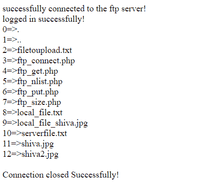
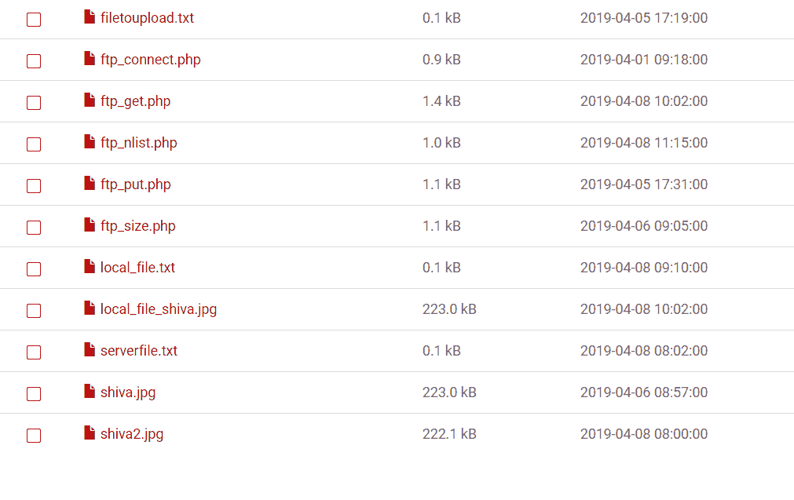

# PHP|ftp_nlist()函数

> Original: [https://www.geeksforgeeks.org/php-ftp_nlist-function/](https://www.geeksforgeeks.org/php-ftp_nlist-function/)

函数**ftp_nlist()**是 PHP 的内置函数，用于获取 FTP 服务器上特定目录下所有文件名和子目录的列表。

**语法：**

```
ftp_nlist( $ftp_connection, $directory );
```

**参数：**此函数接受上述两个参数，如下所述：

*   **$ftp_connection：**必选参数。 它指定已经存在的 FTP 连接，以获取 FTP 服务器中某个目录的所有文件和子目录的列表。
*   **$directory：**字符串类型的必选参数。 它指定要列出其文件&子目录的远程服务器(即 FTP 服务器)中的目录。

**返回值：**成功时返回文件名和子目录数组，失败时返回 False。

**注：**

*   此函数适用于 PHP 4.0.0 及更新版本。
*   以下示例不能在联机 IDE 上运行。 因此请尝试使用正确 ftp 服务器名称在某些 PHP 托管服务器或本地主机上运行。
*   不要与文件名和子目录混淆！ 许多网站将子目录名也作为文件名。

以下示例说明了 PHP 中的 ftp_nlist()函数：

**示例 1：**

## PHP

```
<?php

// Connect to FTP server

// Use a correct ftp server
$ftp_server = "localhost";

// Use correct ftp username
$ftp_username="username";

// Use correct ftp password corresponding
// to the ftp username
$ftp_userpass="password";

// File name or path to upload to ftp server
$file = "filetoupload.txt";

// Establishing ftp connection
$ftp_connection = ftp_connect($ftp_server)
    or die("Could not connect to $ftp_server");

if($ftp_connection) {
    echo "successfully connected to the ftp server!";

    // Logging in to established connection
    // with ftp username password
    $login = ftp_login($ftp_connection, $ftp_username, $ftp_userpass);

    if($login){

        // Checking whether logged in successfully or not
        echo "<br>logged in successfully!";

        // Get file & directory list of current directory
        $file_list = ftp_nlist($ftp_connection, ".");

        //output the array stored in $file_list using foreach loop
        foreach($file_list as $key=>$dat) {
            echo $key."=>".$dat."<br>";
       }
    }
    else {
        echo "<br>login failed!";
    }

    // echo ftp_get_option($ftp_connection, 1);
    // Closing  connection
    if(ftp_close($ftp_connection)) {
        echo "<br>Connection closed Successfully!";
    }
}

?>
```

发帖主题：Re：Колибри0.7.0



**文件管理器中目录内容：**



**示例 2：**使用端口号 21 连接到 ftp 服务器，然后列出目录内容。

## PHP

```
<?php

// Connect to FTP server

// Use a correct ftp server
$ftp_server = "localhost";

// Use correct ftp username
$ftp_username="username";

// Use correct ftp password corresponding
// to the ftp username
$ftp_userpass="password";

// File name or path to upload to ftp server
$file = "filetoupload.txt";

// Establishing ftp connection
$ftp_connection = ftp_connect($ftp_server, 21)
    or die("Could not connect to $ftp_server");

if($ftp_connection) {
    echo "successfully connected to the ftp server!";

    // Logging in to established connection
    // with ftp username password
    $login = ftp_login($ftp_connection, $ftp_username, $ftp_userpass);

    if($login){

        // Checking whether logged in successfully or not
        echo "<br>logged in successfully!";

        // Get file & directory list of current directory
        $file_list = ftp_nlist($ftp_connection, ".");

        //output the array stored in $file_list using foreach loop
        foreach($file_list as $key=>$dat) {
            echo $key."=>".$dat."<br>";
       }
    }
    else {
        echo "<br>login failed!";
    }

    // echo ftp_get_option($ftp_connection, 1);
    // Closing  connection
    if(ftp_close($ftp_connection)) {
        echo "<br>Connection closed Successfully!";
    }
}

?>
```

发帖主题：Re：Колибри0.7.0


**文件管理器中目录内容：**


**引用：**[https://www.php.net/manual/en/function.ftp-nlist.php](https://www.php.net/manual/en/function.ftp-nlist.php)