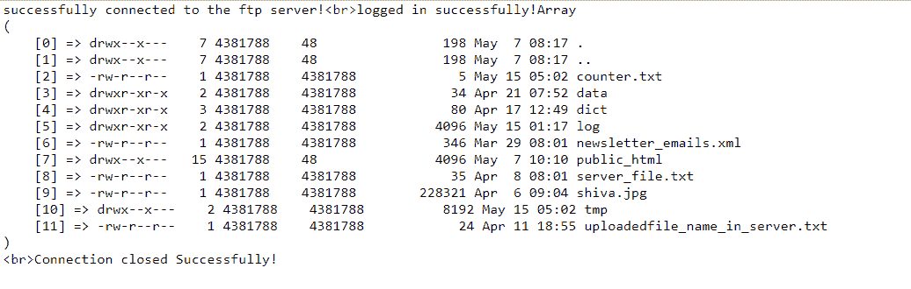

# PHP|ftp_rawlist()函数

> Original: [https://www.geeksforgeeks.org/php-ftp_rawlist-function/](https://www.geeksforgeeks.org/php-ftp_rawlist-function/)

Ftp_rawlist()函数是 PHP 中的一个内置函数，它返回一个文件列表，其中包含上次修改远程服务器(即 FTP 服务器)上指定目录中的文件的权限等信息。

**语法：**

```php
ftp_rawlist( $ftp_connection, $directory, $recursive )
```

**参数：**此函数接受上述三个参数，如下所述：

*   **$ftp_connection：**必选参数。 它指定已经存在的 FTP 连接。
*   **$DIRECTORY：**必选参数。 它指定要检索其文件信息的远程服务器(即 FTP 服务器)中的目录路径。 ‘./’表示当前目录，‘../’表示当前目录的父目录。 它可以包括 LIST 命令自变量。
*   **$RECURSIVE：**可选参数。 它指定是否将 LIST 或 LIST-R 命令发送到服务器。 如果设置为 TRUE，则发送 LIST-R 命令。 默认情况下，它发送 LIST 命令。

**返回值：**

*   **成功时：**它返回一个数组，每个元素对应一行文本。
*   **失败时：**返回 FALSE。 例如当传递无效目录时。

**注：**

*   此函数适用于 PHP 4.0.0 及更新版本。
*   以下示例不能在联机 IDE 上运行。 因此请尝试使用正确 ftp 服务器名称在某些 PHP 托管服务器或本地主机上运行。

**示例：**

## PHP

```php
<?php

// Connect to FTP server

// Use a correct ftp server
$ftp_server = "localhost";

// Use correct ftp username
$ftp_username = "username";

// Use correct ftp password corresponding
// to the ftp username
$ftp_userpass = "password";

// Establishing ftp connection
$ftp_connection = ftp_connect($ftp_server)
        or die("Could not connect to $ftp_server");

if($ftp_connection) {
    echo "successfully connected to the ftp server!";

    // Logging in to established connection with
    // ftp username password
    $login = ftp_login($ftp_connection,
            $ftp_username, $ftp_userpass);

    if($login) {

        // Checking whether logged in successfully
        // or not
        echo "<br>logged in successfully!";

        // Storing  data in $file_list
        $file_list = ftp_rawlist($ftp_connection, "/");

        // Printing raw array with print_r()
        print_r($file_list);
    }
    else {
        echo "<br>login failed!";
    }

    // Closing  connection
    if(ftp_close($ftp_connection)) {
        echo "<br>Connection closed Successfully!";
    }
}
?>
```

发帖主题：Re：Колибри0.7.0



**引用：**[https://www.php.net/manual/en/function.ftp-rawlist.php](https://www.php.net/manual/en/function.ftp-rawlist.php)