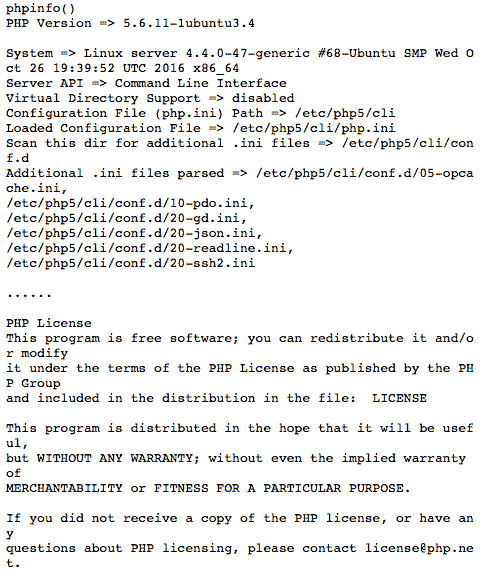

# PHP|使用 phpinfo()

获取 PHP 配置信息

> Original: [https://www.geeksforgeeks.org/php-get-php-configuration-information-using-phpinfo/](https://www.geeksforgeeks.org/php-get-php-configuration-information-using-phpinfo/)

PHP 为我们提供了一个内置函数 phpinfo()，它为我们提供了有关系统中安装的 PHP 的 PHP 版本和 PHP 配置的详细信息。 要了解您的计算机上安装的配置和 PHP 版本，可以使用一个简单的 PHP 脚本。 该脚本由名为“phpinfo()”的 PHP 函数组成，该函数输出有关 PHP 配置的信息。 Phpinfo()函数在调试过程中也很有用。

此函数通常输出大量信息，例如：

1.  有关 PHP 编译选项和扩展的信息。
2.  PHP 版本。
3.  服务器信息和环境(如果编译为模块)。
4.  PHP 环境。
5.  操作系统版本信息、路径、配置选项的主值和本地值。
6.  HTTP 标头。
7.  PHP 许可证。

**语法：**

```php
*bool* phpinfo ([ int $what = INFO_ALL ] )
```

**参数**：
**$什么：**这是一个可选参数，可用于显示特定信息。
它可以采用下列值：

1.  **INFO_GROUAL：**它用于显示配置行、php.ini 位置、构建日期、Web 服务器、系统等。
2.  **INFO_Credits：**用于显示 PHP 信用。
3.  **INFO_CONFIGURATION：**它用于显示 PHP 指令的当前、本地和主值。
4.  **INFO_MODULES：**用于显示加载的模块及其各自的设置。
5.  **INFO_ENVIRONMENT：**用于显示环境变量信息。
6.  **INFO_VARIABLES：**它显示 EGPCS(Environment、Get、POST、Cookie、Server)中的所有预定义变量。
7.  **INFO_LICENSE：**用于显示 PHP 许可证信息。
8.  **INFO_ALL：**它显示上述所有信息。

**返回类型**：phpinfo()函数返回布尔值。 也就是说，成功时返回*true*，失败时返回 false*。*

***显示完整信息**：要显示有关 PHP 版本、配置、环境详细信息等的完整信息，应按以下方式执行 phpinfo()函数：*

```php
*<?php

phpinfo();

?>*
```

***输出：**
* 

***注意：使用 CLI 模式时，**phpinfo()输出纯文本而不是 HTML。*