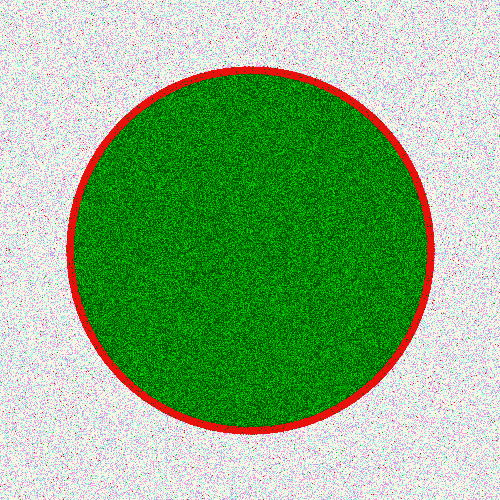

# PHP|Gmagick addnoiseimage()函数

> Original: [https://www.geeksforgeeks.org/php-gmagick-addnoiseimage-function/](https://www.geeksforgeeks.org/php-gmagick-addnoiseimage-function/)

**Gmagick：：addnoiseimage()**函数是 PHP 中的一个内置函数，用于在给定图像中添加噪声。 噪波的强度取决于噪波常数和通道类型。 图像噪声是图像中亮度和对比度的随机变化。

**语法：**

```php
*Gmagick* Gmagick::addnoiseimage ( $noise_type )

```

**参数：**此函数接受单个参数*$NOTICE_TYPE*，该参数用于设置噪波类型。

**返回值：**此函数返回带有噪波的 Gmagick 对象。

**错误/异常：**此函数在出错时引发 GmagickException。

以下程序说明了 PHP 中的**Gmagick：：addnoiseimage()**函数：

**原图 1：**和


**程序 1：**

## PHP

```php
<?php

// Create a Gmagick object
$gmagick = new Gmagick(
'https://media.geeksforgeeks.org/wp-content/uploads/tech.png');

// Add noise in image.
$gmagick->addnoiseimage(2);

header('Content-type: image/png');

// Output the image
echo $gmagick;
?>
```

发帖主题：Re：Колибри0.7.8.0


**程序 2：**

## PHP

```php
<?php

// Create a GmagickDraw object
$draw = new GmagickDraw();

// Create GmagickPixel object
$strokeColor = new GmagickPixel('Red');
$fillColor = new GmagickPixel('Green');

// Set the color, opacity of image
$draw->setStrokeOpacity(1);
$draw->setStrokeColor('Red');
$draw->setFillColor('Green');

// Set the width and height of image
$draw->setStrokeWidth(7);
$draw->setFontSize(72);

// Function to draw circle 
$draw->circle(250, 250, 100, 150);

$gmagick = new Gmagick();
$gmagick->newImage(500, 500, 'White');
$gmagick->setImageFormat("png");
$gmagick->drawImage($draw);

// Add noise in the image
$gmagick->addnoiseimage(5);

// Display the output image
header("Content-Type: image/png");
echo $gmagick->getImageBlob();
?>
```

发帖主题：Re：Колибри0.7.8.0



**引用：**[http://php.net/manual/en/gmagick.addnoiseimage.php](http://php.net/manual/en/gmagick.addnoiseimage.php)