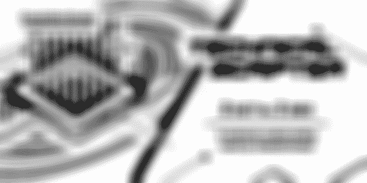
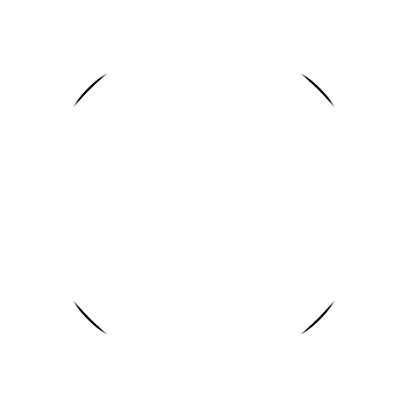

# PHP|Gmagick charcoalimage()函数

> Original: [https://www.geeksforgeeks.org/php-gmagick-charcoalimage-function/](https://www.geeksforgeeks.org/php-gmagick-charcoalimage-function/)

**gmagick：：charcoalimage()**函数是 PHP 中的一个内置函数，用于以给定的角度旋转图像。 旋转图像后，会留下用背景颜色填充的空三角形。

**语法：**

```
*Gmagick* Gmagick::charcoalimage( $color, $degree)
```

*
**参数：**此函数接受上述两个参数，如下所述：

*   **$color：**此参数保存背景颜色。
*   **$Degree：**此参数保存图像的旋转度。

**返回值：**此函数成功时返回 Gmagick 对象。

**错误/异常：**此函数在出错时引发 GmagickException。

以下程序说明了 PHP 中的**Gmagick：：charcoalimage()**函数：

**程序 1：**
**原始图像：**


```
<?php 

// Create a Gmagick object 
$gmagick = new Gmagick(
'https://media.geeksforgeeks.org/wp-content/uploads/tech.png'); 

// Use charcoalimage() function 
$gmagick->charcoalimage(10, 13);

header('Content-type: image/png'); 

// Output the image 
echo $gmagick; 
?> 
```

**输出：**


**程序 2：**

```
<?php 

// Create a GmagickDraw object 
$draw = new GmagickDraw(); 

// Create GmagickPixel object 
$strokeColor = new GmagickPixel('Red'); 
$fillColor = new GmagickPixel('Green'); 

// Set the color, opacity of image 
$draw->setStrokeOpacity(1); 
$draw->setStrokeColor('Red'); 
$draw->setFillColor('Green'); 

// Set the width and height of image 
$draw->setStrokeWidth(7); 
$draw->setFontSize(72); 

// Function to draw circle  
$draw->circle(250, 250, 100, 150); 

$gmagick = new Gmagick(); 
$gmagick->newImage(500, 500, 'White'); 
$gmagick->setImageFormat("png"); 
$gmagick->drawImage($draw); 

// Use charcoalimage() function 
$gmagick->charcoalimage(15, 23);

// Display the output image 
header("Content-Type: image/png"); 
echo $gmagick->getImageBlob(); 
?> 
```

**输出：**


**引用：**[https://www.php.net/manual/en/gmagick.charcoalimage.php/a>](https://www.php.net/manual/en/gmagick.charcoalimage.php)