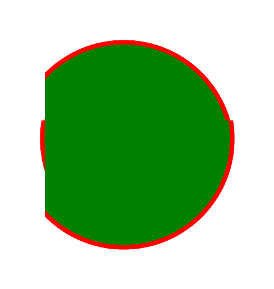

# PHP|Gmagick choimage()函数

> Original: [https://www.geeksforgeeks.org/php-gmagick-chopimage-function/](https://www.geeksforgeeks.org/php-gmagick-chopimage-function/)

**gmagick：：choimage()**函数是 PHP 中的一个内置函数，用于删除图像区域并对其进行修剪。 此函数接受图像的尺寸，并对要裁剪图像的区域和尺寸进行裁切。
**语法：**和

```php
*Gmagick* Gmagick::chopimage( $width, $height, $x, $y )
```

**参数：**此函数接受上述四个参数，如下所述：

*   **$Width：**此参数保持斩波区域的宽度。
*   **$Height：**此参数保存切碎区域的高度。
*   **$x：**此参数保存切割区域的 x 原点。
*   **$y：**此参数保存切割区域的 y 原点。

**返回值：**此函数返回截断的 Gmagick 对象。
**错误/异常：**此函数在出错时引发 GmagickException。
下面的程序说明了 PHP：
**程序 1：**和
**原始图像：**和
中的**Gmagick：：choImage()**函数：
**程序 1：**和
**原始图像：**和


## PHP

```php
<?php

// Create a Gmagick object
$gmagick = new Gmagick(
'https://media.geeksforgeeks.org/wp-content/uploads/tech.png');

// Use chopimage() function
$gmagick->chopimage(45, 20, 45, 300);

header('Content-type: image/png');

// Output the image
echo $gmagick;
?>
```

发帖主题：Re：Колибри0.7.8.0


**程序 2：**和

## PHP

```php
<?php

// Create a GmagickDraw object
$draw = new GmagickDraw();

// Create GmagickPixel object
$strokeColor = new GmagickPixel('Red');
$fillColor = new GmagickPixel('Green');

// Set the color, opacity of image
$draw->setStrokeOpacity(1);
$draw->setStrokeColor('Red');
$draw->setFillColor('Green');

// Set the width and height of image
$draw->setStrokeWidth(7);
$draw->setFontSize(72);

// Function to draw circle 
$draw->circle(250, 250, 100, 150);

$gmagick = new Gmagick();
$gmagick->newImage(500, 500, 'White');
$gmagick->setImageFormat("png");
$gmagick->drawImage($draw);

// Use chopimage() function
$gmagick->chopimage(45, 20, 75, 200);

// Display the output image
header("Content-Type: image/png");
echo $gmagick->getImageBlob();
?>
```

发帖主题：Re：Колибри0.7.8.0



**引用：**[http://php.net/manual/en/gmagick.chopimage.php](http://php.net/manual/en/gmagick.chopimage.php)