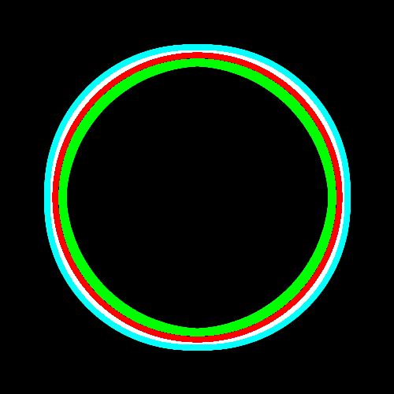

# PHP|Gmagick edgeimage()函数

> Original: [https://www.geeksforgeeks.org/php-gmagick-edgeimage-function/](https://www.geeksforgeeks.org/php-gmagick-edgeimage-function/)

**gmagick：：edgeimage()**函数是 PHP 中的一个内置函数，用于使用给定半径的卷积过滤器增强图像边缘。 半径 0 用作自动选择。
**语法：**和

```php
*Gmagick* Gmagick::edgeimage( $radius )
```

**参数：**此函数接受单个参数，如*$Radius*，它采用操作的半径。
**返回值：**此函数返回图像增强的 Gmagick 对象。
**错误/异常：**此函数在出错时抛出 GmagickException。
下面的程序说明了 PHP：
**程序 1：**和
**原始图像：**和
中的**Gmagick：：edgeImage()**函数


## PHP

```php
<?php

// Create a Gmagick object
$gmagick = new Gmagick(
'https://media.geeksforgeeks.org/wp-content/uploads/tech.png');

// Use edgeimage() function
$gmagick->edgeimage(15);

header('Content-type: image/png');

// Output the image
echo $gmagick;
?>
```

发帖主题：Re：Колибри0.7.8.0


**程序 2：**和

## PHP

```php
<?php

// Create a GmagickDraw object
$draw = new GmagickDraw();

// Create GmagickPixel object
$strokeColor = new GmagickPixel('Red');
$fillColor = new GmagickPixel('Green');

// Set the color, opacity of image
$draw->setStrokeOpacity(1);
$draw->setStrokeColor('Red');
$draw->setFillColor('Green');

// Set the width and height of image
$draw->setStrokeWidth(7);
$draw->setFontSize(72);

// Function to draw circle 
$draw->circle(250, 250, 100, 150);

$gmagick = new Gmagick();
$gmagick->newImage(500, 500, 'White');
$gmagick->setImageFormat("png");
$gmagick->drawImage($draw);

// Use edgeimage() function
$gmagick->edgeimage(10);

// Display the output image
header("Content-Type: image/png");
echo $gmagick->getImageBlob();
?>
```

发帖主题：Re：Колибри0.7.8.0



**引用：**[http://php.net/manual/en/gmagick.edgeimage.php](http://php.net/manual/en/gmagick.edgeimage.php)