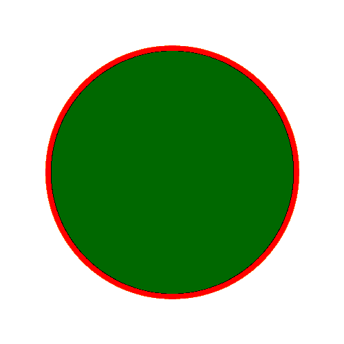

# PHP|Gmagick equalizeimage()函数

> Original: [https://www.geeksforgeeks.org/php-gmagick-equalizeimage-function/](https://www.geeksforgeeks.org/php-gmagick-equalizeimage-function/)

**Gmagick：：equalizeimage()**函数是 PHP 中的一个内置函数，用于均衡图像的直方图。
**语法：**

```
*Gmagick* Gmagick::equalizeimage( void )
```

**参数：**此函数不接受任何参数。

**返回值：**此函数返回均衡的 Gmagick 对象。

**错误/异常：**此函数在出错时引发 GmagickException。

下面的程序演示了 PHP 中的**Gmagick：：equalizeimage()**函数：

**程序 1：**

**原图：**和


## PHP

```
<?php

// Create a Gmagick object
$gmagick = new Gmagick(
'https://media.geeksforgeeks.org/wp-content/uploads/tech.png');

// Equalize the image.
$gmagick->equalizeimage();

header('Content-type: image/png');

// Output the image
echo $gmagick;
?>
```

发帖主题：Re：Колибри0.7.8.0


**程序 2：**

## PHP

```
<?php

// Create a GmagickDraw object
$draw = new GmagickDraw();

// Create GmagickPixel object
$strokeColor = new GmagickPixel('Red');
$fillColor = new GmagickPixel('Green');

// Set the color, opacity of image
$draw->setStrokeOpacity(1);
$draw->setStrokeColor('Red');
$draw->setFillColor('Green');

// Set the width and height of image
$draw->setStrokeWidth(7);
$draw->setFontSize(72);

// Function to draw circle 
$draw->circle(250, 250, 100, 150);

$gmagick = new Gmagick();
$gmagick->newImage(500, 500, 'White');
$gmagick->setImageFormat("png");
$gmagick->drawImage($draw);

// Equalize the image
$gmagick->equalizeimage();

// Display the output image
header("Content-Type: image/png");
echo $gmagick->getImageBlob();
?>
```

发帖主题：Re：Колибри0.7.8.0



**引用：**[http://php.net/manual/en/gmagick.equalizeimage.php](http://php.net/manual/en/gmagick.equalizeimage.php)