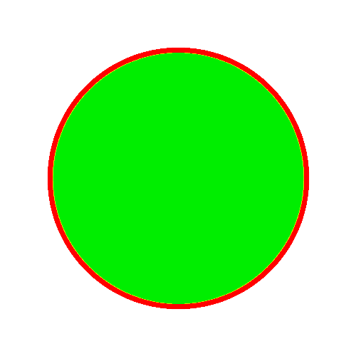

# PHP|Gmagick Gammaimage()函数

> Original: [https://www.geeksforgeeks.org/php-gmagick-gammaimage-function/](https://www.geeksforgeeks.org/php-gmagick-gammaimage-function/)

**Gmagick：：Gammaimage()**函数是 PHP 中的一个内置函数，用于通过提供 Gamma 校正来校正图像。 在不同的设备上，相同图像的视图是不同的。 以这种方式，图像强度被表示在屏幕上。

**语法：**

```php
*Gmagick* Gmagick::gammaimage( $gamma )
```

参数
**：**此函数接受单个参数*$Gamma*，它保存伽马校正值。

**返回值：**此函数返回 Gamma 校正的 Gmagick 对象。

**错误/异常：**此函数在出错时引发 GmagickException。

以下程序说明了 PHP 中的**Gmagick：：Gammaimage()**函数：

**程序 1：**
**原始图像：**


```php
<?php 

// Create a Gmagick object 
$gmagick = new Gmagick(
'https://media.geeksforgeeks.org/wp-content/uploads/tech.png'); 

// Use gammaimage() function 
$gmagick->gammaimage(5);

header('Content-type: image/png'); 

// Output the image 
echo $gmagick; 
?> 
```

**输出：**


**程序 2：**

```php
<?php 

// Create a GmagickDraw object 
$draw = new GmagickDraw(); 

// Create GmagickPixel object 
$strokeColor = new GmagickPixel('Red'); 
$fillColor = new GmagickPixel('Green'); 

// Set the color, opacity of image 
$draw->setStrokeOpacity(1); 
$draw->setStrokeColor('Red'); 
$draw->setFillColor('Green'); 

// Set the width and height of image 
$draw->setStrokeWidth(7); 
$draw->setFontSize(72); 

// Function to draw circle  
$draw->circle(250, 250, 100, 150); 

$gmagick = new Gmagick(); 
$gmagick->newImage(500, 500, 'White'); 
$gmagick->setImageFormat("png"); 
$gmagick->drawImage($draw); 

// Use gammaimage() function 
$gmagick->gammaimage(10);

// Display the output image 
header("Content-Type: image/png"); 
echo $gmagick->getImageBlob(); 
?> 
```

**输出：**


**引用：**[http://php.net/manual/en/gmagick.gammaimage.php](http://php.net/manual/en/gmagick.gammaimage.php)