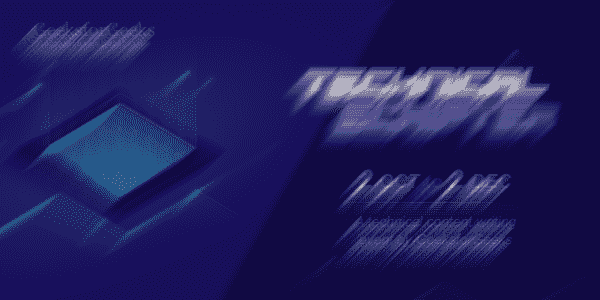
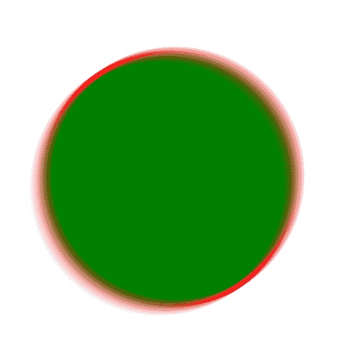

# PHP|Gmagick motionblurimage()函数

> Original: [https://www.geeksforgeeks.org/php-gmagick-motionblurimage-function/](https://www.geeksforgeeks.org/php-gmagick-motionblurimage-function/)

**Gmagick：：motionblurimage()**函数是 PHP 中的内置函数，用于模拟运动模糊。 此函数将图像与给定半径和标准差的高斯运算符进行卷积。
**语法：**和

```php
*Gmagick* Gmagick::motionblurimage( $radius, $sigma, $angle )
```

**参数：**此函数接受上述三个参数，如下所述：

*   **$Radius：**此参数用于设置高斯半径(以像素为单位)。 它不包括中心像素。 如果半径值为零，则表示将自动选择半径。
*   **$sigma：**此参数用于查找高斯的标准偏差(以像素为单位)。
*   **$angle：**此参数沿此角度应用效果。

**返回值：**此函数成功时返回 Gmagick 对象。
**错误/异常：**此函数在出错时引发 GmagickException。
下面的程序说明了 PHP：
**程序 1：**和
**输入图像：**和
中的**Gmagick：：motionblurimage()**函数


## PHP

```php
<?php

// Create a Gmagick object
$gmagick = new Gmagick(
'https://media.geeksforgeeks.org/wp-content/uploads/tech.png');

// Use motionblurimage function
$gmagick->motionblurimage(20, 20, 45);

header('Content-type: image/png');

// Output the image
echo $gmagick;
?>
```

发帖主题：Re：Колибри0.7.8.0



**程序 2：**和

## PHP

```php
<?php

// Create a GmagickDraw object
$draw = new GmagickDraw();

// Create GmagickPixel object
$strokeColor = new GmagickPixel('Red');
$fillColor = new GmagickPixel('Green');

// Set the color, opacity of image
$draw->setStrokeOpacity(1);
$draw->setStrokeColor('Red');
$draw->setFillColor('Green');

// Set the width and height of image
$draw->setStrokeWidth(7);
$draw->setFontSize(72);

// Function to draw circle 
$draw->circle(250, 250, 100, 150);

$gmagick = new Gmagick();
$gmagick->newImage(500, 500, 'White');
$gmagick->setImageFormat("png");
$gmagick->drawImage($draw);

// Use motionblurimage function
$gmagick->motionblurimage(15, 20, 35);

// Display the output image
header("Content-Type: image/png");
echo $gmagick->getImageBlob();
?>
```

发帖主题：Re：Колибри0.7.8.0



**引用：**[http://php.net/manual/en/gmagick.motionblurimage.php](http://php.net/manual/en/gmagick.motionblurimage.php)