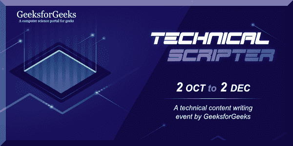
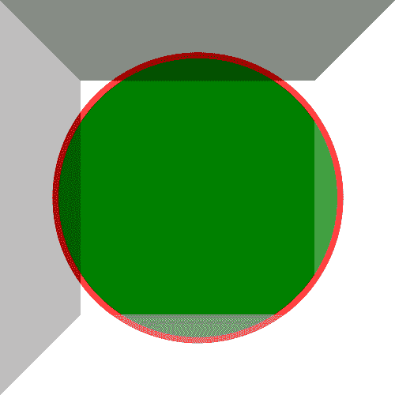

# PHP|Gmagick Rise Image()函数

> Original: [https://www.geeksforgeeks.org/php-gmagick-raiseimage-function/](https://www.geeksforgeeks.org/php-gmagick-raiseimage-function/)

**Gmagick：：Rise eImage()**函数是 PHP 中的一个内置函数，用于通过创建图像的边缘变亮和变暗来创建模拟的三维按钮效果。 RAISE_INFO 的宽度和高度定义效果的垂直边和水平边的宽度。

**语法：**

```
*Gmagick* Gmagick::raiseimage( $width, $height, $x, $y, $raise )
```

*
**参数：**此函数接受上述五个参数，如下所述：

*   **$width：**此参数存储要升高的区域的宽度值。
*   **$Height：**此参数存储要升高的区域的高度值。
*   **$x：**此参数存储 x 坐标的值。
*   **$y：**此参数存储 y 坐标的值。
*   **$RAISE：**此参数存储 RAISE 的值，其中非零值创建三维 RAISE 效果，否则它具有降低的效果。

**返回值：**此函数成功时返回 Gmagick 对象。

**错误/异常：**此函数在出错时引发 GmagickException。

以下程序说明了 PHP 中的**Gmagick：：Rise eImage()**函数：

**程序 1：**
**输入图像：**


```
<?php 

// Create a Gmagick object 
$gmagick = new Gmagick(
'https://media.geeksforgeeks.org/wp-content/uploads/tech.png'); 

// Raise the image. 
$gmagick->raiseimage(12, 12, 12, 12, true); 

header('Content-type: image/png'); 

// Output the image 
echo $gmagick; 
?> 
```

**输出：**

**程序 2：**

```
<?php 

// Create a GmagickDraw object 
$draw = new GmagickDraw(); 

// Create GmagickPixel object 
$strokeColor = new GmagickPixel('Red'); 
$fillColor = new GmagickPixel('Green'); 

// Set the color, opacity of image 
$draw->setStrokeOpacity(1); 
$draw->setStrokeColor('Red'); 
$draw->setFillColor('Green'); 

// Set the width and height of image 
$draw->setStrokeWidth(7); 
$draw->setFontSize(72); 

// Function to draw circle  
$draw->circle(250, 250, 100, 150); 

$gmagick = new Gmagick(); 
$gmagick->newImage(500, 500, 'White'); 
$gmagick->setImageFormat("png"); 
$gmagick->drawImage($draw); 

// Lower the image
$gmagick->raiseimage(102, 102, 102, 102, false); 

// Display the output image 
header("Content-Type: image/png"); 
echo $gmagick->getImageBlob(); 
?> 
```

**输出：**


**引用：**[http://php.net/manual/en/gmagick.raiseimage.php](http://php.net/manual/en/gmagick.raiseimage.php)