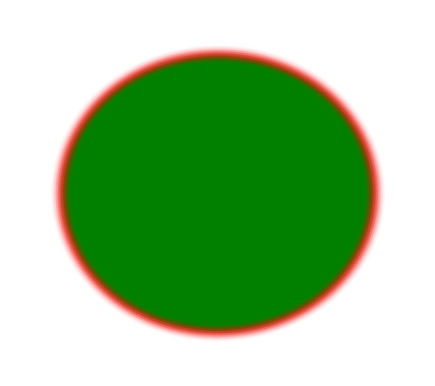

# PHP|Gmagick sizeimage()函数

> Original: [https://www.geeksforgeeks.org/php-gmagick-resizeimage-function/](https://www.geeksforgeeks.org/php-gmagick-resizeimage-function/)

**Gmagick：：ResizeImage()**函数是 PHP 中的一个内置函数，用于通过滤镜将图像缩放到给定的尺寸。
**语法：**和

```php
*Gmagick* Gmagick::resizeimage( $width, $height, $filter, $blur)
```

**参数：**此函数接受上述四个参数，如下所述：

*   **$width：**该参数用于设置图片的宽度。
*   **$Height：**该参数用于设置图像的高度。
*   **$filter：**此参数用于设置 Filter 的值。
*   **$blur：**此参数用于设置模糊值。 值大于 1 表示模糊，小于 1 表示清晰。

**返回值：**此函数成功时返回 Gmagick 对象。
**错误/异常：**此函数在出错时引发 GmagickException。
下面的程序说明了 PHP：
**程序 1：**和
**输入图像：**和
中的**Gmagick：：ResizeImage()**函数


## PHP

```php
<?php

// Create a Gmagick object
$gmagick = new Gmagick(
'https://media.geeksforgeeks.org/wp-content/uploads/tech.png');

// Resize the image.
$gmagick->resizeimage(1024, 768, 10, 5, true);

header('Content-type: image/png');

// Output the image
echo $gmagick;
?>
```

发帖主题：Re：Колибри0.7.8.0


**程序 2：**和

## PHP

```php
<?php

// Create a GmagickDraw object
$draw = new GmagickDraw();

// Create GmagickPixel object
$strokeColor = new GmagickPixel('Red');
$fillColor = new GmagickPixel('Green');

// Set the color, opacity of image
$draw->setStrokeOpacity(1);
$draw->setStrokeColor('Red');
$draw->setFillColor('Green');

// Set the width and height of image
$draw->setStrokeWidth(7);
$draw->setFontSize(72);

// Function to draw circle 
$draw->circle(250, 250, 100, 150);

$gmagick = new Gmagick();
$gmagick->newImage(500, 500, 'White');
$gmagick->setImageFormat("png");
$gmagick->drawImage($draw);

// Resize the image
$gmagick->resizeimage(890, 790, 6, 10);

// Display the output image
header("Content-Type: image/png");
echo $gmagick->getImageBlob();
?>
```

发帖主题：Re：Колибри0.7.8.0



**引用：**[http://php.net/manual/en/gmagick.resizeimage.php](http://php.net/manual/en/gmagick.resizeimage.php)和