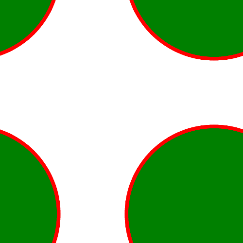

# PHP|Gmagick Rollimage()函数

> Original: [https://www.geeksforgeeks.org/php-gmagick-rollimage-function/](https://www.geeksforgeeks.org/php-gmagick-rollimage-function/)

**Gmagick：：Rollimage()**函数是 PHP 中的一个内置函数，用于滚动图像。
**语法：**和

```
*Gmagick* Gmagick::rollimage( $x, $y )
```

**参数：**此函数接受上述两个参数，如下所述：

*   **$x：**此参数存储 X 偏移量的值。
*   **$y：**此参数存储 Y 偏移量的值。

**返回值：**此函数成功时返回 Gmagick 对象。
**错误/异常：**此函数在出错时引发 GmagickException。
下面的程序说明了 PHP：
**程序 1：**和
**输入图像：**和
中的**Gmagick：：Rollimage()**函数


## PHP

```
<?php

// Create a Gmagick object
$gmagick = new Gmagick(
'https://media.geeksforgeeks.org/wp-content/uploads/tech.png');

// Roll the image.
$gmagick->rollimage(400, 100);

header('Content-type: image/png');

// Output the image
echo $gmagick;
?>
```

发帖主题：Re：Колибри0.7.8.0


**程序 2：**和

## PHP

```
<?php

// Create a GmagickDraw object
$draw = new GmagickDraw();

// Create GmagickPixel object
$strokeColor = new GmagickPixel('Red');
$fillColor = new GmagickPixel('Green');

// Set the color, opacity of image
$draw->setStrokeOpacity(1);
$draw->setStrokeColor('Red');
$draw->setFillColor('Green');

// Set the width and height of image
$draw->setStrokeWidth(7);
$draw->setFontSize(72);

// Function to draw circle 
$draw->circle(250, 250, 100, 150);

$gmagick = new Gmagick();
$gmagick->newImage(500, 500, 'White');
$gmagick->setImageFormat("png");
$gmagick->drawImage($draw);

// Shear the image
$gmagick->rollimage(190, 190);

// Display the output image
header("Content-Type: image/png");
echo $gmagick->getImageBlob();
?>
```

发帖主题：Re：Колибри0.7.8.0



**引用：**[http://php.net/manual/en/gmagick.rollimage.php](http://php.net/manual/en/gmagick.rollimage.php)和