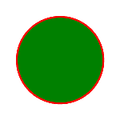

# PHP|Gmagick ThumbnailImage()函数

> Original: [https://www.geeksforgeeks.org/php-gmagick-thumbnailimage-function/](https://www.geeksforgeeks.org/php-gmagick-thumbnailimage-function/)

Gmagick：：thhumnailImage()函数是 PHP 中的一个内置函数，用于将图像的大小更改为给定的尺寸，并删除任何关联的配置文件。 此函数用于生成适合在 Web 上显示的低成本小缩略图。 如果$Fit 参数设置为 True，则行和列参数使用最大边。 两边都将进行缩放，直到匹配或小于为该边指定的参数。

**语法：**

```
*public* Gmagick::thumbnailimage( $width, $height, $fit = FALSE ] )
```

**参数：**此函数接受上述三个参数，如下所述：

*   **$width：**此参数用于设置图像宽度。
*   **$Height：**此参数用于设置图像高度。
*   **$Fit：**此参数描述是否采用布尔值。

**返回值：**此函数成功时返回 Gmagick 对象。
**错误/异常：**此函数在出错时引发 GmagickException。

下面的程序说明了 PHP 中的*Gmagick：：ThumbnailImage()*函数：

**程序 1：**和
**输入图像：**和


## PHP

```
<?php

// Create a Gmagick object
$gmagick = new Gmagick(
'https://media.geeksforgeeks.org/wp-content/uploads/tech.png');

// Thumbnail of the image.
$gmagick->thumbnailImage(320, 425, TRUE);

header('Content-type: image/png');

// Output the image
echo $gmagick;
?>
```

发帖主题：Re：Колибри0.7.8.0


**程序 2：**

## PHP

```
<?php

// Create a GmagickDraw object
$draw = new GmagickDraw();

// Create GmagickPixel object
$strokeColor = new GmagickPixel('Red');
$fillColor = new GmagickPixel('Green');

// Set the color, opacity of image
$draw->setStrokeOpacity(1);
$draw->setStrokeColor('Red');
$draw->setFillColor('Green');

// Set the width and height of image
$draw->setStrokeWidth(7);
$draw->setFontSize(72);

// Function to draw circle 
$draw->circle(250, 250, 100, 150);

$gmagick = new Gmagick();
$gmagick->newImage(500, 500, 'White');
$gmagick->setImageFormat("png");
$gmagick->drawImage($draw);

// Thumbnail of the image.
$gmagick->thumbnailImage(150, 250, TRUE);

// Display the output image
header("Content-Type: image/png");
echo $gmagick->getImageBlob();
?>
```

发帖主题：Re：Колибри0.7.0



**引用：**[http://php.net/manual/en/gmagick.thumbnailimage.php](http://php.net/manual/en/gmagick.thumbnailimage.php)和