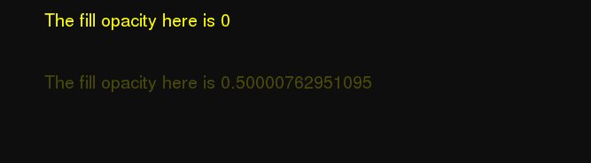

# PHP|GmagickDraw getfiulity()函数

> Original: [https://www.geeksforgeeks.org/php-gmagickdraw-getfillopacity-function/](https://www.geeksforgeeks.org/php-gmagickdraw-getfillopacity-function/)

**GmagickDraw：：getfiopacity()函数**是 PHP 中的一个内置函数，用于获取使用填充颜色或填充纹理绘制时使用的不透明度。 完全不透明为 1，完全透明为 0。

**语法：**

```
*float* GmagickDraw::getfillopacity( *void* )
```

**参数：**此函数不接受任何参数。

**返回值：**此函数返回包含不透明度的浮点值。

**异常：**此函数在出错时引发 GmagickDrawException。

下面给出的程序演示了 PHP 中的**GmagickDraw：：getfiopacity()函数**：

**已用图像：**


**程序 1：**

```
<?php 

// Create a new GmagickDraw object 
$draw = new GmagickDraw(); 

// Get the Fill Opacity 
$fillOpacity = $draw->getfillopacity(); 
echo $fillOpacity; 
?> 
```

发帖主题：Re：Колибри0.7.0

```
0 // Which is the default value
```

**程序 2：**

```
<?php

// Create a new Gmagick object
$gmagick = new Gmagick('geeksforgeeks.png');

// Create a GmagickDraw object
$draw = new GmagickDraw();

// Set the color
$draw->setFillColor('#0E0E0E');

// Draw rectangle for background
$draw->rectangle(-10, -10, 800, 400);

// Set the fill color
$draw->setFillColor('yellow');

// Set the font size
$draw->setFontSize(20);

// Set the fill opacity
$draw->setfillopacity(1);

// Annotate a text
$draw->annotate(50, 30, 'The fill opacity here is '
    . $draw->getfillopacity());

// Set the fill opacity
$draw->setfillopacity(0.5);

// Annotate a text
$draw->annotate(50, 100, 'The fill opacity here is '
    . $draw->getfillopacity());

// Draw the image
$gmagick->drawImage($draw);

// Display the output image
header("Content-Type: image/png");
echo $gmagick->getImageBlob();
?>
```

**输出：**


**引用：**[https://www.php.net/manual/en/gmagickdraw.getfillopacity.php](https://www.php.net/manual/en/gmagickdraw.getfillopacity.php)