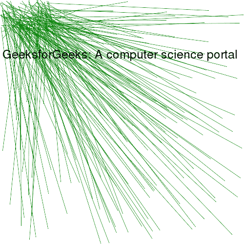

# PHP|GmagickDraw line()函数

> Original: [https://www.geeksforgeeks.org/php-gmagickdraw-line-function/](https://www.geeksforgeeks.org/php-gmagickdraw-line-function/)

GmagickDraw：：Line()函数是 PHP 中的一个内置函数，用于绘制直线。 此函数使用当前笔触颜色、笔触不透明度和笔触宽度绘制线条。

**语法：**

```php
*public* GmagickDraw::line( $sx, $sy, $ex, $ey )
```

*
**参数：**此函数接受上述四个参数，如下所述：

*   **$sx：**此参数取起始 x 坐标的值。
*   **$sy：**此参数采用起始 y 坐标的值。
*   **$ex：**此参数取结束 x 坐标的值。
*   **$ex：**他的参数取结束 y 坐标的值。

**返回值：**此函数成功时返回 GmagickDraw 对象。

**错误/异常：**此函数在出错时引发 GmagickException。

下面的程序说明了 PHP 中的*GmagickDraw：：Annotate()*函数：

**程序 1：**

```php
<?php 

// Create a GmagickDraw object 
$draw = new GmagickDraw();  

// Set the color
$draw->setFillColor('Green'); 

// Set the width and height of image 
$draw->setStrokeWidth(1170); 
$draw->setFontSize(72); 

// Function to draw line
$draw->line(20, 20, 280, 465);

$gmagick = new Gmagick(); 
$gmagick->newImage(500, 500, 'White'); 
$gmagick->setImageFormat("png"); 

// Use of drawimage function
$gmagick->drawImage($draw); 

// Display the output image 
header("Content-Type: image/png"); 
echo $gmagick->getImageBlob(); 
?> 
```

**输出：**


**程序 2：**

```php
<?php 

// Create a GmagickDraw object 
$draw = new GmagickDraw();  

// Set the color
$draw->setFillColor('Green'); 

// Set the width and height of image 
$draw->setStrokeWidth(1); 

// Function to draw line
for($x = 0; $x < 40; $x++) {
    $draw->line(rand(0, 100), rand(0, 60), rand(0, 500), rand(0, 500));
    $draw->line(rand(0, 100), rand(0, 60), rand(0, 500), rand(0, 500));
    $draw->line(rand(0, 100), rand(0, 60), rand(0, 500), rand(0, 500));
    $draw->line(rand(0, 100), rand(0, 60), rand(0, 500), rand(0, 500));
}

$gmagick = new Gmagick(); 
$gmagick->newImage(500, 500, 'White'); 
$gmagick->setImageFormat("png"); 

// Set the color
$draw->setFillColor('Black'); 
$draw->setFontSize(25); 

// Use of drawimage function
$gmagick->drawImage($draw); 

$gmagick->annotateImage($draw, 5, 120, 0, 
        'GeeksforGeeks: A computer science portal'); 

// Display the output image 
header("Content-Type: image/png"); 
echo $gmagick->getImageBlob(); 

?> 
```

**输出：**


**引用：**[http://php.net/manual/en/gmagickdraw.line.php](http://php.net/manual/en/gmagickdraw.line.php)